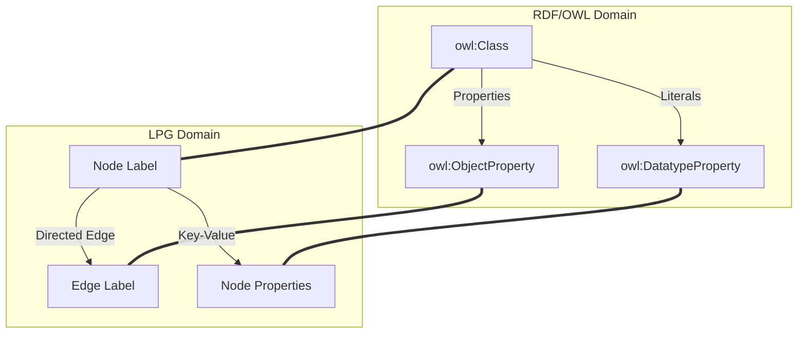
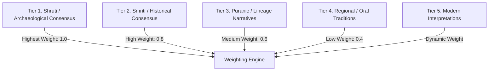

# Knowledge Universe Ontology: Sanatan Dharma & Indian Civilization
## Knowledge Architecture Document (Single Source of Truth)

This document establishes the formal information architecture, semantic schema, and data models for the Sanatan Dharma and Indian Civilization Knowledge Graph. It serves as the single source of truth (SSoT) for engineering, search, AI, content management, and curriculum development.

---

## 1. Ontology Architecture: Hybrid Model
To maximize flexibility and performance, this platform implements a **Hybrid Ontology Architecture**:
1. **Semantic Web/W3C Stack (RDF/OWL)**: Used for logical reasoning, inference, data sharing, interoperability with external academic graphs, and strict semantic validation (SHACL).
2. **Labeled Property Graph (LPG)**: Used for high-performance traversals, real-time recommendation engines, vector-graph hybrid search, and graph machine learning (Node2Vec, GraphSAGE).

### Mapping Specification
* **Classes (OWL)** map directly to **Node Labels (LPG)**.
* **Object Properties (OWL)** map to **Edge Labels (LPG)**.
* **Datatype Properties (OWL)** map to **Node Properties (LPG)**.
* **Instances/Individuals (RDF)** map to **Nodes (LPG)**.



---

## 2. Master Knowledge Domains (Taxonomy Hierarchy)

Below is the nested taxonomy representing the core domains of Indian Civilization. Each node in this hierarchy represents a category under which entities are organized.

* **1. Scriptures & Texts (Shastra)**
    * **1.1. Shruti (Revealed Texts)**
        * 1.1.1. Rigveda (Samhita, Brahmana, Aranyaka, Upanishad)
        * 1.1.2. Yajurveda (Shukla and Krishna recensions: Samhitas, Brahmanas, Aranyakas, Upanishads)
        * 1.1.3. Samaveda (Samhita, Brahmana, Aranyaka, Upanishad)
        * 1.1.4. Atharvaveda (Samhita, Brahmana, Aranyaka, Upanishad)
    * **1.2. Smriti (Remembered Texts)**
        * 1.2.1. Itihasa (Epics: Ramayana, Mahabharata including Bhagavad Gita)
        * 1.2.2. Puranas (18 Maha-Puranas, 18 Upa-Puranas)
        * 1.2.3. Dharma Shastras (Manusmriti, Yajnavalkya Smriti, Narada Smriti, etc.)
        * 1.2.4. Agamas & Tantras (Shaiva Agamas, Vaishnava Pancharatra, Shakta Tantras)
        * 1.2.5. Darshana Shastras (Primary texts of the 6 Astika and Nastika schools)
    * **1.3. Upavedas (Applied Vedic Sciences)**
        * 1.3.1. Ayurveda (Medicine/Health)
        * 1.3.2. Dhanurveda (Archery/Military Science)
        * 1.3.3. Gandharvaveda (Music/Performing Arts)
        * 1.3.4. Sthapatyaveda (Architecture/Vastu)
    * **1.4. Vedangas (Vedic Auxiliaries)**
        * 1.4.1. Shiksha (Phonetics/Pronunciation)
        * 1.4.2. Chandas (Metrics/Poetic Meter)
        * 1.4.3. Vyakarana (Grammar - e.g., Panini's Ashtadhyayi)
        * 1.4.4. Nirukta (Etymology/Lexicography)
        * 1.4.5. Kalpa (Ritual Manuals: Shrauta, Grihya, Dharma, Shulba Sutras)
        * 1.4.6. Jyotisha (Astronomy/Time-keeping)
* **2. Philosophy & Cosmology (Darshana & Siddhanta)**
    * **2.1. Astika (Vedic/Orthodox Schools)**
        * 2.1.1. Nyaya (Epistemology, Logic)
        * 2.1.2. Vaisheshika (Atomism, Metaphysics)
        * 2.1.3. Samkhya (Dualism: Purusha & Prakriti)
        * 2.1.4. Yoga (Psychophysical Practices, Meditation)
        * 2.1.5. Mimamsa (Hermeneutics, Ritual Philosophy)
        * 2.1.6. Vedanta (End of Vedas - Non-dualism, Qualified Non-dualism, Dualism, etc.)
    * **2.2. Nastika (Heterodox Schools)**
        * 2.2.1. Carvaka (Materialism, Skepticism)
        * 2.2.2. Bauddha (Buddhism - Madhyamaka, Yogacara, Theravada)
        * 2.2.3. Jaina (Jainism - Anekantavada, Syadvada)
    * **2.3. Tantric & Regional Philosophies**
        * 2.3.1. Kashmir Shaivism (Trika, Pratyabhijna)
        * 2.3.2. Siddhanta (Shaiva Siddhanta)
        * 2.3.3. Shakta Advaita
* **3. Deities, Avatars & Cosmology (Devata & Loka)**
    * **3.1. Saguna Brahman (Personal Deities)**
        * 3.1.1. Trimurti (Brahma, Vishnu, Shiva)
        * 3.1.2. Tridevi (Saraswati, Lakshmi, Parvati/Durga)
        * 3.1.3. Ganesha, Kartikeya, Hanuman
    * **3.2. Avatars (Descent of Divinity)**
        * 3.2.1. Dashavatara (Matsya, Kurma, Varaha, Narasimha, Vamana, Parashurama, Rama, Krishna, Buddha/Balarama, Kalki)
        * 3.2.2. Minor & Regional Avatars (Dattatreya, Dhanvantari, Hayagriva)
    * **3.3. Cosmic Beings & Planes**
        * 3.3.1. Adityas, Vasus, Rudras (Vedic Deities)
        * 3.3.2. Lokas (Bhur, Bhuvar, Svar, Mahar, Jana, Tapas, Satya, and Patala regions)
* **4. Historical Figures & Lineages (Itihasa-Vamsha)**
    * **4.1. Rishis & Sages**
        * 4.1.1. Saptarishi (Seven Sages of current Manvantara)
        * 4.1.2. Gotra-Pravartakas (Lineage founders)
        * 4.1.3. Female Rishis (Rishikas: Gargi, Maitreyi, Lopamudra)
    * **4.2. Acharyas & Gurus**
        * 4.2.1. Adi Shankara, Ramanuja, Madhva, Nimbarka, Vallabha, Chaitanya
        * 4.2.2. Modern Gurus: Ramakrishna, Swami Vivekananda, Sri Aurobindo, Yogananda
    * **4.3. Kings & Dynasties (Rajarshi & Vamsha)**
        * 4.3.1. Suryavamsha & Chandravamsha (Traditional Lineages)
        * 4.3.2. Historical Dynasties (Maurya, Gupta, Chola, Chalukya, Vijayanagara, Maratha)
* **5. Sacred Geography & Architecture (Kshetra & Vastu)**
    * **5.1. Sacred Geography (Tirthas)**
        * 5.1.1. Sapta Puri (Seven Holy Cities: Ayodhya, Mathura, Maya/Haridwar, Kashi, Kanchi, Avantika/Ujjain, Dvaraka)
        * 5.1.2. Char Dham (Badrinath, Dwarka, Puri, Rameswaram)
        * 5.1.3. Shakti Peethas & Jyotirlingas
        * 5.1.4. Sacred Rivers (Ganga, Yamuna, Saraswati, Narmada, Godavari, Krishna, Kaveri)
    * **5.2. Temple Architecture (Shilpa & Sthapatya)**
        * 5.2.1. Nagara (Northern style)
        * 5.2.2. Dravida (Southern style)
        * 5.2.3. Vesara (Hybrid style)
        * 5.2.4. Cave & Rock-cut Temples (Ellora, Elephanta, Mahabalipuram)
* **6. Practices, Rituals & Astronomy (Sadhana, Yajna, Jyotisha)**
    * **6.1. Rites & Sacrifices (Karmakanda)**
        * 6.1.1. Shodasha Sanskaras (16 Lifespan sacraments: Garbhadhana to Antyesti)
        * 6.1.2. Yajna & Homa (Vedic fire sacrifices)
        * 6.1.3. Puja & Archana (Devotional offerings)
    * **6.2. Yoga & Sadhana (Inner Science)**
        * 6.2.1. Ashtanga Yoga (Yama, Niyama, Asana, Pranayama, Pratyahara, Dharana, Dhyana, Samadhi)
        * 6.2.2. Paths: Karma Yoga, Bhakti Yoga, Jnana Yoga, Raja Yoga
    * **6.3. Calendrical & Astronomical Systems (Panchanga)**
        * 6.3.1. Solar & Lunar Calendars (Saka, Vikram Samvat)
        * 6.3.2. Nakshatras (27 Constellations)
        * 6.3.3. Yugas & Manvantaras (Cosmic Time Cycles)

---

## 3. Entity Types (Class System)

Every node in the Knowledge Graph belongs to at least one entity type. The table below defines the formal Class Schema:

| Entity Class | RDF/OWL Equivalent | LPG Node Label | Semantic Scope / Definition | Sample Instances |
| :--- | :--- | :--- | :--- | :--- |
| **Person** | `foaf:Person`, `schema:Person` | `:Person` | Historical figures, sages, kings, authors, commentators, and legendary characters. | Adi Shankara, Vyasa, Chandragupta Maurya |
| **Scripture** | `bibo:Book`, `schema:CreativeWork` | `:Scripture` | Canonical texts, commentaries, translations, and compilations of sacred/secular literature. | Rigveda Samhita, Bhagavad Gita, Ashtadhyayi |
| **Temple** | `schema:PlaceOfWorship` | `:Temple` | Physical temple complexes and rock-cut shrines possessing historical or ritual significance. | Brihadisvara Temple, Konark Sun Temple |
| **Concept** | `skos:Concept` | `:Concept` | Abstract philosophical, theological, ethical, scientific, or social ideas. | Karma, Dharma, Brahman, Ahimsa, Shunyata |
| **Festival** | `schema:Event` | `:Festival` | Regularly recurring socio-religious celebrations tied to astronomical or seasonal calendars. | Diwali, Maha Shivaratri, Kumbh Mela |
| **Location** | `schema:Place`, `geo:SpatialThing` | `:Location` | Geographic features, sacred cities, rivers, mountains, and archaeological sites. | Varanasi, Mount Kailash, River Narmada, Harappa |
| **Artifact** | `schema:Thing` | `:Artifact` | Physical, portable objects of archaeological, artistic, or historic value (e.g., inscriptions, coins, seals). | Heliodorus Pillar, Pashupati Seal |
| **Dynasty** | `org:Organization` | `:Dynasty` | Ruling houses and lineages that held political authority over regions in the subcontinent. | Gupta Dynasty, Chola Dynasty, Maurya Dynasty |
| **Kingdom** | `schema:AdministrativeArea` | `:Kingdom` | Historical geopolitical units, empires, and Janapadas. | Magadha, Vijayanagara Empire, Kosala |
| **Language** | `schema:Language` | `:Language` | Historical and liturgical tongues used to compose texts, inscriptions, or regional works. | Sanskrit, Classical Tamil, Prakrit, Pali |
| **Fauna** | `schema:Taxon` | `:Fauna` | Animals holding symbolic, ritual, or ecological significance in texts and art. | Airavata (Elephant), Tiger (Vahana), Cow (Surabhi) |
| **Flora** | `schema:Taxon` | `:Flora` | Plants, herbs, and trees holding medicinal, ritual, or symbolic weight. | Tulsi, Soma, Peepal (Ashvattha), Lotus |
| **Mantra** | `schema:CreativeWork` | `:Mantra` | Sacred utterances, sounds, syllables, or verses believed to possess spiritual and transformative power. | Gayatri Mantra, Om Namah Shivaya |
| **Ritual** | `schema:Action` | `:Ritual` | Structured ceremonial actions, sacraments, sacrifices, and formal worship systems. | Upanayana, Agnihotra, Garbhadhana |
| **Symbol** | `skos:Concept` | `:Symbol` | Graphic, physical, or abstract representations containing dense theological meaning. | Swastika, Om, Trishula, Sri Yantra |
| **Architecture** | `skos:Concept` | `:Architecture` | Structural components, architectural styles, layouts (Mandala), and design treatises. | Nagara Style, Garbhagriha, Gopuram |
| **Artwork** | `schema:VisualArtwork` | `:Artwork` | Sculptures, paintings, frescoes, and iconographic carvings. | Nataraja Bronze, Ajanta Caves Murals |
| **Institution** | `schema:Organization` | `:Institution` | Historical universities, monastic orders, schools, and socio-religious bodies. | Nalanda University, Sringeri Sharada Peetham |
| **Event** | `schema:Event` | `:Event` | Specific non-recurring historical or mythological events occurring at a point in time. | Battle of Ten Kings, Coronation of Shivaji |
| **Time Period** | `time:TemporalEntity` | `:TimePeriod` | Specified epochs, eras, geological periods, or traditional cosmic time scales. | Gupta Golden Age, Satya Yuga, Kali Yuga |
| **Philosophy** | `skos:Concept` | `:Philosophy` | Formal intellectual frameworks, systems of metaphysics, epistemology, and ethics. | Advaita Vedanta, Samkhya, Vaisheshika |
| **School** | `schema:Organization` | `:School` | Lineages of thought, lineages of teachers (Sampradaya), and specific subsets of philosophies. | Vishishtadvaita Sampradaya, Nyaya School |
| **Community** | `schema:Organization` | `:Community` | Specific social groups, gotras, lineages, or historical guilds. | Saptarishi Gotra, Guild of Ayyavole |

---

## 4. Relationship Model (Ontology Edge Schema)

The ontology defines a set of directed, semantic relationships. In LPG, these contain properties (like weights or sources), while in RDF they translate to `owl:ObjectProperty` assertions.

| Edge Label (LPG) | Domain (Source Class) | Range (Target Class) | Inverse Relation | OWL Property Type | Semantic Description |
| :--- | :--- | :--- | :--- | :--- | :--- |
| `is_teacher_of` | `Person` | `Person` | `is_student_of` | Asymmetric | A lineage edge denoting direct spiritual or intellectual instruction. |
| `is_student_of` | `Person` | `Person` | `is_teacher_of` | Asymmetric | Inverse of teacher edge. |
| `is_avatar_of` | `Person` | `Person` / `Deity` | `has_avatar` | Functional | Denotes a bodily manifestation (Avatar) of a primary deity. |
| `is_consort_of` | `Person` / `Deity` | `Person` / `Deity` | `is_consort_of` | Symmetric | Denotes divine companionship / conjugal pairing in sacred narrative. |
| `is_child_of` | `Person` | `Person` | `has_child` | Asymmetric | Biological or theological parentage. |
| `belongs_to` | `Scripture` / `Ritual` | `Philosophy` / `School` | `contains` | Many-to-One | Links a text, ritual, or practice to its underlying philosophical lineage. |
| `mentions` | `Scripture` | `Person` / `Place` / `Concept` | `mentioned_in` | Asymmetric | Textual citation/reference to an entity. |
| `written_by` | `Scripture` | `Person` | `wrote` | Asymmetric | Identifies the traditional composer, compiler, or historical author. |
| `located_in` | `Temple` / `Location` | `Location` | `contains_location` | Transitive | Geographic containment. |
| `built_by` | `Temple` / `Artifact` | `Person` / `Dynasty` | `built` | Asymmetric | Identifies the patron, architect, or sovereign who constructed it. |
| `founded_by` | `Institution` / `School` | `Person` | `founded` | Asymmetric | Identifies the physical or intellectual founder. |
| `destroyed_by` | `Temple` / `Institution` | `Person` / `Dynasty` / `Event` | `destroyed` | Asymmetric | Identifies the historical cause of structural destruction. |
| `restored_by` | `Temple` / `Location` | `Person` / `Dynasty` | `restored` | Asymmetric | Identifies the agent responsible for physical restoration. |
| `associated_with` | `Concept` / `Deity` | `Symbol` / `Flora` / `Fauna` | `associated_with` | Symmetric | General mythological or symbolic connection. |
| `symbolizes` | `Symbol` / `Ritual` | `Concept` | `symbolized_by` | Asymmetric | Links an object/action to its abstract semantic representation. |
| `worshipped_in` | `Deity` | `Temple` / `Location` | `dedicated_to` | Asymmetric | Direct worship associations for local and regional centers. |
| `celebrated_on` | `Festival` | `TimePeriod` | `has_festival` | Asymmetric | Maps a festival to its date in the astronomical lunar/solar calendar. |
| `occurs_during` | `Event` / `Festival` | `TimePeriod` | `contains_event` | Asymmetric | Temporal positioning. |
| `references` | `Scripture` | `Scripture` | `referenced_by` | Asymmetric | Internal cross-textual citation and cross-references. |
| `contrasts_with` | `Philosophy` / `Concept` | `Philosophy` / `Concept` | `contrasts_with` | Symmetric | Highlight logical debate or divergence of views. |
| `supports` | `Philosophy` / `Concept` | `Philosophy` / `Concept` | `supported_by` | Asymmetric | Identifies supportive logical assertions or alignment of axioms. |
| `criticizes` | `Philosophy` / `Concept` | `Philosophy` / `Concept` | `criticized_by` | Asymmetric | Formal philosophical critique (Purvapaksha/Uttarakhanda). |
| `derived_from` | `Scripture` / `Concept` | `Scripture` / `Concept` | `derived_to` | Transitive | Genealogies of concepts or text recensions. |
| `translated_into` | `Scripture` | `Language` | `has_translation` | Asymmetric | Identifies target languages of translation instances. |
| `commentary_on` | `Scripture` | `Scripture` | `has_commentary` | Asymmetric | Explains commentary layers (Bhashya, Vartika, Tika). |
| `appears_in` | `Mantra` / `Person` | `Scripture` | `contains_element` | Asymmetric | Exact structural occurrence of a verse/character. |
| `quoted_in` | `Mantra` / `Concept` | `Scripture` | `quotes` | Asymmetric | Citation of a verse in a later textual compiler. |
| `related_to` | `Any` | `Any` | `related_to` | Symmetric | Fallback weak associative connection (low weight). |

---

## 5. Knowledge Graph Connection & Path Patterns

To enable advanced AI reasoning (GraphRAG) and semantic navigation, we define structured path patterns. These show how entities interconnect across domain boundaries.

```
[Person: Krishna] 
     │
     ▼ (wrote)
[Scripture: Bhagavad Gita] ────(appears_in)────► [Scripture: Mahabharata]
     │                                                    │
     ▼ (commentary_on)                                    ▼ (located_in)
[Scripture: Gita Bhashya]                             [Location: Kurukshetra]
     │                                                    │
     ▼ (written_by)                                       ▼ (historical_battle)
[Person: Adi Shankara] ────(founded)────► [Institution: Jyotir Math]
     │
     ▼ (founded_by)
[School: Advaita Vedanta] ────(belongs_to)────► [Philosophy: Vedanta]
```

### Complex Graph Traversal Patterns

#### 1. The Philosophical Dialectic (Vada) Path
Traces debates, critiques, and defensive commentaries across rival schools of philosophy.
* **Pattern**: `(p1:Philosophy)-[:contrasts_with]->(p2:Philosophy)<-[:belongs_to]-(s1:Scripture)-[:commentary_on]->(s2:Scripture)-[:criticizes]->(p1)`
* **Concrete Example**: Advaita Vedanta contrasts with Vishishtadvaita Vedanta. Adi Shankara’s *Brahmasutra Bhashya* (Advaita) is critiqued by Ramanuja’s *Sri Bhashya* (Vishishtadvaita), which in turn references Shankara's axioms to refute them.
* **Cypher Translation**:
  ```cypher
  MATCH (p1:Philosophy {name: "Advaita Vedanta"})<-[:belongs_to]-(s1:Scripture)
  MATCH (p2:Philosophy {name: "Vishishtadvaita"})<-[:belongs_to]-(s2:Scripture)
  MATCH (s2)-[r:criticizes|commentary_on]->(s1)
  RETURN p1.name, s1.title, p2.name, s2.title
  ```

#### 2. The Sacred Geography & Architectural Patronage Path
Traces how historical royal dynasties funded religious architecture, establishing stylistic networks.
* **Pattern**: `(d:Dynasty)-[:built]->(t:Temple)-[:located_in]->(l:Location)-[:associated_with]->(de:Deity)`
* **Concrete Example**: The Chola Dynasty built the Brihadisvara Temple (located in Thanjavur), which is dedicated to Shiva (manifested as Lord Rajarajesvaram).
* **SPARQL Translation**:
  ```sparql
  SELECT ?dynasty ?temple ?location ?deity WHERE {
    ?dynasty ont:built ?temple .
    ?temple ont:located_in ?location .
    ?temple ont:dedicated_to ?deity .
    FILTER(?dynasty = res:Chola_Dynasty)
  }
  ```

#### 3. The Ritual-Mantra-Deity Connection (Yajna Mechanics)
Connects physical/metaphysical actions, vocalizations, target deities, and scriptural origins.
* **Pattern**: `(r:Ritual)-[:uses_mantra]->(m:Mantra)-[:appears_in]->(s:Scripture)-[:dedicated_to]->(d:Deity)`
* **Concrete Example**: The Upanayana ritual uses the Gayatri Mantra, which appears in the Rigveda Samhita and is dedicated to Savitr (Solar deity).

#### 4. The Astrological-Agricultural Festival Mapping
Tracks when and why festivals occur, mapping solar/lunar coordinates to geographical celebrations.
* **Pattern**: `(f:Festival)-[:occurs_during]->(t:TimePeriod)-[:associated_with]->(n:Constellation/Planet)-[:celebrated_in]->(l:Location)`
* **Concrete Example**: Kumbh Mela occurs during specific planetary alignments (Jupiter in Taurus, Sun in Aries) and is celebrated at Prayagraj, Haridwar, Ujjain, and Nashik.

#### 5. The Botanical-Medicinal-Philosophical Grid
Links native flora from scripture to its clinical Ayurvedic classification and philosophical associations.
* **Pattern**: `(s:Scripture)-[:mentions]->(fl:Flora)-[:has_property]->(c:Concept {type: "Ayurveda_Dravyaguna"})-[:derived_from]->(p:Philosophy {name: "Vaisheshika"})`
* **Concrete Example**: The Charaka Samhita (Scripture) mentions Ashwagandha (Flora), classified under *Rasayana* (rejuvenation concept), which employs Vaisheshika atomistic properties (*Guna* and *Virya* analysis).

---

## 6. Unified Metadata Model (Node & Property Schema)

To support dual-chronologies, spatial mapping, and academic validation, every entity in the Knowledge Graph must satisfy the following Metadata Schema.

### JSON-LD Metadata Specification Template
```json
{
  "@context": "https://schema.sanatana.org/context.jsonld",
  "@type": "Person",
  "id": "person_adi_shankara",
  "names": {
    "primary": "Adi Shankara",
    "alternative": [
      { "name": "आदि शङ्कराचार्य", "lang": "sa-Deva" },
      { "name": "Ādi Śaṅkarācārya", "lang": "sa-Latn-IAST" },
      { "name": "Shankara Bhagavatpada", "lang": "en" }
    ]
  },
  "temporal": {
    "academic_consensus_era": {
      "start_year": 788,
      "end_year": 820,
      "calendar": "ISO-8601",
      "scholarly_confidence": 0.85,
      "academic_citations": [
        "https://doi.org/10.1007/bf0234567",
        "https://www.worldcat.org/title/8734293"
      ]
    },
    "traditional_puranic_era": {
      "start_year": -509,
      "end_year": -477,
      "calendar": "Kaliyuga-Era",
      "traditional_source_text": "Punya Sloka Manjari",
      "traditional_lineage_citation": "Dvaraka Peetham Vamshavali"
    },
    "controversy_level": "HIGH"
  },
  "spatial": {
    "birth_place": "Kalady, Kerala",
    "coordinates": {
      "latitude": 10.1654,
      "longitude": 76.3315,
      "system": "WGS84"
    }
  },
  "tradition": {
    "sampradaya": "Dashanami Sannyasi",
    "philosophical_alignment": "Advaita Vedanta"
  },
  "bibliographical_citations": {
    "primary_sources": [
      {
        "citation_id": "ref_brahmasutra_bhashya",
        "title": "Brahmasutra Bhashya",
        "author": "Adi Shankara",
        "evidence_type": "EPIGRAPHIC_AND_TEXTUAL"
      }
    ],
    "secondary_sources": [
      {
        "citation_id": "ref_panchanan_1988",
        "citation_string": "Radhakrishnan, S. (1927). Indian Philosophy. Volume II."
      }
    ]
  },
  "engagement": {
    "difficulty_level": "ADVANCED",
    "estimated_reading_time_minutes": 25,
    "associated_quiz_count": 8
  },
  "editorial": {
    "status": "APPROVED",
    "version": "2.4.0",
    "last_reviewed_by": "editorial_board_member_04",
    "timestamp": "2026-07-14T16:08:03Z"
  }
}
```

---

## 7. Learning Graph (Prerequisites & Curricular Dependencies)

The Learning Graph operates as a **Directed Acyclic Graph (DAG)** layered over the primary Knowledge Graph. It defines the logical flow of information required for a user to master a concept without experiencing cognitive overload.

```
       [Concept: Sanskrit Alphabets (Varnamala)]
                         │
                         ▼
        [Concept: Sandhi Rules (Euphonic Junction)]
                         │
                         ▼
    [Concept: Basic Grammar Rules (Subanta & Tinganta)]
                         │
                         ▼
        [Scripture: Bhagavad Gita (Textual Reading)]
```

### Prerequisite Rule Mechanics
Prerequisites are classified into three strictness tiers:
1. **Strict (Hard Dependency)**: The user *must* complete the assessment/quiz of the predecessor node before unlocking the successor node.
2. **Recommended (Soft Dependency)**: The system prompts the user to read the predecessor, but allows unlocking of the successor.
3. **Topical Link**: Associative learning. Suggests related contextual nodes during exploration.

### Structural Paths for Curriculum Tracks

#### Track A: Vedantic Philosophy
```
[Concept: Upanishads (Primary Texts)]
           │
           ▼ (Strict)
[Concept: Prasthanatrayi (Three Bases)]
           │
           ▼ (Strict)
[Philosophy: Advaita Vedanta] ────(Recommended)────► [Scripture: Vivekachudamani]
           │
           ▼ (Strict)
[Philosophy: Neo-Vedanta (Vivekananda)]
```

#### Track B: Sanskrit Grammar & Linguistic Analysis
```
[Concept: Shiksha (Phonetics)]
           │
           ▼ (Strict)
[Scripture: Ashtadhyayi (Panini)]
           │
           ▼ (Strict)
[Concept: Karaka (Case Relations)]
           │
           ▼ (Recommended)
[Scripture: Mahabhashya (Patanjali)]
```

---

## 8. Semantic Search & Query Intent Model

Natural language queries are parsed using an intent classifier that maps terms to structured graph traversals (SPARQL/Cypher queries).

| User Query | Intent Category | Entity Extraction | Target Graph Relation Paths | Translated Graph Logic |
| :--- | :--- | :--- | :--- | :--- |
| **"Who is Shiva?"** | `Identity_Definition` | `Shiva` (Deity) | `(Shiva)-[:associated_with\|:symbolizes]->(c:Concept)` | Fetches core properties, alternate names, and associated concepts of Shiva. |
| **"Why is Shiva blue?"** | `Causal_Explanation` | `Shiva` (Deity), `Blue` (Property) | `(Shiva)-[:appears_in]->(s:Scripture)<-[:mentions]-(e:Event {name: "Samudra Manthan"})` | Resolves to the churning of the ocean event (Halahala poison consumption). |
| **"Meaning of Trishul"** | `Symbology_Translation` | `Trishul` (Symbol) | `(Trishul)-[:symbolizes]->(c:Concept)` | Fetches the three Gunas (Sattva, Rajas, Tamas) represented by the tines. |
| **"Difference between Dharma and Karma"** | `Comparative_Analysis` | `Dharma` (Concept), `Karma` (Concept) | `(Dharma)-[:contrasts_with\|:supports]->(Karma)` | Compares semantic attributes, dual definitions, and structural overlap of the two nodes. |
| **"Temples near Ujjain"** | `Spatial_Proximity` | `Ujjain` (Location) | `(t:Temple)-[:located_in]->(:Location {name: "Ujjain"})` | Coordinates lookup with bounding box range query ($\le 50$ km radius). |
| **"Books for beginners"** | `Metadata_Filtering` | `Beginner` (Difficulty) | `(s:Scripture {difficulty_level: "BEGINNER"})` | Filters the Scripture collection for properties matching `difficulty: BEGINNER`. |

---

## 9. Knowledge Quality & Epistemic Framework

Because the subject matter contains sacred texts, historical documents, colonial interpretations, and living oral traditions, the Knowledge Graph applies a **Multi-Tier Epistemic Framework** to label the nature and certainty of data.



### Epistemic Classification Tiers

1. **Verified Scripture (Shruti)**
    * **Description**: Primary Vedic corpus (Samhitas, Brahmanas, Upanishads). Unaltered phonetics.
    * **Epistemic Weight**: `1.0`
2. **Historical Consensus (Archaeological/Epigraphic)**
    * **Description**: Events and timelines validated by physically dated inscriptions, numismatics, or multi-site archaeological consensus.
    * **Epistemic Weight**: `0.9`
3. **Scholarly Debate**
    * **Description**: Multi-layered perspectives with varying academic models (e.g., date of Mahabharata composition, Aryan migration vs. Out-of-India theories).
    * **Epistemic Weight**: `0.7` (requires dual-nodes representation).
4. **Regional Tradition / Local Mahatmya**
    * **Description**: Sacred narratives specific to a local temple, region, or community (e.g., Sthala Puranas).
    * **Epistemic Weight**: `0.5`
5. **Oral Tradition**
    * **Description**: Memorized lineages and songs passed down through generations, lacking early manuscript documentation.
    * **Epistemic Weight**: `0.4`
6. **Legend / Narrative (Itihasa-Purana)**
    * **Description**: Traditional narratives valued for their philosophical, pedagogical, and ethical dimensions rather than empirical history.
    * **Epistemic Weight**: `0.6`
7. **Modern Interpretation**
    * **Description**: Commentaries, adjustments, and updates to concepts generated in the 19th–21st centuries.
    * **Epistemic Weight**: `0.4`

---

## 10. Automated Content Linking Rules

To automate search index generation and page cross-connections within the CMS, the platform applies programmatic rules linking articles to related entities.

### Automated Context Link (ACL) Heuristic Formula
Every time a document $D$ is created or updated:
1. **Named Entity Recognition (NER)**: Extract all tokens matching registered entity classes (Person, Location, Concept, Scripture, Temple).
2. **Semantic Contextual Weighting ($W_{ij}$)**: Calculate the strength of connection between Document $D_i$ and Entity $E_j$:
$$W_{ij} = (\text{TF-IDF of } E_j \text{ in } D_i) \times \log\left(1 + \text{Degree of } E_j \text{ in Graph}\right)$$
3. **Link Creation Threshold**: If $W_{ij} \ge \theta$ (system threshold value of `0.65`), automatically construct a bidirectional hyper-link:
    * In UI: Embed context card hover element.
    * In Database: Add edge `(D_i)-[:contains_entity {context_relevance: W_ij}]->(E_j)`.

### Automatic Graph Recommendation Pathways
* **Rule 1 (Spatiotemporal Convergence)**: Suggest entities that are active in the same geographical bounding box during the same era.
  $$\text{Match } (a:Person), (b:Person) \text{ where } a.\text{era} = b.\text{era} \text{ and } \text{distance}(a.\text{coords}, b.\text{coords}) \le 100\text{km}$$
* **Rule 2 (Philosophical Lineage)**: Suggest commentaries or criticisms when a primary text is displayed.
  $$\text{Render } (s:Scripture) \leftarrow [\text{commentary\_on}] - (c:Scripture)$$

---

## 11. Knowledge Governance & Editorial Framework

To preserve the intellectual integrity of the platform, prevent vandalism, manage complex historical debates, and ensure AI accuracy, this section establishes the formal **Knowledge Governance and Editorial Framework**.

### 11.1. Editorial Workflows & Lifecycle
All entity nodes, relationships, and metadata fields must progress through a multi-stage editorial pipeline prior to production release.

```
 [Contributor: Draft Entry] 
            │
            ▼
 [Automated Validation (Linter/LPG Schema/SHACL Constraints)] 
            │
            ▼ (Passes validation)
 [Sanskrit & Civilizational Domain Scholars (Verification)]
            │
            ▼ (Verified)
 [Editorial Board (Peer Review & Controversy Resolution)]
            │
            ▼ (Approved)
 [Production Deployment (Signed Semantic Release)]
```

* **Drafting Phase**: Contributors (academic, institutional, or community members) submit updates via an structured JSON schema interface matching the metadata standards.
* **Automated Validation**: The engine checks the entry for broken references, validation of coordinates, proper IAST transliteration syntax (conforming to ISO 15919), and SHACL constraints on the hybrid ontology.
* **Peer Review (Scholarly Layer)**: Subject matter experts verify textual citations against primary repositories (e.g., GRETIL, Muktabodha Digital Library, or National Manuscript Mission).
* **Controversy Handling Protocol**: If the entry modifies dates or claims disputed by academic or traditional entities, the editorial board classifies the topic as `Controversial` and forces the insertion of a **Multi-Chronology Grid** representing both perspectives.

### 11.2. Source Verification & Citation Standards
The platform enforces academic and traditional citations to prevent the accumulation of unverified content.

* **Traditional Citations (Pramana)**:
    * Must specify: Text name, Chapter (*Adhyaya*), Section (*Kanda* or *Parvan*), Verse number (*Shloka*), and the recension used (e.g., *Rigveda Samhita (Shakala Recension) 10.129.1*).
* **Historical / Academic Citations (Aitihasika)**:
    * Must match DOI or ISBN references.
    * Epigraphical records must specify the Indian Antiquary volume, Epigraphia Indica volume, or archaeological excavation report details (e.g., *ASI Excavation Report, Hastinapur Series 1950-52*).
* **Weighting Rule**: Claims lacking primary sources are labeled as `UNVERIFIED_TRADITION` or `ORAL_LEGEND` and are automatically excluded from primary AI-RAG generation pipelines.

### 11.3. Quality Assurance & Constraint Enforcement
We enforce structural consistency via **Shape Constraint Language (SHACL)**. For instance, a SHACL shape ensures that any node marked as an Avatar must point to a parent deity, and any temple must have valid geographic coordinates.

```turtle
# SHACL Shape for Temple Entity Validation
@prefix sh: <http://www.w3.org/ns/shacl#> .
@prefix xsd: <http://www.w3.org/2001/XMLSchema#> .
@prefix ont: <https://schema.sanatana.org/ontology#> .

ont:TempleShape
    a sh:NodeShape ;
    sh:targetClass ont:Temple ;
    sh:property [
        sh:path ont:hasGeographicCoordinates ;
        sh:minCount 1 ;
        sh:maxCount 1 ;
        sh:node ont:CoordinateShape ;
    ] ;
    sh:property [
        sh:path ont:dedicatedTo ;
        sh:minCount 1 ;
        sh:class ont:Deity ;
    ] .
```

### 11.4. AI Safeguards & Content Integrity
To avoid "AI hallucinations" when using LLMs for search, synthesis, or conversational interfaces:
1. **Deterministic Graph Constraints**: Before generating text, the RAG engine retrieves matching triples (e.g., `(Shiva, consortOf, Parvati)`). The LLM's system prompt strictly confines generation to the factual limits of the returned subgraph.
2. **Source Attribution Constraint**: Any sentence generated by the RAG model must embed the precise citation property matching the metadata node (e.g., `[Rigveda 1.164.46]`).
3. **Out-of-Bound Boundaries**: Queries querying contemporary political commentary or topics outside the scope of the ontology are intercepted at the semantic gateway and rejected automatically.

### 11.5. Community Moderation & Governance
* **Reputation System**: Contributors earn "Scholarly Weight" (Karma score) based on accepted edits, peer reviews, and validated citations.
* **Role Hierarchy**: 
    1. *Reader*: Accesses semantic search, learning paths, and quizzes.
    2. *Contributor*: Submits edits, proposes connections, drafts updates.
    3. *Moderator/Scholar*: Reviews source integrity, approves translations, validates Sanskrit metrics.
    4. *System Architect/Editorial Board*: Resolves structural ontology adjustments and multi-chronology content disputes.

---

## 12. Future Expansion & Scalability Protocols

To scale to 1 million articles, 100 million active users, and 50 languages without architectural decay:

### 12.1. Dynamic Translation & Language Portability
To avoid duplicating the entire graph structure across multiple languages:
* All entities use a language-neutral **Semantic Equivalence Key** (e.g., `concept_dharma`).
* Text strings (titles, descriptions, attributes) are stored in localized property maps:
  `title:en = "Righteousness"`, `title:sa = "धर्म"`, `title:sa-Latn = "Dharma"`.
* The graph structure (nodes and relationship edges) remains unified, while UI translations pull local properties based on user locale.

### 12.2. Distributed Graph Scaling
* **Database Sharding**: LPG clusters (e.g., Neo4j Causal Clustering) shard data using **Geographic and Tradition boundaries** to prevent inter-sharded traversals (e.g., grouping Shaiva deities, texts, and temples on dedicated nodes).
* **Cache Strategy**: Read-heavy operations (e.g., standard semantic searches, learning path templates) are cached in-memory using Redis, while dynamic graph calculations are offloaded to read-replicas.

### 12.3. GraphRAG Integration Protocol
The platform integrates with external Large Language Models (LLMs) via **GraphRAG**:
1. When a user inputs a query, the system runs a vector search on the graph node embeddings to find the nearest concepts.
2. The system executes a Subgraph Extraction query (e.g., extracting 2-hop neighborhoods).
3. The extracted subgraph is serialized into markdown tables and injected into the LLM context alongside a strict instruction set: *"Synthesize a response based ONLY on the provided subgraph structure."*

```
User Query ──► Vector Similarity Search ──► Graph Path Retrieval (2-Hop)
                                                    │
                                                    ▼
   LLM Response ◄── Synthesis Prompt ◄── Context Serialization (Markdown)
```

### 12.4. AR/VR & Multimedia Extension Schema
To support future applications (like interactive 3D temple tours or spatial historical maps):
* Spatial nodes include high-fidelity geometry formats (`.gltf` / `.usdz` assets) mapped directly to coordinates inside temple nodes.
* Temporal events include animation sequence parameters, linking character movements to text passages (e.g., mapping Mahabharata battle formations, or *Vyuha*, in 3D coordinate space).

---
*End of Knowledge Architecture Document.*
