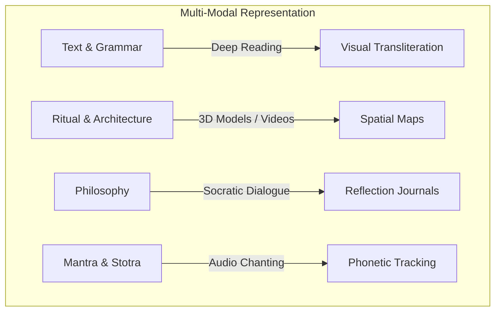
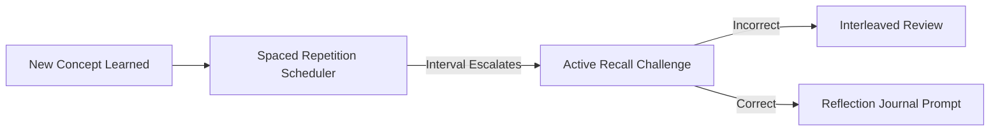
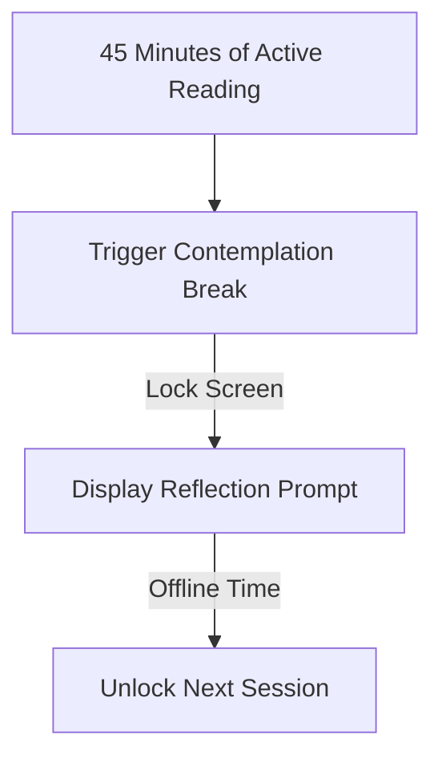

# Human Learning Experience Architecture (HLX)
## Civilizational Learning Design & UX Strategy (Single Source of Truth)

This document defines the Human Learning Experience Architecture (HLX) for the Sanatan Dharma and Indian Civilization platform. It serves as the definitive reference for product designers, UX/UI engineers, learning scientists, and curriculum developers. The HLX structures how users perceive, interact, explore, internalize, and apply civilizational knowledge.

---

## 1. Learning Philosophy & Pedagogical Framework

The platform rejects the design patterns of commoditized information sites (e.g., infinite scrolling, listicles, and clickbait). Instead, it adopts a pedagogical framework inspired by ancient Indian educational paradigms and modernized through cognitive and learning science.

```
       [Shraddha: Active Trust / Clean UI]
                       │
                       ▼
        [Jijnasa: Socratic Inquiry / AI Acharya]
                       │
                       ▼
        [Abhyasa: Deliberate Practice / Retrieval]
                       │
                       ▼
    [Svadhyaya: Reflection & Contemplation / Journaling]
```

### 1.1. The Guru-Shishya Paradigm in the Digital Era
Ancient Indian learning is dialogic, relationship-centered, and transformative. The platform operationalizes these qualities through four core principles:

1. **Shraddha (Receptivity and Trust)**: The UI must establish intellectual sanctity. This is achieved through clean, ad-free layouts, high-fidelity typography, and transparent citation models. The user must feel they have entered a sacred space of learning (*Gurukul*).
2. **Jijnasa (Inquiry and Curiosity)**: Rather than providing static summaries, the interface prompts users to ask deeper questions. The AI mentor does not merely state facts; it guides the user toward discovering them.
3. **Abhyasa (Deliberate Practice)**: Learning requires effortful processing. The platform embeds active retrieval, application, and self-testing throughout the user journey.
4. **Svadhyaya (Self-Study and Contemplation)**: True learning requires quiet reflection. The platform includes structural pauses, reflection journals, and prompts that encourage the user to shut down the screen and contemplate.

### 1.2. The Tension Matrix: Structure vs. Exploration
The HLX balances two modes of learning:
* **The Path (Marga)**: Highly structured, prerequisite-based curriculum tracks designed to build foundational knowledge step-by-step.
* **The Forest (Aranya)**: Open-ended, graph-driven exploration where curiosity leads the user from node to node across domains (e.g., from a deity to a temple, to a historical inscription, to a Sanskrit grammar rule).

---

## 2. Universal Learning Framework (Multi-Sensory Modality)

The platform rejects the scientifically discredited myth of fixed "learning styles" (e.g., classifying a user permanently as a "visual learner"). Cognitive psychology demonstrates that effective learning is **multimodal** and that the *nature of the content* determines the most appropriate medium.



### Modality Engineering Matrix
Users construct deep schemas by translating concepts across different modalities:

* **Textual/Linguistic**: Sanskrit roots, primary verses, transliteration (IAST), and translations.
* **Auditory**: Precision pronunciation guides, traditional chants with swara highlighting, and explanatory audio lectures.
* **Visual**: Dynamic timelines, interactive geographic maps, structural temple schematics, and high-resolution iconography.
* **Dialogic**: Interactive Socratic conversations with the AI mentor to test assumptions and unpack philosophical nuances.
* **Reflective**: Guided journaling prompts where users translate academic concepts into personal ethical frameworks.
* **Formative**: Low-stakes active recall questions, quizzes, and comparative sorting tasks.

---

## 3. From Information to Wisdom (DIKWAPRP Model)

To transform raw data into personal character development, the platform maps the user's progress through an eight-stage cognitive pipeline. The user interface adapts at each stage to transition from informational consumption to personal growth:

```
 Data ──► Information ──► Knowledge ──► Understanding ──► Wisdom ──► Application ──► Reflection ──► Growth
```

1. **Data (A आंकड़ा)**: The raw text of a Sanskrit verse, or geographical coordinates of a temple.
   * *UI Presentation*: Clean, raw, structured metadata block.
2. **Information (सूचना)**: The transliteration, word-by-word meaning, and historical context of the verse.
   * *UI Presentation*: Split-screen interactive translation reader.
3. **Knowledge (ज्ञान)**: How this verse connects to a wider school of philosophy, its author's lineage, and other texts.
   * *UI Presentation*: Localized knowledge graph visualization showing parent/child nodes.
4. **Understanding (बोध)**: Unpacking *why* this philosophical system matters, the logical arguments (Tarka) supporting it, and the critiques leveled against it.
   * *UI Presentation*: AI Socratic dialogue module analyzing arguments.
5. **Wisdom (विवेक)**: Recognizing the universal ethical truths and systemic insights contained within the philosophy.
   * *UI Presentation*: Curated thematic essays and comparisons of ancient values to modern dilemmas.
6. **Application (प्रयोग)**: Translating the wisdom into daily habits, decision-making, and actions (e.g., practicing mindfulness based on Patanjali's Sutras).
   * *UI Presentation*: Guided daily challenges and behavior-design tracking templates.
7. **Reflection (मनन)**: The user evaluates their experience applying the knowledge.
   * *UI Presentation*: Private, digital Reflection Journal with guided prompts.
8. **Personal Growth (विकास)**: Long-term transformation of character, intellectual resilience, and ethical clarity.
   * *UI Presentation*: Personal portfolio highlighting concepts mastered and shifts in reflective journaling themes over years.

---

## 4. User Mindsets & Personas

Learning architecture must address the psychological profiles, motivations, and pain points of distinct users.

| Persona | Key Motivations | Cognitive & Linguistic Barriers | Preferred Learning Modes |
| :--- | :--- | :--- | :--- |
| **Beginner / Seeker** | Curiosity about Indian roots; seeking meaning or spiritual foundation. | Overwhelmed by jargon, Sanskrit vocabulary, and complex multi-layered histories. | Guided paths, Daily micro-learning, Story mode. |
| **Devotee / Practitioner** | Wants to deepen daily worship, learn correct chanting, and celebrate festivals. | Lacks time; struggles to verify correct pronunciations or authentic ritual methods. | Audio-first mode, Festival exploration, Ritual guides. |
| **Student (Academic)** | Studying for exams; writing papers; needs clear, structured facts and timelines. | Needs academic rigor, primary source access, and multi-perspective breakdowns. | Guided paths, Quiz mode, Revision mode. |
| **Researcher / Scholar** | Needs detailed primary manuscript access, transliterated databases, and epigraphical records. | Frustrated by simplified or commercial narratives; needs precise citations and variants. | Deep research mode, Split-pane views, Metadata exploration. |
| **Family / Parent** | Desires to transmit cultural values, ethics, and history to their children. | Struggles to make ancient topics engaging; competes with modern high-dopamine media. | Story mode, Visual maps, Collaborative family quizzes. |
| **International Seeker** | Interest in yoga, meditation, and eastern philosophies. | Zero background in Indian culture; language barrier; risk of cultural appropriation. | Cross-cultural comparisons, Simplified paths, Transliteration guides. |
| **Children** | Loves narratives, interactive visuals, and gaming dynamics. | Low attention span; cannot process dense philosophical texts. | Story mode, Audio-visual interactive trees, Quizzes. |
| **Seniors** | Enjoys deep historical research, listening to discourses, and reflecting. | Accessibility needs (visual, physical); finds complex app navigation frustrating. | Audio-first mode, Large-text reading view, Simple navigation. |

---

## 5. Emotional Journey Architecture

A learning experience is only as memorable as its emotional resonance. The HLX maps emotional target states to specific interface interactions and sensory assets.

```
  [Curiosity] ──► [Wonder] ──► [Humility] ──► [Discovery] ──► [Devotion/Gratitude] ──► [Mastery]
```

### Emotional Mapping Schema

* **Curiosity (जिज्ञासा)**
  * *Target Interface Action*: Encountering unexpected connections in the Knowledge Graph or daily "What if" prompts.
  * *Sensory Design*: Micro-animations revealing hidden links; minimalist search design with changing curiosity prompts.
* **Wonder (विस्मय)**
  * *Target Interface Action*: Viewing high-fidelity spatial maps of ancient empires or interactive astronomical timelines.
  * *Sensory Design*: Zoomable, high-resolution visuals; cinematic ambient drone scoring when exploring historical locations.
* **Humility (विनय)**
  * *Target Interface Action*: Encountering the vast scale of Cosmic Time (Yugas) or reading multi-layered critiques of single concepts.
  * *Sensory Design*: Cosmic visual scales; objective, non-judgmental explanations of historical debates.
* **Discovery (बोध)**
  * *Target Interface Action*: Cracking a Sanskrit root translation or completing an active recall exercise.
  * *Sensory Design*: Soft, satisfying haptic confirmation; visual unfolding of related graph nodes.
* **Reflection (मनन)**
  * *Target Interface Action*: Closing a long reading session and entering a journal response.
  * *Sensory Design*: Visual decluttering (fading interface elements to dark mode); silent intervals with no audio cues.
* **Confidence (आत्मविश्वास)**
  * *Target Interface Action*: Scoring perfectly on an advanced Upanishadic philosophy quiz.
  * *Sensory Design*: Upbeat, elegant visual progression markers; personalized AI validation of user-expressed thoughts.
* **Inspiration (प्रेरणा)**
  * *Target Interface Action*: Exploring the biography of a historical figure, sage, or king who overcame great adversity.
  * *Sensory Design*: Rich narrative illustrations; dramatic audio narratives.
* **Devotion (भक्ति)**
  * *Target Interface Action*: Listening to a highly accurate chant of a Vedic Stotra with synchronized pronunciation overlays.
  * *Sensory Design*: Rich, immersive acoustic recordings; option to toggle on traditional temple lighting presets in the app.
* **Gratitude (कृतज्ञता)**
  * *Target Interface Action*: Reflecting on the lineage of teachers (*Guru Parampara*) that preserved a text for thousands of years.
  * *Sensory Design*: Elegant, flowing lineage maps showing generations of preservation; quiet transitions at the end of deep lessons.
* **Mastery (पारंगति)**
  * *Target Interface Action*: Unlocking the ability to mentor other community members or compose commentary drafts.
  * *Sensory Design*: Clean, minimalist badge designs; access to advanced editorial tools.

---

## 6. Learning Modes & Delivery Channels

The platform provides ten distinct learning modes, each optimized for different user contexts and energy levels.

```
                     ┌──► Guided Paths (Structured)
                     ├──► Story Mode (Narrative)
  Learning Modes ────┼──► AI Socratic Conversation (Dialogic)
                     ├──► Audio-First Mode (Immersive)
                     └──► Deep Research (Scholar/Manuscript)
```

### 1. Guided Learning Paths (Marga)
A linear, sequential progression through a curriculum.
* *Pedagogical Focus*: Scaffolding.
* *Interaction*: The system unlocks new lessons only after the user demonstrates basic understanding of prerequisites via micro-assessments.

### 2. Self-paced Exploration (Vihara)
An open-world, self-directed exploration of the Knowledge Graph.
* *Pedagogical Focus*: Associative learning.
* *Interaction*: A visual interface resembling a node-network where users tap on related entities (e.g., clicking on *Nataraja* icon leads to *Chidambaram Temple*, which leads to *Patanjali*, which leads to *Sanskrit Grammar*).

### 3. Daily Micro-learning (Sutra)
A low-friction mode for busy days.
* *Pedagogical Focus*: Spaced repetition and micro-dosing.
* *Interaction*: A single daily deck of 5 high-impact, visual concept cards with a single active recall question, designed to fit into a 3-minute window.

### 4. Deep Research Mode (Sadhana)
For advanced students, scholars, and translators.
* *Pedagogical Focus*: Textual criticism and textual analysis.
* *Interaction*: A split-pane layout with the primary Sanskrit manuscript on the left, word-by-word grammatical parser in the middle, and multi-line commentaries/academic citations on the right.

### 5. Story Mode (Akhyana)
An immersive, narrative-driven journey through epics and historical events.
* *Pedagogical Focus*: Case-based learning and narrative empathy.
* *Interaction*: Comic-strip styling or voice-narrated storyboards with interactive decision points (e.g., "Put yourself in Yudhishthira's place: how do you resolve this ethical dilemma of Dharma?").

### 6. AI Conversation Mode (Samvada)
Interactive Socratic chat with the digital mentor.
* *Pedagogical Focus*: Dialectical reasoning (Tarka).
* *Interaction*: Natural language input interface where the AI dynamically probes, redirects, and guides the user’s assumptions using classical Indian debating frameworks.

### 7. Quiz & Retrieval Mode (Pariksha)
Low-stakes testing to solidify knowledge.
* *Pedagogical Focus*: The testing effect (active recall).
* *Interaction*: Dynamic multiple choice, sorting Sanskrit prefixes, card matchings, and textual blank-fillings.

### 8. Revision Mode (Manana-Smarana)
Personalized review dashboard.
* *Pedagogical Focus*: Spaced repetition.
* *Interaction*: Automatically populates with concepts the user previously struggled with, scheduling active recall questions based on the forgetting curve.

### 9. Audio-first Mode (Shruti)
Designed for hands-free and commute environments.
* *Pedagogical Focus*: Auditory learning.
* *Interaction*: Immersive audio playlisting containing chants, audiobooks, and discursive explanations, synchronized with standard phonetic subtitle scrolls on the lock-screen.

### 10. Visual Learning Mode (Darshana)
Exploration of spatial, temporal, and geometric representations.
* *Pedagogical Focus*: Dual coding and spatial mapping.
* *Interaction*: Chronological zoomable timelines, geographical map views of pilgrimage circuits, and geometrical breakdowns of yantras or temple layouts.

---

## 7. Knowledge Retention Engine

To ensure that learning on the platform translates into permanent semantic memory, the platform implements a specialized **Knowledge Retention Engine**.



### 1. The Spaced Repetition Protocol
The system calculates optimal review intervals for every concept node using a modified SuperMemo-2 (SM-2) algorithm adapted for conceptual (non-rote) learning. Instead of memorizing words, the system tracks the user's mastery of the underlying semantic nodes.

* **Interval Calculation**:
  $$I(1) = 1 \text{ day}, \quad I(2) = 6 \text{ days}$$
  For $n > 2$:
  $$I(n) = I(n-1) \times EF$$
  Where $EF$ (Ease Factor) starts at `2.5` and adjusts dynamically based on user retrieval score ($q$ from 0-5):
  $$EF' = EF + (0.1 - (5 - q) \times (0.08 + (5 - q) \times 0.02))$$

### 2. Active Recall vs. Passive Reading
The platform prevents the "illusion of competence" (where rereading text makes a user believe they know it). Every third reading card triggers an **Active Recall Challenge**:
* instead of presenting a summary paragraph, it hides key keywords or prompts the user to define a term in their own words.
* *AI Semantic Assessment*: The AI mentor reads the user's free-text response and compares it semantically to the target node, validating correct concepts rather than enforcing word-for-word alignment.

### 3. Interleaving Concepts
Rather than studying one domain in a single block (e.g., studying only Maurya Dynasty for a week), the retention engine injects related concepts from philosophy or geography into the study queue:
* Studying Maurya history $\rightarrow$ System injects a review card on the philosophical concept of *Dharma Vijaya* (righteous victory).
* This variety strengthens contextual neural networks, facilitating real-world recall.

### 4. Spaced Reflection Journaling
Once a week, the engine requests a reflection entry:
* *Socratic Prompt*: "Three days ago, you studied the concept of *Satya* (Truth) in the Upanishads. Write one sentence on how you observed this value in your interactions today."
* The entry is saved in the user's **Svadhyaya Portfolio**.

---

## 8. Curiosity Engine

The Curiosity Engine is designed to spark intellectual discovery using open loops, mystery mechanics, and non-addictive graph pathways.

```
 Intriguing Fact ("Did you know?") ──► Open Question ──► Interactive Exploration ──► Insight
```

### 1. Curiosity Hook Typology
To prompt cognitive dissonance (the gap between what a user knows and what they want to know), the engine dynamically places hooks within articles:
* **The Connected Query**: *"This temple layout matches an astronomical alignment that occurs once in 12 years. How did 8th-century engineers compute this without telescopes? [Explore the Astronomical Formula]"*
* **The "What-If" Counterfactual**: *"What if Arjuna had refused to fight? The Mahabharata records three alternate dialogues that occurred before the war. [Read the Alternate Gita Dialectics]"*
* **The Linguistic Root Unlock**: *"The word 'Ayurveda' shares its linguistic root with 'Life' (Ayus). Find out how this root is used to describe ecological systems. [Parse the Root 'Ayus']"*

### 2. Non-Addictive Discovery Algorithms
The Curiosity Engine does not use dopamine-driven infinite loops (like social media autoplay reels). Instead, it uses a **Satiation-Bound Recommendation Model**:
* The system allows a maximum of 4 exploratory jumps away from the primary learning track.
* After 4 jumps, the system displays a "Synthesis Portal": *"You've traveled deep into the forest of links. Let's trace back: you started at [concept A], discovered [concept B], mapped [concept C], and arrived at [concept D]. Write one sentence summarizing this connection to save your path."*
* This forces reflection and closes the open loops, preventing mindless surfing.

---

## 9. From Information to Wisdom Model (DIKWAPRP)

To clarify how the platform elevates static data to character development, the table below outlines the transition criteria and design requirements for each stage of the **DIKWAPRP** pipeline:

| Stage | Target Cognitive State | UI/UX Delivery Mechanism | Assessment Method | Educational Science Metric |
| :--- | :--- | :--- | :--- | :--- |
| **Data** | Acquisition of factual points (dates, verses, locations). | Metadata cards, raw text displays, spatial coordinates. | Matching, identification, or recognition tests. | Retrieval Accuracy (0-100%). |
| **Information** | Processing raw facts into structured, contextualized text. | Split-pane translations, word-by-word Sanskrit parsers, localized timelines. | Grammatical parsing questions, translation validation. | Context Comprehension Score. |
| **Knowledge** | Mapping connections between diverse concepts and texts. | Localized 2D/3D knowledge graphs showing semantic edges. | Concept mapping tasks, relational sorting challenges. | Relational Network Density. |
| **Understanding**| Unpacking the rationale, logic, and debates behind ideas. | AI Socratic dialogue interface, debate path charts. | Dialogue synthesis (explaining a concept to a child via AI). | Cognitive Schema Integration. |
| **Wisdom** | Extracting universal ethics and system-level insights. | Comparative essays, ethical dilemma scenarios. | Open-ended philosophical analysis. | Moral Reasoning Maturity (Kohlberg-adapted scale). |
| **Application** | Translating philosophical values into daily habits. | Daily behavioral habit tracker, situational challenges. | Self-reported habit verification, scenario-based decisions. | Deliberate Practice Frequency. |
| **Reflection** | Critical self-evaluation of applied knowledge. | Darkened, distraction-free digital journal interface. | Qualitative analysis of journal frequency and vocabulary. | Metacognitive Depth Index. |
| **Growth** | Permanent positive transformation of character and worldview.| Personalized development dashboard, long-term portfolio. | Periodic self-reflection audits, semantic shift analysis over time.| Lifelong Learning Resilience. |

---

## 10. Information Architecture & Progressive Disclosure

The platform’s Information Architecture (IA) is designed to respect the user's mental models while avoiding cognitive overload through **Progressive Disclosure of Complexity**.

```
[Level 1: Core Concept] ──► [Level 2: Contextual Map] ──► [Level 3: Scholarly Debate]
   (Plain English)              (Multi-lingual/History)       (Sanskrit Root/Manuscripts)
```

### 10.1. Progressive Disclosure Levels
When a user accesses any concept node, the content is rendered in three progressive layers:

* **Level 1: The Seed (Bija)**
  * *Target*: Beginners & general public.
  * *Content*: Plain language description (300 words max), key takeaways, core visual symbol, and primary audio summary. No Sanskrit jargon without inline definitions.
* **Level 2: The Branch (Shakha)**
  * *Target*: Students & regular practitioners.
  * *Content*: Detailed historical context, geographical map of associated locations, translation of primary verses, and comparative analysis with related concepts.
* **Level 3: The Root (Mula)**
  * *Target*: Researchers & advanced scholars.
  * *Content*: Complete Sanskrit parsing, manuscript variant comparisons, epigraphical evidence, academic citations (DOIs), and details of traditional lineage controversies.

### 10.2. Navigation Architecture
* **Search-First Gateway**: A central conversational inquiry field (resembling a clean, peaceful portal) where users type natural language queries.
* **Graph-Driven Navigation**: A permanent contextual sidebar showing "Where you are in the Knowledge Universe," allowing users to toggle between geographical, historical, and philosophical dimensions of the current topic.

---

## 11. AI Mentor Experience (The Digital Acharya)

The AI Mentor behaves not as an assistant, but as an **Acharya** (a teacher who leads by example).

```
   User Statement ──► Probe Axioms ──► Present Scenario ──► Encourage Synthesis
```

### 11.1. Socratic Teaching Guidelines
1. **Never Spoon-feed**: If the user asks, *"What is the meaning of Karma?"*, the AI should not output a dictionary definition. It should respond: *"Karma is tied to cause and effect. Think of a decision you made today. What was its immediate impact, and what could be its long-term ripples?"*
2. **Encourage Dual Perspectives**: When asked about a historical controversy, the AI must say: *"Academic historians date this event to X based on epigraphic records. However, traditional lineage records date it to Y based on astronomical descriptions in the text. Let's look at the evidence for both."*
3. **Transparent Uncertainty**: The AI must confess limits. If querying a damaged manuscript, it responds: *"The manuscript is missing this section. Rather than guessing, we must look at how commentators filled this gap. Here are two historical interpretations."*

### 11.2. Example Conversational Script

> **User**: *“I don't understand why the Bhagavad Gita tells Arjuna to fight. Isn't non-violence (Ahimsa) the highest dharma?”*
>
> **AI Acharya**: *“You have pointed to one of the central tensions in Indian ethics. Ahimsa is indeed defined as the highest dharma in many scriptures. But consider this: If a king witnesses a tyrant attacking innocent citizens, what is the king's duty? Does practicing non-violence in that moment uphold justice, or does it permit violence against the innocent?”*
>
> **User**: *“But fighting still causes suffering. It seems hypocritical.”*
>
> **AI Acharya**: *“It does cause suffering. That is why Krishna does not celebrate war; instead, he asks Arjuna to evaluate the cost of inaction. In this scenario, Arjuna is not fighting for personal gain, but to defend a larger societal order. This leads to a deeper question: Can the motive behind an action alter its ethical value? What is the difference between violence committed for selfish gain versus force used to protect others?”*

---

## 12. Cognitive Load Strategy & Interface Psychology

To ensure that deep philosophy and history do not cause mental fatigue, the interface applies cognitive load management principles:

### Miller's Law & Visual Chunking
* **No Wall of Text**: Content cards are restricted to a maximum of 3 paragraphs. Each paragraph contains a single idea.
* **Inline Terminology Tooltips**: Users can tap any technical Sanskrit word (e.g., *Purusha*) to reveal a mini-definition card, preventing the need to leave the page and break reading flow.
* **Dual Coding**: Text descriptions of temple layouts are always paired with an interactive 3D floor plan. The spatial visual offsets the cognitive load of processing directional text.

### Visual Hierarchy & Aesthetic Triggers
* **Typography**: Primary reading fonts are selected for legibility and aesthetic character (e.g., *Outfit* for headers, *Lora* or *Merriweather* for body text).
* **Color Psychology**: The interface uses a palette of muted, earth-toned colors (sandalwood cream, terracotta, forest green, deep copper) that reduces eye strain and signals tranquility, avoiding high-contrast blues and neon alerts that trigger cognitive arousal.

---

## 13. Digital Well-being & Healthy Habit Formation

The platform is designed to promote offline assimilation. It actively discourages excessive screen usage and system dependency.



### 1. Mindful Streaks vs. Toxic Retention
* **The Grace Streak**: Traditional apps reset streaks to zero if a user misses a day, inducing anxiety. This platform uses the **Abhyasa Balance Index**: it measures average weekly consistency. If a user misses a day for family, study, or offline contemplation, the streak remains intact, rewarding sustainable patterns over daily addiction.
* **Reflection Breaks (Dhyana Pauses)**: After 45 minutes of continuous interaction, the application pauses and locks screen navigation for 3 minutes, displaying a minimalist animation of a breathing circle with the prompt: *"Close your eyes. Let what you have read settle in your mind."*

### 2. Offline Contemplation Prompts
At the end of a study session, the user is given a physical challenge to take offline:
* *"Leave your screen. Walk outside and notice three things in nature that demonstrate the balance of seasons. Tomorrow, log your observation in your journal."*

---

## 14. Accessibility, Localization & Inclusivity

The platform must serve all segments of humanity, regardless of physical ability, linguistic background, or geographical constraints.

### 1. Visual & Auditory Accessibility (WCAG 2.2 AAA Compliant)
* **Screen Reader Semantic Layout**: All interactive visual elements, maps, and timelines have rich text equivalents. For example, a geographic map of a pilgrimage route is accompanied by a structured nested list detailing stops, distances, and coordinate details.
* **Sanskrit Pronunciation Sync**: For users with hearing impairments, the audio chanting is accompanied by real-time visual phonetic highlights showing vowel elongation (*Dirgha*) and emphasis (*Pratibhaga*).

### 2. Low-Bandwidth & Offline Optimization (Pilgrimage Mode)
* **Text-First Fallback**: If connection speed drops below 100 kbps (common in remote temples or mountains), the app automatically strips 3D models and high-resolution images, serving light markdown texts and vector outlines.
* **Local Storage Syncing**: Users can download localized packages (e.g., "Kashi Pilgrim Package" containing maps, texts, and temple histories) to run offline without GPS or cellular data.

### 3. Adjustable Reading Levels
* Users can toggle reading levels via the interface:
  - *Level A (Simplified)*: Lexile range 800L-1000L. Suitable for children and non-native English readers.
  - *Level B (Standard)*: Lexile range 1100L-1300L. Standard academic translation.
  - *Level C (Advanced)*: Lexile range 1400L+. Technical parsing, original commentaries, untranslated Sanskrit passages.

---

## 15. Future Spatial & Experiential Interface Hooks

The HLX is designed to scale into emerging interface paradigms without structural redesign.

```
       ┌──► Voice-First Mode (Oral tradition simulation)
       ├──► AR Temple Overlays (Physical archaeology metadata)
       └──► Satsang Classroom Integrations (Collaborative cohorts)
```

### 1. Voice-First Dialogic Interface
* Emulates the traditional oral method of recitation and feedback.
* The system listens to the user reciting a Vedic verse, evaluates phonetic accuracy using speech-to-text models trained on Sanskrit linguistics, and guides correction of pitch and rhythm (*Svara*).

### 2. AR Archaeological Overlays
* While standing physically at a ruined archaeological site (e.g., Hampi or Nalanda), the user holds up their mobile screen or AR glasses.
* The system overlays reconstructed 3D architectural models of the structures as they stood in their historical prime, matching the physical ruins to nodes in the Knowledge Graph.

### 3. Collaborative Learning (Satsang Mode)
* Allows users to form cohort-based study groups.
* Cohorts can embark on shared "Virtual Pilgrimages" or participate in weekly debate challenges where they present logical arguments (Purvapaksha) to be evaluated by peer groups and the AI mentor.

---
*End of Human Learning Experience Architecture.*
