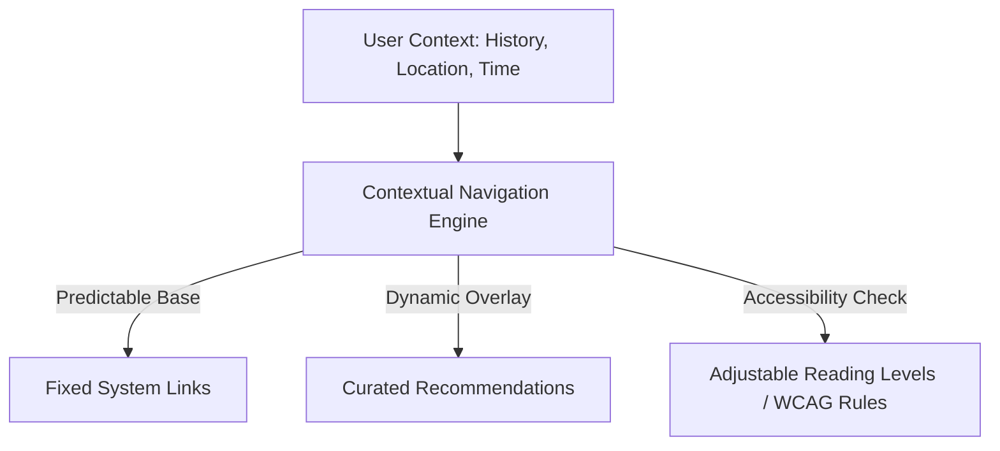

# Enterprise Information Architecture & Navigation Ecosystem
## Master Navigation & Routing Specification (Single Source of Truth)

This document establishes the formal Information Architecture (IA), site hierarchies, routing tables, and navigation structures for the Sanatan Dharma and Indian Civilization platform. It serves as the single source of truth (SSoT) for frontend engineers, backend system architects, CMS managers, search indexing systems, and product designers.

---

## 1. Master Product Map (System Hierarchy)

The platform is organized into three distinct layers: the **Public Layer**, the **Interactive Learner Layer**, and the **Administrative & Scholar Layer**.

```
[System Root]
  ├── Public Layer (Landing, SEO, Core Reference)
  ├── Interactive Learner Layer (Dashboard, AI Guru, Personal Workspace)
  └── Administrative & Scholar Layer (CMS, Review Board, API Portal)
```

### 1.1. Detailed Hierarchical Outline

* **1. Public Layer (Reference & Discovery)**
    * **1.1. Landing Portal (`/`)**
        * 1.1.1. Visual Civilizational Showcase
        * 1.1.2. Knowledge Graph Preview Widget
        * 1.1.3. Global Search Gateway
    * **1.2. The scriptures Index (`/texts`)**
        * 1.2.1. Text Directory (grouped by Shruti/Smriti)
        * 1.2.2. Translation & Commentary Viewer (`/texts/[text-slug]/[chapter]/[verse]`)
        * 1.2.3. Pronunciation Library (`/texts/[text-slug]/audio`)
    * **1.3. Sacred Geography & Temples (`/places`)**
        * 1.3.1. Interactive Geographic Map (`/places/map`)
        * 1.3.2. Temple Directory (`/places/temples`)
        * 1.3.3. Pilgrimage Circuit Guides (`/places/circuits`)
    * **1.4. Historical Timelines (`/timeline`)**
        * 1.4.1. Dynastic Genealogies (`/timeline/dynasties`)
        * 1.4.2. Archaeological Excavation Reports (`/timeline/archaeology`)
        * 1.4.3. Astronomical Epoch Mapping (`/timeline/astronomical`)
    * **1.5. Philosophical Schools (`/darshanas`)**
        * 1.5.1. Astika/Nastika School Matrix
        * 1.5.2. Concept Glossary (`/darshanas/concepts`)
        * 1.5.3. Debates & Dialectics Log (`/darshanas/debates`)
    * **1.6. Festivals & Panchanga (`/festivals`)**
        * 1.6.1. Lunar/Solar Calendar (`/festivals/calendar`)
        * 1.6.2. Ritual Instruction Library (`/festivals/rituals`)
* **2. Interactive Learner Layer (Authenticated)**
    * **2.1. Learner Dashboard (`/dashboard`)**
        * 2.1.1. Streak & Consistency Tracker (Abhyasa Index)
        * 2.1.2. Active Learning Paths (`/dashboard/paths`)
        * 2.1.3. Today's Sutra (Micro-learning queue)
    * **2.2. Personal Knowledge Workspace (`/workspace`)**
        * 2.2.1. Notebook & Highlights (`/workspace/notes`)
        * 2.2.2. Custom Concept Collections (`/workspace/collections`)
        * 2.2.3. Svadhyaya Reflection Portfolio (`/workspace/reflections`)
        * 2.2.4. Export & Synced Integrations (`/workspace/exports`)
    * **2.3. AI Acharya Interface (`/guru`)**
        * 2.3.1. Active Socratic Conversations (`/guru/sessions`)
        * 2.3.2. Query History & Context Storage
    * **2.4. Knowledge Universe Explorer (`/explorer`)**
        * 2.4.1. 2D/3D Network Graph Canvas (`/explorer/graph`)
        * 2.4.2. Guru-Shishya Parampara Visualizer (`/explorer/lineage`)
        * 2.4.3. Civilizational Journey Player (`/explorer/journeys`)
    * **2.5. Revision & Quiz Center (`/practice`)**
        * 2.5.1. Spaced Repetition Cards Deck (`/practice/cards`)
        * 2.5.2. Formative Quiz Portal (`/practice/quizzes`)
        * 2.5.3. Mock Debates Simulator (`/practice/debates`)
* **3. Administrative & Scholar Layer (Governance)**
    * **3.1. CMS Editor (`/cms`)**
        * 3.1.1. Rich Markdown Content Composer (`/cms/editor`)
        * 3.1.2. Knowledge Graph Relationship Linker (`/cms/graph-manager`)
        * 3.1.3. Translation & Localization Matrix (`/cms/translations`)
    * **3.2. Scholarly Review Portal (`/board`)**
        * 3.2.1. Citation Audit Console (`/board/citations`)
        * 3.2.2. Peer Review Queue (`/board/reviews`)
        * 3.2.3. Dispute Resolution Matrix (`/board/disputes`)
    * **3.3. System Console (`/admin`)**
        * 3.3.1. API Gateway Console (`/admin/api`)
        * 3.3.2. Navigation Analytics Dashboard (`/admin/analytics`)
        * 3.3.3. System Logs & Audit Trails (`/admin/logs`)

---

## 2. Global Navigation System & Universal Command Center

To maintain navigation stability across millions of records, the platform divides interactive elements into clear spatial planes.

```
+-------------------------------------------------------------------+
|  [Logo]   [Explore]   [Universal Command: Cmd+K]   [Profile] [Nav]  | (Primary Header)
+-------------------------------------------------------------------+
|  ◄ Back  /  Texts  /  Bhagavad Gita  /  Chapter 1  /  Verse 1     | (Breadcrumbs)
+-------------------------------------------------------------------+
|                                                                   |
|                       Main Content Area                           |
|                                                                   |
+-------------------------------------------------------------------+
|   [Dashboard]    [Search]    [Universe Explorer]    [Workspace]   | (Mobile Tab Bar)
+-------------------------------------------------------------------+
```

### 2.1. Navigational Channels
* **Primary Navigation Header (Desktop)**: Always present. Contains:
  - Brand identity / Home link
  - Core directory link (dropdown mapping Scriptures, Temples, Timelines, Philosophies)
  - **Universal Command Center (Search Field)**
  - Active Streak Counter (Muted visual marker)
  - User Workspace Profile node
* **Mobile Navigation (Bottom Tab Bar)**: Fixed to viewport bottom on screens $\le 768$ px wide:
  1. `Home` (`/dashboard` or `/` based on auth state)
  2. `Search` (Launches Universal Command Overlay)
  3. `Explorer` (`/explorer`)
  4. `Workspace` (`/workspace`)
* **Contextual Navigation (Left Sidebar - Desktop)**: Dynamically rendered based on active subdomain.
  - *Within `/texts`*: Renders table of contents, chapters list, and translation toggles.
  - *Within `/places`*: Renders maps, structural sections, and historical dynasties of the region.

### 2.2. The Universal Command Center (Cmd+K Palette)
A central interaction hub accessible via keyboard shortcuts (`Cmd+K` or `Ctrl+K`), voice activation, or mobile swipe-down gestures.

```
+-------------------------------------------------------------------+
|  Search concepts, texts, places, or ask the AI Acharya...         |
+-------------------------------------------------------------------+
|  SUGGESTED ACTIONS                                                |
|  > Resume "Journey of Upanishads" (82% Complete)                  |
|  > Ask AI Acharya: "What is the meaning of Satya?"                |
|  > Open Daily Study Deck (5 cards due)                            |
|                                                                   |
|  RECENT PAGES                                                     |
|  /texts/bhagavad-gita/chapter-2/verse-47                          |
|  /places/varanasi/kashi-vishwanath-temple                         |
+-------------------------------------------------------------------+
```

* **Keyboard Shortcut System**:
  - `Cmd+K` / `Ctrl+K`: Open Command Center.
  - `↑` / `↓`: Navigate list items.
  - `Enter`: Select action/destination.
  - `/`: Immediately focus input search text.
  - `Esc`: Close Command Center.
  - `?`: Open shortcut dictionary.
* **Commands Execution Schema**:
  - Typing `> study`: Opens `/practice/cards`.
  - Typing `> gps`: Activates Pilgrimage Mode.
  - Typing `? [natural query]`: Submits search query directly to AI Acharya conversation view.

---

## 3. Contextual Navigation Intelligence

The navigation layout adapts to user behaviors, local time, and current geolocations, while preserving predictability.



### 3.1. Adaptation Rules Engine

To prevent disorientation, **80% of the navigation layout remains static**, while a dedicated **20% dynamic context section** adapts based on the following rules:

* **Rule 1: Temporal Context (Panchanga Alignment)**
  - *Trigger*: Local date matches a major festival (e.g., Maha Shivaratri).
  - *Action*: The dashboard and Universal Command Center inject a high-priority navigation shortcut: `[Explore Shivaratri: Rituals, Texts, & Shiva Temples]`.
* **Rule 2: Geographic Proximity (Pilgrimage Mode)**
  - *Trigger*: User is located within 5 km of a registered historical temple node (via GPS permissions).
  - *Action*: Prompts the user to activate Pilgrimage Mode, rendering an offline-first spatial map of the temple complex (`/places/[temple-slug]/pilgrimage`).
* **Rule 3: User Knowledge Level**
  - *Trigger*: User has completed basic paths (Level 1) on a topic.
  - *Action*: In-context links in text change destination from Level 1 explanation pages to Level 2 (Shakha) and Level 3 (Mula) primary sources.
* **Rule 4: Device Context**
  - *Trigger*: Access via Voice Assistant (e.g., Apple CarPlay or Home Pod).
  - *Action*: Disables dense text rendering; redirects navigation tree to Audio-first streams (`/texts/[slug]/audio`).

### 3.2. Transparency & User Controls
* **Implicit Personalization Toggle**: Users can toggle off personalized recommendations in their profile settings.
* **Context Disclosure Badge**: When a dynamic navigation item is surfaced, it includes a small indicator explaining the suggestion (e.g., *"Surfaced because you completed Vedanta Level 1"* or *"Surfaced due to proximity to Kalady"*).

---

## 4. Civilization Journey Maps (Spatial-Temporal Paths)

Journeys serve as curated, narrative-driven pathways that connect multi-disciplinary nodes (Texts, Geography, Timelines, and AI dialogues) into a single cohesive exploration sequence.

```
       [Historical Inception] ──► [Geographic Migration] ──► [Textual Compilation]
                │                          │                         │
                ▼                          ▼                         ▼
         (Battle of Kings)          (Sarasvati Basin)         (Rigveda Samhita)
```

### 4.1. Core Journey Map Specifications

#### 1. Journey of Ramayana
* **Path Pattern**: Geographic migration combined with text chronology.
* **Nodes Sequence**:
  1. *Ayodhya* (Location) $\rightarrow$ *Valmiki Ramayana* (Scripture)
  2. *Chitrakoot* (Location) $\rightarrow$ *Concept of Aranya* (Concept)
  3. *Dandakaranya* (Location) $\rightarrow$ *Ramayana Inscriptions* (Artifacts)
  4. *Rameswaram* (Location) $\rightarrow$ *Temple Architecture* (Temple)
  5. *Sri Lanka Sites* (Locations) $\rightarrow$ *Epic Conclusion*
* **Navigation Overlay**: Renders a permanent geographic progress tracker at the bottom of the screen, mapping the route coordinates as the user progresses through the texts.

#### 2. Journey of Indian Mathematics
* **Path Pattern**: Timeline sequence tracing mathematical theorems.
* **Nodes Sequence**:
  1. *Shulba Sutras* (Scripture) $\rightarrow$ *Geometric Yajna Altars* (Concepts)
  2. *Aryabhatas* (Person) $\rightarrow$ *Aryabhatiya* (Scripture) $\rightarrow$ *Kusumapura/Patna* (Location)
  3. *Brahmagupta* (Person) $\rightarrow$ *Brahmasphutasiddhanta* (Scripture) $\rightarrow$ *Zero Concept* (Concept)
  4. *Bhaskara II* (Person) $\rightarrow$ *Lilavati* (Scripture)
  5. *Kerala School of Astronomy and Mathematics* (Institution) $\rightarrow$ *Madhava of Sangamagrama* (Person)

---

## 5. Knowledge Universe Explorer (Visual Navigation Engine)

The Knowledge Universe Explorer replaces traditional directory trees with an interactive visual canvas, allowing users to zoom in and navigate the Knowledge Graph.

```
        (Rigveda) ───[commentary]───► (Sayana Bhashya)
            │
       [contains]
            │
            ▼
    (Gayatri Mantra) ───[deity]───► (Savitr)
```

### 5.1. Visualization Modes

1. **The Web (Graph View)**:
   - Interactive 2D/3D physics-directed node-link layout.
   - Node sizes scale based on PageRank centrality (frequency of citations in other texts).
   - Edges are color-coded by relationship type (e.g., red for `criticizes`, green for `supports`, blue for `written_by`).
2. **The Flow (Chronological Timeline)**:
   - Scales horizontally from ancient epochs (Puranic astronomical calculations) to modern historical documentation.
   - Allows users to overlay dynastic reigns parallel to the Lifespans of scholars and dates of text compilations.
3. **The Earth (Geographical Map)**:
   - An interactive, layered geospatial map using coordinates defined in the metadata model.
   - Filters allow rendering of "Temple Networks by Century", "Rivers Mentioned in Rigveda", or "Path of Adi Shankara's Digvijaya".
4. **The Tree (Lineage View)**:
   - Custom hierarchical trees mapping *Guru-Shishya Paramparas* and royal dynasty successions. Tapping a node displays their main compositions and geographical center.

### 5.2. Structural Simplification for Beginners
* **Dynamic Node Hiding (Clustering)**: The graph groups related nodes into high-level thematic clusters (e.g., grouping 108 Upanishad nodes under a single "Upanishad Cluster" bubble). Double-tapping the cluster expands it.
* **Predefined Guided Camera Fly-throughs**: Beginners can select a button (e.g., *"Fly through Shaiva Siddhanta Lineage"*) where the camera moves automatically across the nodes, presenting Level 1 summaries in a sidebar.

---

## 6. Personal Knowledge Workspace (Svadhyaya)

The Personal Knowledge Workspace is the private database of the learner, integrated into the platform's public architecture.

```
       [Highlighted Scripture Passage]
                     │
                     ▼ (Linked by User)
       [Personal Concept Note: "My Daily Satya Practice"]
                     │
                     ▼ (Export Target)
       [PDF / Markdown Document / Notion Sync]
```

### 6.1. Workspace Information Schema
* **Highlights Database**: Tracks text ranges highlighted within `/texts` pages. Stores:
  - `source_entity_id` (UUID of the Scripture node)
  - `text_range` (start_offset, end_offset)
  - `user_note_association` (optional linked note ID)
  - `timestamp`
* **Custom Learning Paths Creator**: A drag-and-drop dashboard allowing users to build a sequence of nodes (e.g., compiling a reading list of 5 specific verses and 2 temples to share with a study group).
* **Reflection Journal (Svadhyaya Portfolio)**: A text database encrypting user reflections on philosophical concepts. Entries are tag-linked to core concepts, allowing the system to surface historical commentary nodes when a user views their journal history.

---

## 7. Cross-Knowledge & Interdisciplinary Navigation

To prevent the compartmentalization of knowledge, the system enforces **Cross-Subdomain Bridges** (horizontal navigation links).

```
                      [Scripture: Surya Siddhanta]
                                   │
                                   ├─(Science)───────► [Concept: Heliocentrism]
                                   ├─(Architecture)──► [Temple: Konark Sun Temple]
                                   └─(Geography)─────► [Location: Ujjain Meridian]
```

### Cross-Linking Navigation Schema
Whenever a user is on an entity page, the interface renders a persistent **Interdisciplinary Bridge Panel**:

* **If on a Scripture page**: Show its geographical origin (Location), historical patrons who funded its transcription (Dynasty), and scientific parameters discussed within the text (e.g., astronomical observations).
* **If on a Temple page**: Show the texts that mention it (Scripture), the deities worshipped inside (Deity), the architectural rules of its structure (Architecture), and the local flora used in its rituals (Flora).
* **If on a Concept page**: Show its historical origin (Era), the philosophers who debated it (People), and its practical application in modern mental health/ethics (Modern Relevance).

---

## 8. Deep Search Experience & Intent Routing

The search interface acts as the primary gateway, directing users to the appropriate navigation subdomains based on query parameters.

```
                   [User Input: "Temples near Varanasi"]
                                    │
                                    ▼ (Vector Parse)
                      [Intent: Spatial_Proximity]
                                    │
                         ┌──────────┴──────────┐
                         ▼                     ▼
             (Coordinates Lookup)      (Faceted Filters)
                         │                     │
                         └──────────┬──────────┘
                                    ▼
                [Map View Rendering: Temples within 50km]
```

### 8.1. Faceted & Advanced Search Filters
* **Faceted Navigation Sidebar**: Accessible on search result pages:
  - *Domain Filters*: Scriptures, Temples, Persons, Concepts, Events.
  - *Language Filters*: Sanskrit, Tamil, English, Hindi, etc.
  - *Epistemic Quality Tiers*: Verified Scripture, Historical Consensus, Oral Tradition.
  - *Difficulty Level*: Beginner, Standard, Advanced.
* **Context-Aware Predictive Search**:
  - As a user types, the dropdown categorizes predictions:
    - *Go to Text*: "Ashtadhyayi" $\rightarrow$ `/texts/ashtadhyayi`
    - *Go to Place*: "Kashi" $\rightarrow$ `/places/varanasi`
    - *Ask AI*: "Why did Adi Shankara travel?" $\rightarrow$ Launches Socratic conversation.

### 8.2. Zero-Result Recovery Protocols
If a search query yields zero results:
* **Step 1: Spelling Normalization (IAST/Devanagari Fuzzy Matching)**: Checks if the search query is a phonetic variation of a Sanskrit word (e.g., matching "Rig Veda", "Rgveda", and "Rgc Veda" to "Rigveda").
* **Step 2: Broadening Scope Recommendations**: Surfaces the nearest parent categories in the taxonomy tree.
* **Step 3: Hand-off to AI Acharya**: Displays an action box: *"We couldn't find a direct document matching your query. Would you like to ask the AI Acharya to search historical contexts for this topic?"*

---

## 9. Content Hierarchy & Progressive Disclosure Rules

To prevent cognitive overload, pages follow a strict layout structure that systematically unfolds complexity based on user action.

```
+-------------------------------------------------------------+
| LEVEL 1: THE SEED (Bija)                                    |
| Simple overview summary, key visualization, audio player.   |
+-------------------------------------------------------------+
| [Button: Deepen Knowledge]                                  | (User Trigger)
+-------------------------------------------------------------+
| LEVEL 2: THE BRANCH (Shakha)                                |
| Historical maps, text translation, comparative views.       |
+-------------------------------------------------------------+
| [Button: View Scholarly Roots]                              | (User Trigger)
+-------------------------------------------------------------+
| LEVEL 3: THE ROOT (Mula)                                    |
| Sanskrit Grammatical parsing, variant analysis, citations.  |
+-------------------------------------------------------------+
```

### Content Layout Ordering Schema

1. **Header Block**: Title, Alternate Names (Devanagari, IAST), Quick Summary, Epistemic Tier Badge.
2. **Visual Representation Widget**: Chronological timeline marker, geographical location map, or family tree/lineage snippet.
3. **Core Explanation (Level 1 - Seed)**:
   - Muted, brief conceptual paragraphs.
   - Primary Audio player (recitation or summary).
4. **Comparative & Relational Grid (Level 2 - Branch)**:
   - Primary translation split-screens.
   - Dynamic links to related concepts and journeys.
5. **Scholarly & Grammatical Analysis (Level 3 - Root)**:
   - Lexical breakdown of Sanskrit roots.
   - Critical apparatus showing manuscript variations and scholarly disputes.
   - Bibliography containing DOIs, epigraphical catalog codes, and traditional lineage credentials.

---

## 10. AI Integration Points & Contextual Overlays

The AI Acharya is integrated contextually within the information architecture, acting as a guide rather than a separate chat module.

### 10.1. Reading Overlay (The Inline Acharya)
* While reading a scripture or article, the user can highlight any sentence or paragraph.
* An inline menu appears: `[Ask Acharya to: Explain | Unpack Sanskrit Grammar | Show Debates | Add to Notes]`.
* The response opens in a sliding side drawer, preserving the user's reading position on the main screen.

### 10.2. Interactive Map & Timeline Overlay
* When viewing a historical map or timeline, an AI exploration panel appears: *"I can trace migrations or events over these coordinates. Ask me: 'Who crossed these mountains in the 4th century BCE?'"*

---

## 11. Multi-Device Information Architecture

The navigation model adapts layouts for different device profiles while maintaining mental model consistency.

| Device Type | Primary Navigation Mechanics | Screen/Viewport Strategy | Offline Capability |
| :--- | :--- | :--- | :--- |
| **Desktop** | Dual-axis header; Left-hand contextual sidebar; Cmd+K Command Palette. | Split-pane layouts; Interactive 3D graphics on main canvas. | Cached database sync. |
| **Tablet** | Collapsible left drawer; Header command icon; Swipe gestures. | Multi-column layouts; Focus mode reading layouts. | High capability; complete offline course downloads. |
| **Mobile** | 4-tab bottom navigation bar; Search-first portal; Bottom sheet menus. | Single column; Progressive disclosure via bottom sheets. | Pilgrimage-mode active (GPS and lightweight text). |
| **Voice Interface** | Conversational prompt-response; Voice commands ("Next verse"). | Interactive auditory tree; Audio subtitle scroll on linked screens. | Stream cached files only. |
| **AR Glasses** | Spatial gaze tracking; Air gestures; Audio voice commands. | Holographic metadata overlays mapped to real-world coordinates. | Real-time coordinate sync. |
| **VR / Spatial** | 360-degree immersive dome navigation; Virtual spatial graph. | Spherical canvas layouts; Virtual classroom spaces. | Pre-downloaded environments. |
| **Smart TV** | D-Pad remote navigation; Voice search button. | Visual maps, documentary playback, large-text reading cards. | No offline capability. |
| **Car Display** | Large touch targets; Voice-first commands. | Minimal map coordinates; Audio-first chanting/lectures. | Cache-only local storage. |
| **Wearables** | Scroll wheel; Haptic responses. | Complications; Streak count; Chanting pace calculator. | Muted synchronization. |

---

## 12. CMS Information Architecture & Editorial Workflow

The back-office interface governs content creation, ontology linking, and academic verification.

```
  [Author drafts content] ──► [AI Syntax & Citation check] ──► [Peer Review Queue]
                                                                        │
                                                                        ▼
   [Production Graph Sync] ◄── [Audit Log Stamp] ◄── [Editorial Board Approval]
```

### 12.1. CMS Navigation Subdomains
* **Content Editor (`/cms/editor`)**: WYSIWYG editor optimized for bilingual Sanskrit-English input. Automatically prompts the author for IAST input when Sanskrit text is entered.
* **Knowledge Graph Relationship Canvas (`/cms/graph-manager`)**: A visual node editor where editors draw lines between entities to establish semantic links (e.g., connecting a new temple to a dynasty).
* **Citation & Source Manager (`/cms/citations`)**: A verified database of sources. Links every text claim to a DOI, manuscript scan page, or epigraphical catalog index.
* **Translation Sync Board (`/cms/translations`)**: Parallel text grid display showing translation status across languages. Highlights outdated segments when a source text is updated.

### 12.2. Validation & Review Pipelines
1. **Automated AI Review Assistant**: Scans draft content for translation consistency, IAST formatting accuracy, and broken internal graph linkages.
2. **Scholarly Audit Log (`/board/audit`)**: Unalterable database registry logging who verified the citations, which manuscripts were referenced, and the consensus weight of the entry.

---

## 13. Technical & Structural Standards

### 13.1. Clean URL Architecture & Route Naming
The routing schema uses language-neutral semantic paths with localized subfolders. It enforces lowercase, hyphenated slugs:

* **Scripture Verse Route**: `/texts/[text-slug]/[chapter-slug]/[verse-slug]`
  - *Example*: `/texts/bhagavad-gita/chapter-1/verse-1`
* **Temple Route**: `/places/temples/[temple-slug]`
  - *Example*: `/places/temples/brihadisvara-temple`
* **Philosophical Concept Route**: `/darshanas/concepts/[concept-slug]`
  - *Example*: `/darshanas/concepts/karma`
* **Sanskrit Root Route**: `/linguistics/roots/[root-slug]`
  - *Example*: `/linguistics/roots/kr`
* **Historical Event Route**: `/timeline/events/[event-slug]`
  - *Example*: `/timeline/events/battle-of-ten-kings`

### 13.2. Content Discoverability Score Model (CDS)
To ensure no concept node remains isolated, the CMS computes a **Content Discoverability Score (CDS)** for every node $N$:
$$\text{CDS}(N) = w_1 \times \text{In-Degree}(N) + w_2 \times \text{SemanticSimilarity}(N) + w_3 \times \left(1 - \text{DepthInTaxonomy}(N)\right)$$
Where:
- $\text{In-Degree}(N)$ is the number of incoming links to $N$.
- $\text{SemanticSimilarity}(N)$ represents connection strength to primary search terms.
- **Action Trigger**: If $\text{CDS}(N) < 0.3$, the CMS tags the node as an *Orphan Concept* and alerts editors to link it within appropriate Civilization Journey maps or related articles.

### 13.3. Dual User Views Navigation Modes

#### Guest vs. Registered User
* **Guest User**:
  - Focuses on the Public Layer (`/texts`, `/places`, `/timeline`).
  - Search queries lead directly to reference pages.
  - Interstitial banners encourage profile creation to save notes.
* **Registered User**:
  - Automatically lands on the Learner Dashboard (`/dashboard`).
  - Active recall challenges and personal progress metrics are integrated inline.

#### Child-Safe Navigation Mode
* **Goal**: Visual-first, simplified language, focus on storytelling.
* **Navigation Changes**:
  - Replaces Level 3 (Mula) root structures with interactive animations and storyboards.
  - Filters out philosophical debates on advanced logic, focusing on ethical concepts and stories.
  - Replaces text search with visual concept matching wheels.

#### Research Mode vs. Pilgrimage Mode
* **Research Mode**:
  - Activates multi-column split-pane viewer (`/texts` and `/board/citations` synchronized).
  - Maximizes screen space, disables casual gamification streaks, and surfaces academic journals first.
* **Pilgrimage Mode**:
  - Optimizes for mobile screens, high sunlight visibility (high-contrast themes), and low bandwidth.
  - Surface GPS-guided maps showing physical temple structures and local ritual details.

---

## 14. Future Scalability & Evolutionary Protocols

To scale to 100 million active users and 1 million knowledge articles without performance degradation:

### 14.1. GraphRAG Navigation Architecture
Search and AI mentoring use the **GraphRAG Navigation Protocol**:
1. A search query triggers a parallel traversal of the localized sub-graph surrounding the target concept.
2. The system renders the search result page alongside a visual "Map of Related Ideas" generated dynamically from the retrieved sub-graph.
3. This guarantees that AI-generated search results are linked to physical, verified nodes in the database, eliminating hallucinated URLs.

### 14.2. Open API & Partner Ecosystem Routing
To enable external universities, schools, and digital museums to consume platform data:
* **API Route Structure**: `/api/v1/graphql`
* **JSON-LD Serialization**: All queries return data annotated with standard schema ontologies, allowing partner platforms to ingest the knowledge graph directly into their local search indices.

---
*End of Enterprise Information Architecture & Navigation Ecosystem Document.*
