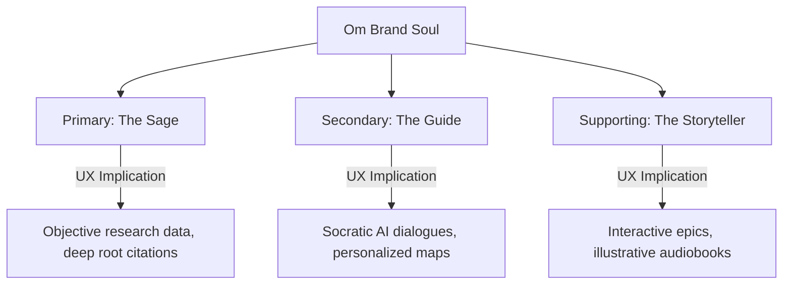
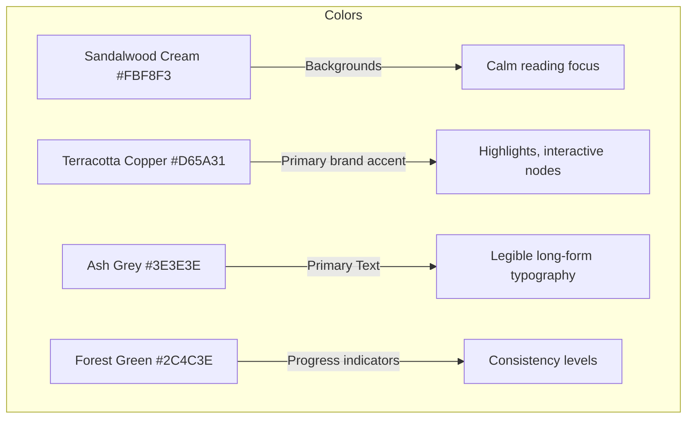

# P06A – Brand Identity & Visual Philosophy
## The Design Constitution of Om (Single Source of Truth)

This constitution defines the brand visual philosophy, emotional design system, interactive tone, and experience DNA of the Om platform. It serves as the immutable structural guide for all UI/UX components, illustrators, backend developers, content creators, and AI agents.

---

## 1. Brand Story

### 1.1. Why Om Exists
In an era dominated by hyper-accelerated information pipelines, humanity has traded deep understanding for distraction, and wisdom for algorithms. Sanatan Dharma and Indian Civilization represent one of the oldest, unbroken lines of human inquiry into the mind, cosmos, science, ethics, and consciousness. However, this knowledge sits fragmented across manuscripts, remote geographic ruins, diverse languages, and academic silos. Om exists to re-synthesize this heritage into a single, unified, and living digital ecosystem.

### 1.2. The Three Civilizational Needs
* **Why Humanity Needs This**: Modernity faces crises of mental wellness, ecological alienation, and ethical fragmentation. The holistic systems of Indian philosophy (Vedanta, Yoga, Ayurveda) offer paths to mental resilience, ecological balance, and cosmic connection (*Vasudhaiva Kutumbakam*).
* **Why India Needs This**: As India develops technologically, it must secure its civilizational anchors. The youth require tools that present their ancestral knowledge with intellectual rigor, devoid of political polarization or outdated dogmatism.
* **Why Future Generations Need This**: To prevent the loss of primary sources, epigraphs, and local oral lineages. Om acts as a digital Noah’s Ark for Indian knowledge systems, preserved with blockchain-level citation tracing and dynamic accessibility.

### 1.3. Purpose Beyond Software
Om is not a commercial enterprise or utility application. It is a civilizational digital monument—a gateway where the human seeker meets the timeless inquiry of the rishis, engineered using the highest standards of computer science and cognitive pedagogy.

---

## 2. Brand Positioning

Om occupies a unique segment, positioning itself at the intersection of academic rigor and deep contemplative spirituality.

```
                  [Spiritual / Experiential]
                             │
                             │
                             │   ● Om Platform
                             │
[Informational/Popular] ─────┼───── [Academic / Rigorous]
                             │
                             │
                             │
                             │
                     [Secular / Flat]
```

### 2.1. What Om Is
* An intelligent, Socratic guide that aids personal study.
* A verified database of civilizational facts, texts, and geographic links.
* A calm, mindful visual sanctuary.

### 2.2. What Om Is Not
* **Not Wikipedia**: We do not present flat, unweighted edits or long unreadable pages.
* **Not Google Search**: We do not index commercial links or raw uncurated search pages.
* **Not Duolingo**: We do not use anxious streaks, game show audio cues, or bright cartoon graphics.
* **Not a Religious Echo Chamber**: We do not promote dogma, sectarian superiority, or unscientific assertions.

### 2.3. Target Audience Positioning
* **Primary**: Seekers, university students, and researchers looking for authentic, structured sources.
* **Secondary**: Families wanting to introduce kids to cultural narratives, and pilgrims seeking deep context for sacred locations.
* **Global**: International users interested in Yoga, Sanskrit, and Eastern philosophy seeking cultural depth over commercialized variants.

---

## 3. Brand DNA

* **Vision**: An enlightened global society connected to the core wisdom of Indian civilization.
* **Mission**: To index, map, translate, and personalize the entirety of Sanatan Dharma knowledge into a unified semantic graph.
* **Core Values**:
  1. *Pramana* (Epistemic Validity): Every claim must map to a primary source or physical artifact.
  2. *Shanti* (Quiet Confidence): The UI must feel peaceful, spacious, and respectful.
  3. *Adhyatma* (Experiential Focus): Knowledge must lead to reflection and personal growth.
  4. *Samanvaya* (Harmonious Synthesis): Respecting and presenting multiple traditional and historical lineages fairly.
* **Brand Promise**: To respect your attention, elevate your intellect, and guide you toward wisdom.

---

## 4. Brand Personality Matrix

The design identity of Om is balanced across seven core attributes:

```
Ancient      [■■■■■□□□□□] Modern
Academic     [■■■■■■□□□□] Spiritual
Emotional    [■■■■□□□□□□] Rational
Minimal      [■■■■■■■□□□] Rich
Formal       [■■■■■□□□□□] Friendly
Traditional  [■■■■■□□□□□] Innovative
Human        [■■■■■■□□□□] Technological
```

### 4.1. Ancient ↔ Modern
* **Position**: Center-balanced (5/10).
* **Rationale**: We display ancient content (manuscripts, historic timelines) using modern, glassmorphic interfaces and responsive vector graphs.

### 4.2. Academic ↔ Spiritual
* **Position**: Moderately Academic (6/10).
* **Rationale**: Every spiritual text or mantra must be presented alongside its linguistic root and historical commentary, anchoring experience in rigorous documentation.

### 4.3. Minimal ↔ Rich
* **Position**: Leaning Minimal (7/10).
* **Rationale**: We use high-fidelity layouts with ample whitespace (visual silence) to prevent cognitive overload.

### 4.4. Traditional ↔ Innovative
* **Position**: Balanced (5/10).
* **Rationale**: We honor traditional lineages while introducing innovative GraphRAG models and geographic spatial engines.

---

## 5. Brand Archetypes

Om integrates three core archetypes to shape its product interactions:



### 5.1. The Sage (Primary - 60%)
* *Core Drive*: Truth, understanding, and objectivity.
* *Expression*: In-depth, primary-source citations (DOIs), neutral writing style, and structured conceptual graphs.

### 5.2. The Guide / Mentor (Secondary - 25%)
* *Core Drive*: Nurturing progress and supporting self-inquiry.
* *Expression*: Dynamic Socratic conversations, daily reflective challenges, and step-by-step Guided Paths (DAG).

### 5.3. The Storyteller (Supporting - 15%)
* *Core Drive*: Capturing imagination and conveying values.
* *Expression*: Rich audio stotra narration, visual timeline maps, and interactive epic decision modules.

---

## 6. Design Philosophy

Every designer and engineer working on Om must adhere to these eight core principles:

1. **Knowledge before Information**: Prioritize structural comprehension over sheer volume of data. Use progressive disclosure to reveal detailed complexity only when requested.
2. **Wisdom before Engagement**: Do not optimize for time spent on the screen. Optimize for time spent in contemplation (*Svadhyaya*). Design friction where needed to encourage offline breaks.
3. **Silence before Noise**: Ensure the screen layout has at least 35% empty space (whitespace). Keep background colors neutral and avoid distracting notifications.
4. **Depth without Intimidation**: Make advanced subjects (Sanskrit grammar, Nyaya logic) approachable to beginners through interactive overlays.
5. **Beauty with Purpose**: Do not use purely decorative ornaments. Visual layout ratios, shapes, and animations must be derived from functional parameters (e.g., sacred proportions).
6. **Technology serving Learning**: AI models and search algorithms must assist the user's active recall rather than passively showing answers.
7. **Respect before Virality**: Avoid gamification mechanisms that exploit user anxiety (e.g., ticking clocks, red alert badges, daily panic warnings).
8. **Design for Contemplation**: Layout structures should draw focus, encouraging the user to read deeply and reflect.

---

## 7. Sacred Design Philosophy

The visual metrics and layout patterns of Om are inspired by the sacred geometry and proportions of classical Indian architecture.

```
       [Sacred Architecture proportions: 1:1, 1:2, 8:9]
                               │
                               ▼
            [Golden Ratio Grid / Modular Scale]
                               │
                               ▼
        [Responsive Digital Grid & Card Layouts]
```

### 7.1. Temple Architecture & Spatial Layouts
* **Garbhagriha (The Sanctuary)**: The central viewport of a scripture or reading card must draw focus. It represents the inner sanctuary of the temple—distraction-free, centered, and structurally protected by ample margin paddings.
* **Mandala Grids**: Card placements and relationship clusters in the explorer view follow concentric symmetry grids (e.g., Vastu Purusha Mandala layouts).

### 7.2. Palm-Leaf Manuscripts
* **Horizontal Proportion**: Reading cards and scriptural verse containers use a horizontal aspect ratio of 3:1, mimicking traditional palm-leaf manuscripts (*Tala-patra*).
* **Side Margins**: Verse pages include subtle vertical border guides on the left and right, framing the text to focus the eyes.

### 7.3. Nature & Rivers
* **Flow Transitions**: Page loads and timeline navigations use smooth, horizontal water-flow animations, reflecting the continuous transmission of oral traditions along India’s major river systems.

---

## 8. Visual Language

Our interface feels lightweight, multi-layered, and clean. It uses **Glassmorphism** to suggest layered depth without causing visual clutter.

```
+-------------------------------------------------------------+
| LAYER 3: Interactive overlay cards / Socratic panel (Glass)  | (z-index: 300)
+-------------------------------------------------------------+
| LAYER 2: Primary reading pane / Maps / Timelines            | (z-index: 200)
+-------------------------------------------------------------+
| LAYER 1: Core cosmic background / Muted gradient canvas     | (z-index: 100)
+-------------------------------------------------------------+
```

### 8.1. Glassmorphism Philosophy
* **Use Case**: Contextual side panels (AI Acharya), translation tooltips, and floating menus.
* **Properties**:
  - Background Blur: `backdrop-filter: blur(12px)`
  - Opacity: `rgba(255, 255, 255, 0.7)` (Light mode) | `rgba(20, 20, 20, 0.7)` (Dark mode)
  - Border: 1px solid semi-transparent line mimicking structural glass frames.

### 8.2. Elevation & Shadowing
* Avoid deep, heavy black shadows.
* Use soft, ambient color diffusion (e.g., deep copper shadow tint at 4% opacity) to elevate cards, giving the impression of floating layers.

---

## 9. Color Philosophy

Om uses earth-toned colors to reduce eye strain and signal tranquility.



### 9.1. Core Semantic Palettes
* **Primary Brand Accent (Terracotta/Tamra - `#D65A31`)**: Represents fire, purification, and the transmission of knowledge. Used for active nodes, primary call-to-actions, and streak indicators.
* **Background Canvas (Sandalwood Cream/Chandana - `#FBF8F3`)**: Neutral, non-glare light-mode background.
* **Primary Text (Ash/Bhasma - `#3E3E3E`)**: High-legibility charcoal tone for long-form reading, avoiding high-contrast pure black.

### 9.2. Contextual Mode Palettes
* **Research Mode (Academic Ink)**: Muted slate blues and clean ivory backgrounds to support long periods of reading.
* **Meditation Mode (Deep Dusk)**: Indigo base tones with soft golden amber accents, signaling quiet reflection.
* **Night Mode**: Charcoal background (`#1A1A1A`) with warm ivory text (`#E5E5E5`), keeping contrast within comfortable limits.

---

## 10. Typography Philosophy

The reading experience requires typography that handles transliterations (IAST) and Devanagari scripts with equivalent kerning and legibility.

```
       Devanagari:  आदि शङ्कराचार्य (Shobhika Font)
       IAST / Latin: Ādi Śaṅkarācārya (Lora Font)
       Sanskrit Root: Parse: √कृ (kr̥)
```

### 10.1. Font Pairings
* **Devanagari Script**: Use **Shobhika** or **Yatra One** for headings, and **Siddhanta** or **Federo** for body text. Shobhika is optimized for complex ligatures and phonetic markings.
* **English & Transliterated Latin (IAST)**: Use **Outfit** or **Inter** for user interface elements, and **Lora** or **Merriweather** for scripture reading and commentary text.

### 10.2. Text Hierarchy & Scale
```
Display 1 (Epic Headings)   : 48px / Line Height: 1.2 / Outfit Bold
Heading 2 (Chapter Titles)  : 32px / Line Height: 1.3 / Outfit SemiBold
Body Text (Commentary)      : 18px / Line Height: 1.6 / Lora Regular
Verse Text (Sanskrit Core)  : 22px / Line Height: 1.5 / Shobhika Medium
```

---

## 11. Logo Philosophy

Om's brand mark is designed to represent core concepts of Indian civilization rather than a simple visual identifier.

### 11.1. Symbolic Meaning
* **The Curve of Pranava**: A stylized, minimalist depiction of the *Aum* syllable, representing the primordial sound of creation.
* **The Axis (Meru)**: The intersection of lines forms a central vertical axis, symbolizing intellectual clarity and alignment.
* **The Infinity Loop**: An underlying design grid based on the Möbius strip, representing the cycle of time (Samsara) and eternity.

### 11.2. Evolution Protocol
* The logo must scale down to $16 \times 16$ px without losing clarity.
* It must adapt in color to match active themes (e.g., terracotta in standard mode, amber in meditation mode).

---

## 12. Iconography System

Our icons are lightweight, open-stroke, and visually balanced.

```
      [Functional Icon: 24x24 px / 1.5px stroke weight / Open terminals]
```

### 12.1. Icon Classes
* **Functional Icons**: Simple UI controls (Back, Close, Settings, Search, Edit) using a standard 1.5px stroke weight.
* **Sacred Icons**: Minimalist outline symbols (Lotus, Temple Tower/Shikhara, Yajna Pit, Palm Leaf) used for subdomain navigation.
* **Linguistic/Grammar Icons**: Special symbols (e.g., `√` for Sanskrit roots, character linkage hooks) used in the parsing view.

---

## 13. Illustration Philosophy

Illustrations on Om serve an educational, non-decorative purpose.

```
           Line Art (80%) ──► Technical & Architectural Schematics
           Modern Editorial (15%) ──► Historical Biographies
           Manuscript Styles (5%) ──► Primary Source Contexts
```

* **Ancient Manuscript Style**: Fine ink-line borders, parchment textures, and traditional regional art styles (e.g., Kangra or Chola style) used to illustrate narrative events (Story Mode).
* **Technical Drawings**: Temple layout schematics using clean, architectural orthographic drawings, detailing the exact measurements and layout divisions.

---

## 14. Photography & AI Imagery

### 14.1. Photography Standards
* **Authenticity**: Temples and archaeological ruins must be photographed using natural, un-stylized lighting. Avoid high-saturation filters.
* **Respect**: Artifact photography must include clean, museum-grade backgrounds with precise scale indicators.

### 14.2. AI Generation Ethics
* **Zero Hallucination Policy**: AI generation cannot be used to recreate historical events or archaeological structures where no physical record exists.
* **Illustrative Contexts**: AI may only be used to generate concept backgrounds for meditation or abstract philosophical ideas. These must be tagged clearly: `[AI-Generated Concept Art]`.

---

## 15. Motion Philosophy

Motion in Om simulates the rhythmic pacing of breath (*Pranayama*).

```
   Page Entry Transition ──► 600ms Horizontal Ease-In-Out (Sarasvati Flow)
   Micro-interactions ─────► 150ms Scale Up (Soft bounce)
   Contemplation Pause ────► 4000ms Loop Animation (Breathing Circle)
```

### 15.1. Animation Rules
* **The River Flow**: Large screen transitions use a horizontal sliding transition with a timing curve of `cubic-bezier(0.25, 1, 0.5, 1)` over 600ms, evoking a sense of smooth, continuous flow.
* **Micro-interactions**: Button states and graph node selections react with a scale-up animation of `1.03` over 150ms.
* **Rules for Silence (When NOT to Animate)**:
  - Do not use animations during deep reading or Svadhyaya journaling views.
  - Do not animate scrollbars, footnotes, or search result listings.

---

## 16. Sound Philosophy

Sound design on the platform supports focus and auditory learning.

### 16.1. Acoustic Components
* **The Temple Bell (Sound Confirmation)**: Successfully completing a study path or revision cycle triggers a soft, recorded sound of a traditional bronze temple bell (*Ghanta*), engineered to decay naturally over 3 seconds.
* **Ambient Soundscapes**: Toggling Meditation Mode activates optional background scores of natural environments (running river water, birds at dawn, rain) paired with a classical *Tanpura* drone.
* **Audio Notifications**: Alerts are signaled with a soft, single string pluck of a *Veena*, avoiding sharp electronic pings.

---

## 17. Language & Editorial Voice

Om speaks with clarity, respect, and academic objectivity.

### 17.1. Tone Matrix
* **Academic**: All descriptions must be objective, citing evidence rather than assertion.
* **Warm**: Socratic AI interactions must encourage curiosity rather than correcting users pedantically.
* **Non-Sectarian**: The writing style must present sectarian views (Shaiva, Vaishnava, Shakta) and heterodox views (Buddhist, Jain) with equivalent neutrality.
* **Non-Political**: Om does not comment on modern geopolitical disputes or contemporary debates.

---

## 18. Brand Vocabulary (Linguistic Mapping)

To maintain a consistent mental model, the platform replaces common corporate software jargon with values-aligned terminology:

| Standard Software Term | Platform Term | Conceptual Rationale |
| :--- | :--- | :--- |
| **Dashboard** | **Learning Space (अध्ययन-पीठ)** | Shifts focus from control panels to a dedicated space for learning. |
| **Quiz** | **Knowledge Challenge (ज्ञान-परीक्षा)** | Focuses on testing understanding rather than simple gamification. |
| **Notification** | **Daily Wisdom (नित्य-बोध)** | Elevates alerts to daily highlights. |
| **Streak** | **Consistency (अभ्यास-अनुपात)** | Focuses on regular practice rather than stress-inducing milestones. |
| **User Settings** | **Preferences (संकल्प)** | Represents a conscious choice or path setup. |
| **Favorites / Bookmarks** | **Saved Core (संग्रह)** | A curated collection of wisdom. |
| **AI Chatbox** | **Socratic Acharya (आचार्य)** | Represents an interactive teacher, not a chatbot. |
| **Monetization / Upgrade** | **Support (दक्षिणा)** | Respects the tradition of support for knowledge preservation. |
| **Error Screen** | **Pause (विश्राम)** | Reframes errors as moments to rest. |

---

## 19. Emotional Journey Mapping

Every primary view in the application is engineered to guide the user's emotional state.

```
       [Home Screen] ────────► [Universe Explorer] ────────► [Commentary Page]
             │                         │                         │
             ▼                         ▼                         ▼
        {Curiosity}                {Wonder}                  {Humility}
```

* **Onboarding $\rightarrow$ Curiosity**: The onboarding path uses simple, clear queries to hook interest without overwhelming users with complexity.
* **Graph Explorer $\rightarrow$ Wonder**: Visualizing the sheer scale of the civilizational graph (linking texts, dynasties, and places) sparks wonder.
* **Scripture Page $\rightarrow$ Humility**: Unfolding the layers of translation, root meanings, and historical debates encourages intellectual humility.
* **Revision Dashboard $\rightarrow$ Mastery**: Daily micro-challenges build confidence as retention stats rise.

---

## 20. AI Acharya Identity

The AI Acharya acts as a digital Socratic mentor.

* **Teaching Framework**: The AI uses Socratic questioning to guide user understanding:
  1. Acknowledge user input with warmth and respect.
  2. Identify the core assumptions in the user's statement.
  3. Ask a probing question to guide the user to test those assumptions.
* **Intellectual Honesty**: If the AI cannot find a citation in the knowledge base, it must state: *"The primary text does not address this question directly, but traditional commentators debate it here."*

---

## 21. Accessibility & Universal Design

Om is designed for all segments of humanity.

### 21.1. Universal Design Parameters
* **Senior Citizens**: The UI includes a persistent text scaling slider. Tap targets are at least $48 \times 48$ px with 16px of clear space around them.
* **Low-Bandwidth (Pilgrimage Mode)**: Strips high-resolution assets, serving lightweight text and vector outlines to support use in remote locations.

---

## 22. Cultural Responsibility

We maintain high standards of respect and accuracy when handling cultural heritage.

* **Fair Representation**: Heterodox schools (Carvaka, Buddhist, Jain) are presented alongside orthodox schools (Vedic, Astika) with equal detail.
* **Controversy Handling**: When a historical date is disputed (e.g., date of Adi Shankara), the interface renders a side-by-side **Multi-Chronology comparison chart** showing the traditional lineage dating and the modern academic consensus.

---

## 23. Design Governance & Auditing

* **Review Pipeline**: Every design asset (illustrations, layouts, icons) must pass a visual audit before release.
* **Validation of AI Content**: All AI Acharya conversation logs are sampled and reviewed by human domain experts to correct hallucinations and update the system prompt.

---

## 24. Future Brand Evolution

The design language is engineered to scale across future platforms:

* **5-Year Goal**: Interactive web and mobile apps, and localized offline guides.
* **10-Year Goal**: Open API integrations supporting universities and digital museums worldwide.
* **25-Year Goal**: Immersive AR overlays mapping physical ruins to the Knowledge Graph in real-time.
* **100-Year Goal**: A persistent, community-archived digital library of Indian civilization.

---

## 25. Anti-Patterns (What to Avoid)

Om must **never** implement the following design patterns:

* **No Clickbait**: No sensationalized titles (e.g., *"10 Secrets Sages Kept Hidden"*).
* **No Attention Addiction**: No infinite scrolling, auto-playing media, or notifications designed to pull users back to screens.
* **No Sectarian Bias**: No ranking of philosophical systems, and no claims of sectarian superiority.
* **No Visual Clutter**: No flashing banner ads, or cluttered, confusing card layouts.

---

## 26. Design Tokens Philosophy

Design tokens are centralized design variables that enforce consistency across platforms.

```
       [Sandalwood Cream #FBF8F3] ──► Token: color-background-primary
       [Outlines Border: 12px] ─────► Token: radius-card-standard
       [Spacings: 24px] ────────────► Token: space-layout-medium
```

* **Color Tokens**: Mapped to natural pigments (e.g., `color-brand-tamra` for terracotta).
* **Radius Tokens**: Card corners use a radius of 12px (`radius-card-standard`), representing soft symmetry.
* **Spacing Tokens**: Margins and paddings use a scale based on the Fibonacci sequence (8px, 13px, 21px, 34px), aligning layout spacing with natural proportions.

---

## 27. Inspiration Sources

This Design Constitution draws inspiration from the documentation quality and design standards of leading systems:
* **Apple HIG**: For clean typography, visual focus, and spatial transitions.
* **Material Design**: For light elevations and responsive grids.
* **IBM Carbon**: For structured documentation governance and design tokens.
* **Ancient Indian Manuscripts**: For horizontal card layouts and centered visual focus.

---

## 28. The Brand Manifesto

```
We exist to preserve, organize, and illuminate the civilizational wisdom of 
Sanatan Dharma and the Indian Knowledge System for generations to come. 

We pledge to honor the seeker’s attention, present diverse lineages with 
neutrality, and ground all knowledge in rigorous research and primary sources.

May this platform serve as a bridge between ancient contemplation and modern 
discovery, guiding users from information to wisdom.
```

---
*End of Brand Identity & Design Constitution.*
