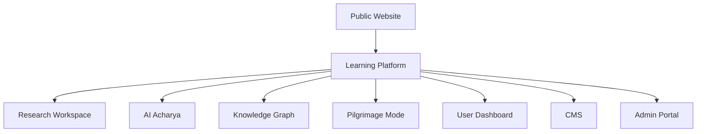

# P07 – UI/UX Blueprint & Experience Architecture
> **Status**: COMPLETE

---

## SECTION 1 — UX Philosophy

| Principle | Description |
|-----------|-------------|
| **Experience Principles** | *Consistency*, *Delight*, *Cultural Resonance*, *Scalability* – every interaction must feel unmistakably Om while being reusable across platforms. |
| **Human‑Centered Design** | Empathic research, persona‑driven workflows, iterative testing with diverse user groups (beginners to scholars). |
| **Calm Technology** | Technology recedes into the background; visual noise is minimized, ambient cues guide the user without interruption. |
| **Knowledge‑First Interactions** | Primary affordances surface knowledge (texts, commentaries, graphs) before tools; every UI element asks *what does the user need to learn?* |
| **Progressive Disclosure** | Advanced features appear only when the user’s knowledge level or learning path unlocks them. |
| **Accessibility‑First** | WCAG 2.2 AA compliance baked into every component; inclusive language, voice‑first pathways, reduced‑motion options. |
| **Learning‑First Philosophy** | Every interaction is a micro‑learning moment – tooltips double as brief teachings, UI states surface contextual insights. |

---

## SECTION 2 — Product Experience Map

* **Public Website** – Landing, marketing, festival highlights, open‑source docs.
* **Learning Platform** – Core learner‑facing flows (paths, flashcards, progress).
* **Research Workspace** – Advanced query, annotation, export tools for scholars.
* **AI Acharya** – Conversational mentor powered by LLMs, contextual citations.
* **Knowledge Graph** – Visual navigation of entities, relationships, timelines.
* **Pilgrimage Mode** – Location‑aware, ritual‑specific journeys (temple maps, festival routes).
* **User Dashboard** – Personalisation, bookmarks, achievements, settings.
* **CMS** – Content creators author scriptures, commentaries, multimedia.
* **Admin Portal** – Governance, user‑role management, analytics.

---

## SECTION 3 — Complete User Personas

| Persona | Primary Goals | Key Traits |
|--------|--------------|------------|
| **Beginner** | Discover basics, simple reading | Low prior knowledge, prefers guided tours |
| **Student** | Structured learning paths, assessments | Goal‑oriented, time‑constrained |
| **Teacher** | Curate curricula, assign tasks | Content author, mentor |
| **Researcher** | Deep semantic search, export data | High expertise, needs citations |
| **Devotee** | Ritual support, daily prayers | Spiritual focus, frequent visits |
| **Pilgrim** | Navigate real‑world temples, festivals | Mobile, location‑aware |
| **Child** | Gamified exploration, short sessions | Visual, audio‑rich, parental controls |
| **Senior Citizen** | Large fonts, voice navigation | Accessibility, low tech comfort |
| **International User** | Multilingual UI, cultural localisation | Language switch, cultural sensitivity |
| **Academic** | Publish annotations, reference management | Collaboration, versioning |
| **Content Editor** | Author scriptures, media assets | Editorial workflow, review cycles |
| **Administrator** | Manage users, monitor usage | Security, analytics |

---

## SECTION 4 — User Journey Maps

### 4.1 First Visit
1. **Landing Page** → Hero carousel → *Festival Spotlight*.
2. CTA **“Explore Knowledge”** → Guided tour start (context‑aware).
3. Optional **Sign‑Up** flow (email, social, SSO).

### 4.2 Onboarding
- **Step 1**: Knowledge level questionnaire (progressive‑disclosure). 
- **Step 2**: Recommended learning path (e.g., *Intro to Vedas*). 
- **Step 3**: Personalized UI theme (light/dark, cultural theme). 
- **Step 4**: Accessibility checklist (font size, voice assistant toggle).

### 4.3 Guest Journey
- Browses **Public Knowledge Explorer**.
- Limited bookmarking (session‑only).
- Prompted to **Create Account** for saving progress.

### 4.4 Registered Journey
- Full access to **Dashboard**, **Bookmarks**, **AI Acharya**.
- Sync across devices via cloud store.

### 4.5 Daily Learning
- Dashboard shows **Daily Insight** (quote, verse, micro‑lesson).
- One‑click **Start Learning Session** → Adaptive flashcards → Progress bar.

### 4.6 Festival Discovery
- **Festival Calendar** highlights active festivals.
- Contextual UI accents (colors, iconography).
- Links to **Pilgrimage Mode** for nearby temples.

### 4.7 Temple Exploration
- Map view with **AR overlay** (future). 
- Click a temple → **Temple Page** with history, rituals, live streaming.

### 4.8 Research Journey
- Open **Research Workspace** → Upload corpus → Semantic search → **Knowledge Graph** exploration → Export citations (APA, MLA).

### 4.9 AI Conversation
- Launch **AI Acharya** → Natural language query → System provides answer with **source citation** and **related learning links**.

### 4.10 Knowledge Graph Exploration
- Node click expands **related concepts**, **timeline**, **map**.
- Breadcrumb trail maintains orientation.

### 4.11 Offline Journey
- **Offline Mode** pre‑caches selected scriptures.
- UI indicates offline status; sync occurs on reconnection.

### 4.12 Returning User
- Dashboard greets with **Progress Recap** and **Next Suggested Step**.
- Persistent **quick‑actions** (continue learning, resume AI chat).

---

## SECTION 5 — Information Flow

| Flow | Description |
|------|-------------|
| **Navigation Hierarchy** | Global Nav → Sidebar (contextual) → Breadcrumbs → Content pages. |
| **Decision Trees** | Adaptive paths based on persona, knowledge level, and current festival. |
| **Search Flows** | Natural language → Semantic ranking → Graph expansion → Facet filters. |
| **Recommendations** | Knowledge‑graph‑based “You may also like” cards, curated by AI Acharya. |
| **Cross‑linking** | Every verse links to commentary, related verses, and map locations. |
| **Knowledge Discovery** | Progressive disclosure surface deeper layers only when user shows intent (e.g., expands a concept). |

---

## SECTION 6 — Complete Screen Inventory

| Screen | Category |
|--------|----------|
| Landing Page | Public Website |
| Home | Public Website |
| Dashboard | Learning Platform |
| Search | All contexts |
| Knowledge Explorer | Learning Platform |
| Scripture Reader | Learning Platform |
| Verse Reader | Learning Platform |
| Translation Viewer | Learning Platform |
| Commentary Viewer | Learning Platform |
| Temple Page | Pilgrimage Mode |
| Person Profile | Knowledge Graph |
| Dynasty Page | Knowledge Graph |
| Timeline | Knowledge Graph |
| Map Explorer | Pilgrimage Mode |
| Knowledge Graph | Knowledge Graph |
| Festival Calendar | Pilgrimage Mode |
| Learning Dashboard | Learning Platform |
| Bookmarks | User Dashboard |
| Collections | User Dashboard |
| Notes | Learning Platform |
| AI Chat | AI Acharya |
| Profile | User Dashboard |
| Settings | User Dashboard |
| Notifications | User Dashboard |
| CMS (Content Editor) | CMS |
| Admin (User Management) | Admin Portal |
| Research Workspace | Research Workspace |
| Offline Mode | All platforms |
| Error Pages | Global |
| Empty States | Global |
| Loading States | Global |
| Success States | Global |

---

## SECTION 7 — Screen‑Level Layout Specifications

> **Template – Example: Scripture Reader**

| Attribute | Details |
|-----------|---------|
| **Purpose** | Read a single verse or passage with contextual tools (translation, commentary, audio). |
| **Content Hierarchy** | 1️⃣ Header (title, navigation)  2️⃣ Verse text (primary)  3️⃣ Translation pane (toggle)  4️⃣ Commentary pane (expandable)  5️⃣ Toolbar (bookmark, share, AI ask) |
| **Primary Actions** | *Bookmark*, *Play Audio*, *Ask AI*. |
| **Secondary Actions** | *Adjust Font Size*, *Switch Theme*, *Export*. |
| **Navigation** | Back breadcrumb → *Scripture → Chapter → Verse*. Global top bar persists. |
| **Desktop Layout** | Two‑column: Verse on left (70 %), toolbar on right (30 %). Sticky header. |
| **Tablet Layout** | Single column; toolbar collapses into bottom sheet. |
| **Mobile Layout** | Full‑width verse; toolbar as floating action button (FAB). |
| **Accessibility** | - Text resizable up to 200 %  - `aria-label` on toolbar buttons  - VoiceOver‑friendly reading order  - High‑contrast mode respects color tokens. |

*The same template is applied to all major screens (Dashboard, Knowledge Graph, Map Explorer, etc.) with content‑specific adjustments.*

---

## SECTION 8 — Navigation Blueprint

| Element | Behaviour |
|---------|----------|
| **Global Navigation** | Persistent top bar with logo, search, profile avatar, dark‑mode toggle. |
| **Sidebar** | Context‑aware (shows relevant sections for the current module). Collapsible on tablet/mobile. |
| **Bottom Navigation** | Mobile‑first: Home, Search, AI, Bookmarks, Settings. |
| **Breadcrumbs** | Dynamic path reflecting hierarchy; clickable for back‑track. |
| **Search** | Expands from top‑right icon; auto‑focus on activation. |
| **Command Palette** | `⌘K` / `Ctrl+K` opens modal with fuzzy search across commands, pages, and AI shortcuts. |
| **Context Menus** | Right‑click / long‑press reveals actions (share, copy, annotate). |
| **Quick Actions** | Floating button on key screens (e.g., “Add Note” on Verse Reader). |
| **Keyboard Navigation** | Arrow keys move focus between cards; `Enter` activates. Global shortcuts list in help modal. |
| **Voice Navigation** | Voice commands (`“Open Bhagavad Gītā”`, “Show next verse”) routed through Speech‑to‑Text → command parser. |

---

## SECTION 9 — Search Experience

1. **Natural Language Search** – Users type questions; LLM rewrites to semantic query.
2. **Semantic Search** – Embedding‑based ranking across verses, commentaries, and research papers.
3. **Knowledge Graph Search** – Entity‑centric results (people, places, concepts).
4. **Filters** – Language, scripture, era, annotation type, difficulty.
5. **Suggestions** – Auto‑complete with popular queries and recent user terms.
6. **Recent Searches** – Persistent list with one‑click re‑run.
7. **Zero‑Result Recovery** – “Did you mean…”, fallback to broader corpus, offer to ask AI Acharya.

---

## SECTION 10 — AI Experience

| Interaction | Flow |
|-------------|------|
| **AI Acharya Launch** | Persistent FAB → modal chat window opens. |
| **Conversation Flows** | User question → LLM generates answer → citation block (link to source) → optional “Explore deeper” cards. |
| **Citation Behavior** | Inline superscript numbers map to a bibliography panel; click opens source preview. |
| **Learning Guidance** | AI suggests next verses, related commentaries, or flashcards based on knowledge gaps. |
| **Research Assistance** | Structured query → graph‑based results → export options (BibTeX, RIS). |
| **Ethical AI Responses** | Content filters for misinformation, tone‑adjusted for cultural sensitivity, user can flag responses. |

---

## SECTION 11 — Learning Experience Flows

- **Learning Paths** – Curated sequences (e.g., *Ramayana Journey*). Progress bar across path.
- **Flashcards** – Swipe‑style cards generated from verses & commentary key points.
- **Revision** – Spaced‑repetition algorithm schedules cards.\n- **Bookmarks** – One‑click save; hierarchical folders.
- **Notes** – Inline rich‑text editor linked to verse; searchable.
- **Reflection** – End‑of‑session prompt: *What did you learn?* stored as journal entry.
- **Achievements** – Badges for milestones (e.g., *Completed 100 verses*).
- **Progress Tracking** – Visual heatmap on dashboard.

---

## SECTION 12 — Knowledge Exploration

| Mode | Navigation |
|------|------------|
| **Graph Exploration** | Node‑click expands relationships; pan/zoom controls; breadcrumb trail. |
| **Timeline Navigation** | Horizontal scroll of eras; clicking an era filters content. |
| **Map Navigation** | Geospatial view of temples, pilgrimage routes; location‑aware suggestions. |
| **Relationship Explorer** | Dual‑pane: selected entity on left, linked entities list on right. |
| **Topic Explorer** | Card grid of topics; dynamic clustering based on user interest. |
| **Related Concepts** | Inline “See also” chips within verses and commentaries. |

---

## SECTION 13 — Responsive Experience

| Device | Adaptation |
|--------|------------|
| **Desktop** | Multi‑column layouts, hover interactions, rich tooltips. |
| **Tablet** | Adaptive grid, touch‑friendly controls, collapsible sidebars. |
| **Mobile** | Single‑column, FABs, swipe gestures, voice entry. |
| **Foldables** | Dual‑screen continuation of map/graph; seamless handoff. |
| **TV** | 4K‑optimized dashboard, remote navigation, voice control. |
| **Watch** | Quick notifications, short meditation prompts, voice‑only interaction. |
| **AR** | Overlay of temple information on real‑world view (future). |
| **VR** | Immersive temple walk‑through, 3‑D knowledge graph. |

---

## SECTION 14 — Accessibility Experience

- **Screen Readers** – Full ARIA labeling, logical reading order, live region updates for dynamic content.
- **Keyboard Only** – All actions reachable via `Tab`/`Enter`; focus visible at all times.
- **Voice Interaction** – Integrated with OS speech recognizers; voice feedback for alerts.
- **Reduced Motion** – Global toggle disables non‑essential transitions.
- **Color Blindness** – Alternative patterns on charts; color palettes pass deuteranopia tests.
- **Senior Mode** – Larger touch targets (44 dp), high‑contrast text, simplified navigation.
- **Child Mode** – Illustrated icons, gamified feedback, parental control restrictions.
- **Offline Mode** – All UI remains usable; cached assets indicate sync status.

---

## SECTION 15 — Micro‑interactions

| Interaction | Description |
|-------------|-------------|
| **Hover** | Subtle elevation, color shift (0.2 s). |
| **Focus** | 4 dp outline using `accent` token; smooth glow transition. |
| **Selection** | Card flips to reveal back content (300 ms). |
| **Transitions** | Page slide (ease‑out‑elastic) for major navigation; fade for modals. |
| **Loading** | Skeleton screens with animated gradient (1.5 s loop). |
| **Feedback** | Toast notifications with icon + concise message. |
| **Success** | Confetti burst (optional reduced‑motion). |
| **Error** | Shake animation (100 ms) + inline error text. |

---

## SECTION 16 — Empty, Loading & Error Experiences

- **Empty State** – Illustrative art, explanatory copy, primary CTA (“Start exploring”).
- **Loading State** – Skeleton UI, progress indicator, optional voice cue (“Loading, please wait”).
- **Error State** – Friendly language, error code, troubleshooting steps, contact support link.
- **Recovery** – Retry button, auto‑refresh after 5 s, fallback to offline cache.

---

## SECTION 17 — UX Metrics

| Metric | Measurement Method |
|--------|--------------------|
| **Task Completion Rate** | Success vs. failure of key flows (onboarding, search, AI query). |
| **Navigation Efficiency** | Average clicks per goal; time to reach target page. |
| **Learning Effectiveness** | Pre‑/post‑quiz scores, spaced‑repetition retention rates. |
| **Retention** | 7‑day & 30‑day active‑user percentages. |
| **Accessibility** | Automated aXe audit scores; manual screen‑reader testing pass rate. |
| **Performance Perception** | First Contentful Paint, Time to Interactive, perceived load via surveys. |

---

## SECTION 18 — Future UX Evolution

- **Museums** – On‑site kiosks with curated exhibitions of Indian heritage.
- **Schools & Universities** – LMS integration, teacher dashboards, assessment tools.
- **AR/VR** – Immersive pilgrimages, 3‑D reconstructions of ancient sites.
- **Voice‑First** – Full‑screen voice UI for hands‑free learning.
- **Wearables** – Haptic reminders for daily chants, micro‑learning nudges.
- **Emerging Interaction Models** – Brain‑computer interfaces, gesture‑only navigation (future research). |

---

## SECTION 19 — UX Governance

1. **Design Reviews** – Bi‑weekly cross‑functional critique (design, engineering, cultural scholars). |
2. **Consistency Audits** – Automated token usage check; style guide linting. |
3. **Accessibility Reviews** – Quarterly WCAG audit, user testing with assistive tech. |
4. **Content Validation** – Scholarly review of scriptures, citations, translations. |
5. **User Testing** – Remote usability sessions for each persona segment; metrics fed back into backlog. |
6. **Change Management** – All UI changes require a **Design Change Request (DCR)** documented in `docs/09_Decisions/`. |

---

## SECTION 20 — UX Blueprint Summary

The **UI/UX Blueprint (P07)** operationalizes the strategic vision (P01), product requirements (P02), knowledge architecture (P03), learning experience (P04), information architecture (P05), and the Design Constitution & System (P06A‑B). It provides a **single source of truth** for every interaction, screen, and workflow across the Om ecosystem. Designers and developers can now translate these specifications directly into implementation‑ready components—ensuring cultural fidelity, accessibility, and learning‑centric excellence throughout the platform.

---

*Prepared by the Om Experience Architecture Team – July 2026*
