# Frontend Architecture Specification
> **Status**: COMPLETE  
> **Document ID**: P08-FE  
> **Version**: 1.0.0  
> **Last Updated**: July 2026  
> **Cross-References**: P01 (Vision), P02 (PRD), P03 (Knowledge Architecture), P04 (Human Learning Experience), P05 (Information Architecture), P06A (Brand Identity), P06B (Design System), P07 (UI/UX Blueprint)

---

## Table of Contents

1. [Frontend Vision](#1-frontend-vision)
2. [Technology Stack](#2-technology-stack)
3. [Folder Structure](#3-folder-structure)
4. [Component Architecture](#4-component-architecture)
5. [Routing Architecture](#5-routing-architecture)
6. [State Management](#6-state-management)
7. [Data Flow](#7-data-flow)
8. [Design Token Integration](#8-design-token-integration)
9. [Localization Architecture](#9-localization-architecture)
10. [Accessibility](#10-accessibility)
11. [Performance Strategy](#11-performance-strategy)
12. [Offline-First Strategy](#12-offline-first-strategy)
13. [Security](#13-security)
14. [Error Handling](#14-error-handling)
15. [Analytics](#15-analytics)
16. [Testing Strategy](#16-testing-strategy)
17. [Build Pipeline](#17-build-pipeline)
18. [Future Scalability](#18-future-scalability)
19. [Anti-Patterns](#19-anti-patterns)
20. [Architecture Summary](#20-architecture-summary)

---

## 1. Frontend Vision

### 1.1 Goals

The Om frontend is not a conventional web application. It is the primary experiential surface for a **civilizational knowledge platform** that must serve 100M+ users (P02 §3), render content in 100+ languages (ROADMAP v1.0.0), and operate seamlessly across nine device categories — from mobile phones in rural India to AR headsets in university laboratories (P05 §11).

The frontend must accomplish the following strategic goals:

| Goal | Description | Traceability |
|------|-------------|--------------|
| **Civilizational Fidelity** | Render Sanskrit, Devanagari, IAST transliterations, and regional scripts with typographic precision. | P03 §1, P06A §4.2 |
| **Socratic Interactivity** | Enable the AI Acharya conversational interface with streaming responses, citation overlays, and contextual inline assistance. | P04 §1.1, P05 §10 |
| **Knowledge Graph Navigation** | Deliver interactive 2D/3D graph visualizations, geographic maps, and chronological timelines as first-class navigation paradigms. | P05 §5, P07 §12 |
| **Progressive Disclosure** | Implement the three-tier content model (Bija → Shakha → Mula) where complexity unfolds based on user action and knowledge level. | P04 §3, P05 §9 |
| **Offline-First Resilience** | Support Pilgrimage Mode with GPS-guided temple maps, downloaded scriptures, and background synchronization in low-connectivity environments. | P01 §3.2, P02 §2 |
| **Ethical Engagement** | Replace addictive UI patterns with grace-streaks, reflection pauses, and contemplation prompts — no infinite scrolling, no dopamine loops. | P04 §1.2, P01 §3.3 |
| **Universal Accessibility** | Achieve WCAG 2.2 AAA compliance across all public interfaces, including screen reader support, high-contrast themes, and voice-first navigation. | P02 §3, P06A §6 |

### 1.2 Principles

Every architectural decision in this document is governed by seven immutable principles. These principles are non-negotiable and override convenience-driven shortcuts.

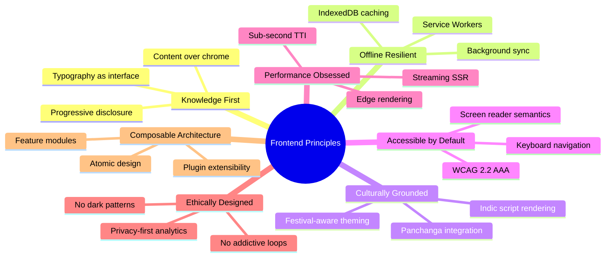

**Principle 1 — Knowledge First**: The frontend exists to surface knowledge, not to showcase technology. Every component, animation, and interaction must answer the question: *does this help the user learn?*

**Principle 2 — Offline Resilient**: Rural India, temple premises, and pilgrimage routes lack reliable connectivity. The architecture treats offline as a first-class state, not an error condition.

**Principle 3 — Culturally Grounded**: The platform renders civilizational content across millennia. The frontend must handle complex scripts (Devanagari, Tamil, Telugu, Grantha), bidirectional text, and festival-aware theming without degradation.

**Principle 4 — Accessible by Default**: Accessibility is not a post-launch audit item. Every component, route, and interaction is designed with assistive technology support from inception.

**Principle 5 — Performance Obsessed**: The platform must serve users on 2G networks and decade-old Android devices. Performance budgets are architectural constraints, not aspirational targets.

**Principle 6 — Ethically Designed**: The Om platform explicitly rejects engagement-maximization patterns. No infinite scroll, no notification spam, no algorithmic rabbit holes. The UI encourages contemplation and offline reflection (P04 §1.1 — Svadhyaya).

**Principle 7 — Composable Architecture**: The system must scale from a monolithic MVP to a distributed micro-frontend ecosystem without rewriting core modules. Feature boundaries are plugin-ready from day one.

### 1.3 Maintainability

| Concern | Strategy |
|---------|----------|
| **Code Ownership** | Feature-based folder structure with clear CODEOWNERS mapping. Each feature module has a designated team. |
| **Documentation** | Every exported function, component, and hook requires TSDoc. Architectural Decision Records (ADRs) live in `docs/09_Decisions/`. |
| **Dependency Governance** | All third-party dependencies require an ADR justifying inclusion. A quarterly dependency audit removes unused packages and updates security-critical ones. |
| **Technical Debt Tracking** | `TODO(om-debt)` comments are indexed by CI. Debt items exceeding 90 days trigger automated tickets. |
| **Code Review Standards** | All PRs require at least two reviewers — one domain expert and one accessibility reviewer for UI changes. |

### 1.4 Scalability

The frontend must scale along three independent axes:

| Axis | Current Target | Future Target | Mechanism |
|------|---------------|---------------|-----------|
| **Content Volume** | 10,000 knowledge articles | 1,000,000+ articles | Virtualized lists, paginated queries, ISR/SSG hybrid rendering |
| **Concurrent Users** | 10,000 | 100,000,000+ | Edge-deployed static assets, CDN-first architecture, streaming SSR |
| **Feature Surface** | 6 core modules | 50+ modules with plugin ecosystem | Feature module isolation, lazy loading, micro-frontend readiness |
| **Language Coverage** | 5 languages | 100+ languages | ICU-based i18n, server-driven translation, regional script font subsetting |
| **Device Coverage** | Web (desktop, mobile) | 9 device categories (P05 §11) | Responsive tokens, adaptive rendering, progressive enhancement |

### 1.5 Performance

Performance budgets are hard constraints enforced by CI. Violations block deployment.

| Metric | Budget | Measurement |
|--------|--------|-------------|
| **Largest Contentful Paint (LCP)** | ≤ 2.5 s on 3G | Lighthouse CI, WebPageTest |
| **First Input Delay (FID)** | ≤ 100 ms | Chrome UX Report |
| **Cumulative Layout Shift (CLS)** | ≤ 0.1 | Lighthouse CI |
| **Time to Interactive (TTI)** | ≤ 3.5 s on 3G | WebPageTest |
| **Total Bundle Size (initial)** | ≤ 150 KB gzipped | Bundle analyzer CI gate |
| **JavaScript Execution Time** | ≤ 350 ms on mid-tier mobile | Chrome DevTools profiling |

### 1.6 Accessibility

Accessibility is a foundational architectural concern, not a cosmetic overlay. The following requirements are non-negotiable:

| Requirement | Standard | Enforcement |
|-------------|----------|-------------|
| **WCAG Compliance Level** | 2.2 AAA for public UI, 2.2 AA minimum for admin UI | Automated aXe audits in CI, quarterly manual audits |
| **Keyboard Navigation** | All interactive elements reachable via Tab/Enter/Arrow keys | E2E keyboard-only test suites |
| **Screen Reader Support** | Full ARIA semantics; logical reading order; live regions for dynamic content | VoiceOver and TalkBack regression tests |
| **Color Contrast** | ≥ 4.5:1 for normal text, ≥ 3:1 for large text and UI components | Automated contrast ratio checks on design tokens |
| **Text Scaling** | Layouts remain functional up to 200% browser zoom | Visual regression tests at 200% zoom |
| **Reduced Motion** | `prefers-reduced-motion` disables all non-essential animations | Media query enforcement in animation utilities |
| **Focus Indicators** | Visible 4 dp outline using `accent` color token on all focusable elements | Automated focus-visible audits |

---

## 2. Technology Stack

Every technology in the Om frontend stack is selected based on explicit architectural rationale. No technology is adopted for novelty. Each selection is justified against the platform's unique requirements.

### 2.1 Core Framework

| Technology | Role | Rationale |
|-----------|------|-----------|
| **Next.js (App Router)** | Application framework | The App Router provides React Server Components, nested layouts, streaming SSR, and route-level code splitting — all critical for the Om platform's content-heavy, multi-layout architecture. Server Components enable zero-JS rendering of scripture text, reducing bundle size for the most common pages. The built-in ISR (Incremental Static Regeneration) supports the platform's 1M+ article target without full rebuilds. |
| **React 19+** | UI library | React's component model, concurrent features (Suspense, Transitions), and ecosystem maturity make it the only viable choice for the platform's complex interactive requirements — 2D/3D graph visualizations, streaming AI chat, and multi-pane scripture readers. |
| **TypeScript (strict mode)** | Type system | The platform's knowledge domain is semantically rich — scripture verses, ontology relationships, geographic coordinates, and temporal data all require compile-time type safety. Strict mode eliminates entire categories of runtime errors. TypeScript also serves as living documentation for the API contract between frontend and backend. |

### 2.2 Styling and Design System

| Technology | Role | Rationale |
|-----------|------|-----------|
| **TailwindCSS** | Utility-first CSS framework | Enables rapid, consistent styling using design tokens as configuration. The `tailwind.config` file consumes `packages/config/tokens.json` (P06B §2), ensuring every utility class maps directly to the Om design token registry. Purging eliminates unused CSS, keeping the stylesheet under 10 KB gzipped. |
| **shadcn/ui** | Component primitives | Unlike traditional component libraries that impose their own design language, shadcn/ui provides unstyled, accessible primitives (built on Radix UI) that are copied into the project and fully owned. This gives the Om team complete control over styling, theming, and behavior — critical for implementing cultural themes (P06B §5) and the festival overlay system. |
| **CSS Custom Properties** | Runtime theming | Design tokens are resolved at runtime via CSS Custom Properties (`--om-color-primary`, etc.), enabling instant theme switching (light/dark/festival) without JavaScript recomputation. This is the mechanism described in P06B §5 for Dynamic Token Resolution. |

### 2.3 Animation and Motion

| Technology | Role | Rationale |
|-----------|------|-----------|
| **Framer Motion** | Declarative animations | The platform requires nuanced motion — page transitions that mirror a "learning journey" (P06A §4.5), card flip reveals for flashcards (P07 §15), skeleton loading states, and celebratory confetti for achievements. Framer Motion's layout animations, `AnimatePresence` for exit animations, and `useReducedMotion` hook directly support the platform's accessibility-first motion requirements. |

### 2.4 Data Management

| Technology | Role | Rationale |
|-----------|------|-----------|
| **TanStack Query (React Query)** | Server state management | The Om platform is fundamentally server-data-driven — scriptures, knowledge graph nodes, AI responses, and user progress all originate from backend APIs. TanStack Query provides automatic caching, background refetching, optimistic updates, infinite scroll pagination, and offline persistence — precisely the data-fetching semantics required for a content platform with offline-first requirements. |
| **Zustand** | Client state management | Global client state (active theme, sidebar visibility, command palette state, user preferences) is lightweight and ephemeral. Zustand's minimal API, lack of boilerplate, and compatibility with React Server Components (no Provider wrapping required) make it ideal. It avoids the overhead of Redux for state that is genuinely client-only. |
| **React Hook Form** | Form management | The CMS editor (P05 §12), user profile settings, search filters, and scholarly review forms all require complex validation, multi-step workflows, and high-performance re-rendering. React Hook Form's uncontrolled component approach minimizes re-renders, while its integration with Zod provides schema-based validation. |
| **Zod** | Schema validation | Zod provides runtime type validation that mirrors TypeScript types. It validates API responses at the network boundary, form inputs at the interaction boundary, and URL parameters at the routing boundary. This triple-layer validation prevents malformed data from propagating into the application state. |

### 2.5 Content and Rendering

| Technology | Role | Rationale |
|-----------|------|-----------|
| **MDX** | Rich content authoring | The CMS (P05 §12) produces bilingual Sanskrit-English content with embedded interactive components — pronunciation players, inline knowledge graph widgets, and translation toggles. MDX enables this by allowing React components within Markdown, while the Markdown base ensures content portability and version control. |
| **Mermaid** | Diagram rendering | Civilization Journey Maps (P05 §4), Guru-Shishya lineage trees, and philosophical debate flows are defined as structured data and rendered as interactive diagrams. Mermaid provides declarative diagramming that can be authored in the CMS and rendered on the client without custom visualization code for standard diagram types. |

### 2.6 Visualization and Mapping

| Technology | Role | Rationale |
|-----------|------|-----------|
| **Recharts** | Data visualization | Learning analytics dashboards (streak heatmaps, progress charts, quiz performance), admin analytics (P05 §3.3.2), and Content Discoverability Score visualizations (P05 §13.2) require composable, accessible chart components. Recharts builds on D3 primitives with a React-native API, ensuring charts participate in the component lifecycle and accessibility tree. |
| **MapLibre GL JS** | Geospatial mapping | Sacred Geography (P02 §1, P05 §1.3) is a core pillar. MapLibre provides high-performance WebGL-based vector tile rendering, offline tile caching (critical for Pilgrimage Mode), custom layer support for temple overlays, and freedom from proprietary API lock-in. It replaces Leaflet where WebGL performance is required while maintaining Leaflet as a lightweight fallback for low-end devices. |
| **Leaflet** | Lightweight map fallback | For devices that lack WebGL support or operate under extreme bandwidth constraints, Leaflet provides a raster-tile-based fallback with a smaller JavaScript footprint. The map abstraction layer switches between MapLibre and Leaflet based on device capability detection. |

### 2.7 Technology Stack Dependency Map

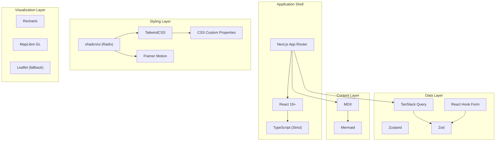

---

## 3. Folder Structure

The Om frontend follows a **feature-first** folder architecture within the Next.js App Router convention. Every directory has a single, clearly defined responsibility. This structure supports both the current monolithic deployment and future migration to federated micro-frontends.

### 3.1 Complete Folder Hierarchy

```
apps/web/
├── app/                          # Next.js App Router (routes and layouts)
│   ├── (public)/                 # Public route group (unauthenticated)
│   │   ├── layout.tsx
│   │   ├── page.tsx              # Landing page
│   │   ├── texts/                # Scripture Reader
│   │   ├── places/               # Sacred Geography
│   │   ├── timeline/             # Historical Timelines
│   │   ├── darshanas/            # Philosophical Schools
│   │   ├── festivals/            # Festivals & Panchanga
│   │   └── search/               # Global search results
│   ├── (authenticated)/          # Authenticated route group
│   │   ├── layout.tsx
│   │   ├── dashboard/            # Learner Dashboard
│   │   ├── workspace/            # Personal Knowledge Workspace
│   │   ├── guru/                 # AI Acharya Interface
│   │   ├── explorer/             # Knowledge Universe Explorer
│   │   ├── practice/             # Revision & Quiz Center
│   │   └── profile/              # User Profile & Settings
│   ├── (admin)/                  # Administrative route group
│   │   ├── layout.tsx
│   │   ├── cms/                  # CMS Editor
│   │   ├── board/                # Scholarly Review Portal
│   │   └── admin/                # System Console
│   ├── api/                      # API route handlers (BFF layer)
│   ├── layout.tsx                # Root layout (providers, fonts, metadata)
│   ├── not-found.tsx             # Global 404
│   ├── error.tsx                 # Global error boundary
│   ├── loading.tsx               # Global loading state
│   └── globals.css               # Global styles and CSS Custom Properties
│
├── components/                   # Shared UI components (Atomic Design)
│   ├── atoms/                    # Indivisible UI primitives
│   │   ├── button/
│   │   ├── icon/
│   │   ├── badge/
│   │   ├── avatar/
│   │   ├── tooltip/
│   │   ├── skeleton/
│   │   └── input/
│   ├── molecules/                # Composite components
│   │   ├── search-bar/
│   │   ├── navigation-item/
│   │   ├── card/
│   │   ├── verse-display/
│   │   ├── breadcrumb/
│   │   └── toast/
│   ├── organisms/                # Complex, self-contained sections
│   │   ├── header/
│   │   ├── sidebar/
│   │   ├── command-palette/
│   │   ├── scripture-reader/
│   │   ├── knowledge-graph/
│   │   ├── map-explorer/
│   │   ├── ai-chat-panel/
│   │   └── footer/
│   ├── templates/                # Page-level layout compositions
│   │   ├── public-template/
│   │   ├── dashboard-template/
│   │   ├── reader-template/
│   │   ├── explorer-template/
│   │   └── admin-template/
│   └── ui/                       # shadcn/ui primitives (auto-generated)
│       ├── dialog.tsx
│       ├── dropdown-menu.tsx
│       ├── popover.tsx
│       ├── tabs.tsx
│       └── ...
│
├── features/                     # Feature modules (domain logic)
│   ├── texts/                    # Scripture Reader feature
│   │   ├── components/           # Feature-specific components
│   │   ├── hooks/                # Feature-specific hooks
│   │   ├── services/             # Feature-specific API calls
│   │   ├── stores/               # Feature-specific state
│   │   ├── types/                # Feature-specific types
│   │   └── utils/                # Feature-specific utilities
│   ├── places/                   # Sacred Geography feature
│   ├── timeline/                 # Historical Timelines feature
│   ├── darshanas/                # Philosophical Schools feature
│   ├── festivals/                # Festivals & Panchanga feature
│   ├── dashboard/                # Learner Dashboard feature
│   ├── workspace/                # Personal Workspace feature
│   ├── guru/                     # AI Acharya feature
│   ├── explorer/                 # Knowledge Universe Explorer feature
│   ├── practice/                 # Revision & Quiz Center feature
│   ├── search/                   # Universal Search feature
│   ├── cms/                      # CMS feature
│   ├── board/                    # Scholarly Review feature
│   └── admin/                    # System Administration feature
│
├── hooks/                        # Shared custom hooks
│   ├── use-debounce.ts
│   ├── use-intersection-observer.ts
│   ├── use-media-query.ts
│   ├── use-keyboard-shortcut.ts
│   ├── use-offline-status.ts
│   ├── use-reduced-motion.ts
│   ├── use-locale.ts
│   └── use-theme.ts
│
├── lib/                          # Core library code
│   ├── api-client.ts             # Typed HTTP client wrapper
│   ├── query-client.ts           # TanStack Query configuration
│   ├── auth.ts                   # Authentication utilities
│   ├── analytics.ts              # Analytics abstraction
│   ├── i18n.ts                   # Internationalization setup
│   ├── fonts.ts                  # Font loading configuration
│   └── logger.ts                 # Structured logging
│
├── services/                     # API service layer (backend communication)
│   ├── graph.service.ts          # Knowledge Graph API
│   ├── texts.service.ts          # Scripture API
│   ├── places.service.ts         # Geography API
│   ├── ai.service.ts             # AI Acharya API
│   ├── search.service.ts         # Search API
│   ├── auth.service.ts           # Authentication API
│   ├── user.service.ts           # User profile API
│   └── analytics.service.ts      # Analytics API
│
├── providers/                    # React context providers
│   ├── theme-provider.tsx        # Light/dark/festival theme
│   ├── auth-provider.tsx         # Session and auth state
│   ├── locale-provider.tsx       # Language and script direction
│   ├── offline-provider.tsx      # Offline status and sync
│   ├── analytics-provider.tsx    # Analytics consent and tracking
│   └── query-provider.tsx        # TanStack Query provider
│
├── layouts/                      # Reusable layout compositions
│   ├── root-layout.tsx           # Global shell (header, footer, providers)
│   ├── public-layout.tsx         # Public pages layout
│   ├── authenticated-layout.tsx  # Authenticated pages layout
│   ├── reader-layout.tsx         # Split-pane scripture reading layout
│   ├── explorer-layout.tsx       # Graph/map exploration layout
│   └── admin-layout.tsx          # Administrative panel layout
│
├── styles/                       # Global styles and theme definitions
│   ├── tokens.css                # CSS Custom Properties from design tokens
│   ├── typography.css            # Indic script font-face declarations
│   ├── animations.css            # Shared keyframe definitions
│   ├── themes/
│   │   ├── light.css
│   │   ├── dark.css
│   │   └── festivals/            # Festival-specific theme overrides
│   │       ├── diwali.css
│   │       ├── holi.css
│   │       ├── navaratri.css
│   │       └── shivaratri.css
│   └── print.css                 # Print-specific styles
│
├── types/                        # Shared TypeScript type definitions
│   ├── api.types.ts              # API response/request shapes
│   ├── graph.types.ts            # Knowledge Graph entity types
│   ├── text.types.ts             # Scripture and verse types
│   ├── geo.types.ts              # Geographic coordinate types
│   ├── user.types.ts             # User and session types
│   ├── ai.types.ts               # AI Acharya conversation types
│   └── common.types.ts           # Shared utility types
│
├── constants/                    # Application-wide constants
│   ├── routes.ts                 # Route path constants
│   ├── query-keys.ts             # TanStack Query key factory
│   ├── keyboard-shortcuts.ts     # Global keyboard shortcut registry
│   ├── breakpoints.ts            # Responsive breakpoint values
│   ├── api-endpoints.ts          # Backend API endpoint URLs
│   └── feature-flags.ts         # Feature flag definitions
│
├── utils/                        # Pure utility functions
│   ├── formatting.ts             # Date, number, and text formatting
│   ├── transliteration.ts        # IAST/Devanagari conversion
│   ├── slug.ts                   # URL slug generation
│   ├── validation.ts             # Shared Zod schemas
│   ├── accessibility.ts          # ARIA attribute helpers
│   └── cn.ts                     # Tailwind class merging utility
│
├── config/                       # Build and runtime configuration
│   ├── site.config.ts            # Site metadata, SEO defaults
│   ├── navigation.config.ts      # Navigation menu structure
│   ├── feature-flags.config.ts   # Feature flag provider config
│   └── sentry.config.ts          # Error monitoring configuration
│
├── public/                       # Static assets (served as-is)
│   ├── fonts/                    # Self-hosted web fonts
│   ├── icons/                    # Favicon and app icons
│   ├── manifest.json             # PWA manifest
│   └── sw.js                     # Service Worker entry point
│
├── middleware.ts                 # Next.js middleware (auth, locale, redirects)
├── next.config.ts                # Next.js configuration
├── tailwind.config.ts            # TailwindCSS configuration (consumes tokens)
├── tsconfig.json                 # TypeScript configuration
├── .eslintrc.json                # ESLint configuration
├── .prettierrc                   # Prettier configuration
└── vitest.config.ts              # Vitest test runner configuration
```

### 3.2 Folder Responsibility Matrix

| Folder | Responsibility | Depends On | Depended Upon By |
|--------|---------------|------------|------------------|
| `app/` | Route definitions, page-level data fetching, layout nesting. Contains **no business logic**. | `features/`, `components/`, `layouts/` | Nothing (entry point) |
| `components/` | Shared, reusable UI components organized by Atomic Design tier. **Domain-agnostic.** | `hooks/`, `utils/`, `types/`, `styles/` | `app/`, `features/` |
| `features/` | Domain-specific logic, components, hooks, and services. Each feature is a **self-contained module** with internal layering. | `components/`, `hooks/`, `lib/`, `services/`, `types/` | `app/` |
| `hooks/` | Shared custom React hooks. **Stateless logic extraction.** | `lib/`, `utils/` | `components/`, `features/` |
| `lib/` | Core infrastructure code — API clients, query configuration, authentication. **Singleton instances.** | `config/`, `utils/` | `services/`, `hooks/`, `features/` |
| `services/` | API communication layer. Each service maps to a backend microservice. **Pure data fetching.** | `lib/`, `types/`, `utils/` | `features/` |
| `providers/` | React context providers for cross-cutting concerns. **Compose in root layout.** | `lib/`, `hooks/`, `stores/` | `app/` (root layout) |
| `layouts/` | Reusable layout compositions (header + sidebar + content area arrangements). | `components/` | `app/` |
| `styles/` | Global CSS, theme definitions, and font declarations. **No component-specific styles.** | `packages/config/tokens.json` | `components/`, `app/` |
| `types/` | Shared TypeScript interfaces and type aliases. **No runtime code.** | Nothing | Everything |
| `constants/` | Application-wide immutable values. **No logic, no imports from other app code.** | Nothing | Everything |
| `utils/` | Pure, stateless utility functions. **No React imports, no side effects.** | `types/` | Everything |
| `config/` | Build-time and runtime configuration objects. | `constants/` | `lib/`, `providers/` |

### 3.3 Import Boundary Rules

To prevent circular dependencies and maintain clean architectural layers, the following import rules are enforced by ESLint:

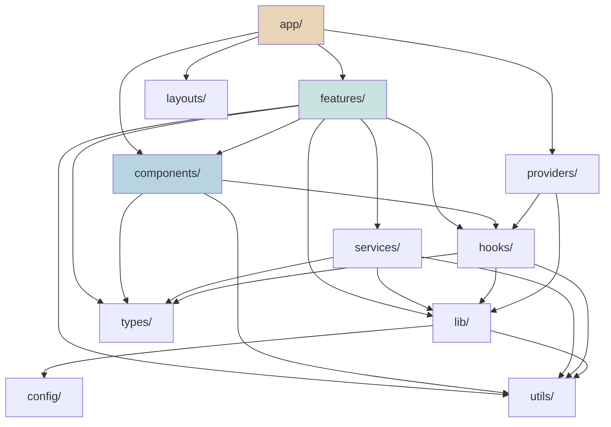

**Critical Rule**: `components/` must NEVER import from `features/`. Components are domain-agnostic. Feature-specific UI lives inside `features/[feature]/components/`.

**Critical Rule**: `utils/` and `constants/` must NEVER import from any other application folder. They are leaf nodes in the dependency graph.

**Critical Rule**: `services/` must NEVER import from `components/` or `features/`. The data layer is independent of the presentation layer.

---

## 4. Component Architecture

### 4.1 Atomic Design Methodology

The Om component library follows Brad Frost's Atomic Design methodology, adapted for the platform's civilizational knowledge domain. This provides a shared vocabulary across design and engineering teams and enforces compositional discipline.

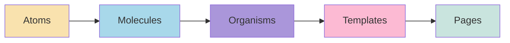

### 4.2 Tier Definitions

#### Atoms

The smallest indivisible UI primitives. Atoms have no domain knowledge and no internal state beyond what is passed via props.

| Atom | Purpose | Design Token Consumption |
|------|---------|--------------------------|
| **Button** | Primary, secondary, tonal, ghost, and icon-only variants. Loading state. | `color.primary`, `borderRadius.md`, `spacing.sm` |
| **Icon** | SVG icon wrapper with `currentColor` inheritance. Cultural icon set. | `color.neutral` |
| **Badge** | Epistemic tier indicators (Verified, Consensus, Oral Tradition). | `color.accent`, `typography.caption` |
| **Avatar** | User profile image or initials fallback. | `borderRadius.pill`, `spacing.sm` |
| **Tooltip** | Contextual help on hover/focus. Learning-first: tooltips double as micro-teachings. | `elevation.shadow2`, `color.neutral` |
| **Skeleton** | Loading placeholder with animated gradient (P07 §15). | `color.neutral.gray-100`, `animation` |
| **Input** | Text, search, and number inputs with label association. | `borderRadius.sm`, `typography.body` |
| **Tag** | Language labels, difficulty levels, domain filters. | `color.secondary`, `borderRadius.pill` |

#### Molecules

Compositions of two or more atoms that form a functional unit. Molecules may hold minimal internal state for interaction management.

| Molecule | Composition | Purpose |
|----------|-------------|---------|
| **SearchBar** | Input + Icon + Button | Universal Command Center input field (P05 §2.2) |
| **NavigationItem** | Icon + Text + Badge | Sidebar and header navigation entries |
| **VerseDisplay** | Text (Sanskrit) + Text (Translation) + Badge (Tier) | Single verse rendering with transliteration |
| **Card** | Image + Title + Description + Tag | Content preview cards for scriptures, temples, concepts |
| **Breadcrumb** | NavigationItem + Separator (chain) | Hierarchical path display (P05 §2) |
| **Toast** | Icon + Text + Button (dismiss) | Transient notification messages |
| **StreakCounter** | Icon + Number + ProgressBar | Abhyasa Index display (P05 §2.1.1) |
| **AudioPlayer** | Button (play/pause) + ProgressBar + Text (duration) | Pronunciation and chanting playback |

#### Organisms

Complex, self-contained sections that combine molecules and atoms to deliver complete functional blocks. Organisms may manage significant internal state and perform data fetching.

| Organism | Responsibility | Key Interactions |
|----------|---------------|------------------|
| **Header** | Primary navigation, logo, search trigger, user avatar, streak counter. | Cmd+K activation, mobile menu toggle |
| **Sidebar** | Context-aware navigation panel (P05 §2.1). Dynamic content based on active route. | Collapse/expand, scroll-to-section |
| **CommandPalette** | Universal Command Center overlay (P05 §2.2). Fuzzy search, recent pages, AI shortcuts. | Keyboard-driven navigation, intent routing |
| **ScriptureReader** | Paginated scripture viewing with inline annotations, translation toggles, audio playback (P06B §4.2). | Word-by-word parsing, commentary expansion, highlight-to-note |
| **KnowledgeGraph** | Force-directed 2D/3D node-link visualization (P05 §5). | Zoom, pan, node click expansion, cluster collapse |
| **MapExplorer** | Geospatial temple and pilgrimage map (P05 §5.1.3). | Layer toggles, GPS location, offline tile rendering |
| **AIChatPanel** | Streaming AI Acharya conversation interface (P05 §10). | Message streaming, citation expansion, context carry-over |
| **ProgressDashboard** | Learning analytics: streak heatmap, path progress, quiz scores (P07 §11). | Date range filtering, export |

#### Templates

Page-level layout compositions that define the spatial arrangement of organisms without injecting content data. Templates are the structural contracts between routes and organisms.

| Template | Layout Structure | Used By |
|----------|-----------------|---------|
| **PublicTemplate** | Header + Hero/Content Area + Footer | Landing, festival pages, public reference |
| **DashboardTemplate** | Header + Sidebar (collapsible) + Main Content + Right Panel (optional) | Dashboard, workspace, practice |
| **ReaderTemplate** | Header + Left Sidebar (ToC) + Center (verse/text) + Right Panel (commentary/AI) | Scripture reader, darshanas, concept pages |
| **ExplorerTemplate** | Header + Full-Canvas (graph/map/timeline) + Bottom Sheet (mobile) | Knowledge graph, map explorer, timeline |
| **AdminTemplate** | Header + Left Navigation + Main Content + Breadcrumb Bar | CMS, review board, system console |

#### Pages

Pages are the thinnest layer. They compose templates with data-fetching logic (via Server Components) and pass resolved data to organisms. Pages contain **no styling logic and no business logic**.

### 4.3 Reuse Strategy

| Strategy | Description |
|----------|-------------|
| **Composition over Inheritance** | Components are composed via children and render props, never via class inheritance. |
| **Slot Pattern** | Templates expose named slots (header, sidebar, content, panel) for page-level customization. |
| **Variant Pattern** | Atoms and molecules expose a `variant` prop for visual variations (e.g., `Button variant="primary"`) rather than creating separate components. |
| **Feature Component Promotion** | When a feature-specific component is needed by three or more features, it is promoted to `components/` via a formal review process. |
| **Headless Logic Extraction** | Interactive behaviors (keyboard navigation, focus management, drag-and-drop) are extracted into custom hooks, separating logic from presentation. |

---

## 5. Routing Architecture

The Om routing architecture implements the three-layer product hierarchy defined in P05 §1 — Public Layer, Interactive Learner Layer, and Administrative Layer — using Next.js App Router route groups.

### 5.1 Route Group Architecture

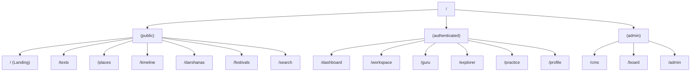

### 5.2 Complete Route Table

#### Public Routes (Unauthenticated)

These routes are accessible without login. They are SSG/ISR rendered for maximum SEO and performance.

| Route | Purpose | Rendering | Reference |
|-------|---------|-----------|-----------|
| `/` | Landing portal — civilizational showcase, knowledge graph preview, search gateway | SSG | P05 §1.1 |
| `/texts` | Scripture index — grouped by Shruti/Smriti | ISR | P05 §1.2 |
| `/texts/[text-slug]` | Individual scripture overview | ISR | P05 §1.2 |
| `/texts/[text-slug]/[chapter]` | Chapter listing within a scripture | ISR | P05 §1.2 |
| `/texts/[text-slug]/[chapter]/[verse]` | Individual verse with translation and commentary | ISR | P05 §13.1 |
| `/texts/[text-slug]/audio` | Pronunciation library for a scripture | ISR | P05 §1.2.3 |
| `/places` | Sacred Geography landing — map and temple directory | SSG | P05 §1.3 |
| `/places/map` | Interactive geographic map | CSR (heavy WebGL) | P05 §1.3.1 |
| `/places/temples` | Temple directory | ISR | P05 §1.3.2 |
| `/places/temples/[temple-slug]` | Individual temple page | ISR | P05 §13.1 |
| `/places/circuits` | Pilgrimage circuit guides | ISR | P05 §1.3.3 |
| `/places/[temple-slug]/pilgrimage` | Pilgrimage Mode for a specific temple | CSR (GPS) | P05 §3.1 Rule 2 |
| `/timeline` | Historical timelines landing | SSG | P05 §1.4 |
| `/timeline/dynasties` | Dynastic genealogies | ISR | P05 §1.4.1 |
| `/timeline/archaeology` | Archaeological excavation reports | ISR | P05 §1.4.2 |
| `/timeline/astronomical` | Astronomical epoch mapping | ISR | P05 §1.4.3 |
| `/timeline/events/[event-slug]` | Individual historical event | ISR | P05 §13.1 |
| `/darshanas` | Philosophical Schools landing — Astika/Nastika matrix | SSG | P05 §1.5 |
| `/darshanas/concepts` | Concept glossary | ISR | P05 §1.5.2 |
| `/darshanas/concepts/[concept-slug]` | Individual concept page | ISR | P05 §13.1 |
| `/darshanas/debates` | Debates and dialectics log | ISR | P05 §1.5.3 |
| `/festivals` | Festivals and Panchanga landing | SSG | P05 §1.6 |
| `/festivals/calendar` | Lunar/Solar calendar view | CSR (dynamic dates) | P05 §1.6.1 |
| `/festivals/rituals` | Ritual instruction library | ISR | P05 §1.6.2 |
| `/search` | Global search results page | SSR (dynamic) | P05 §8 |
| `/linguistics/roots/[root-slug]` | Sanskrit root analysis | ISR | P05 §13.1 |

#### Authenticated Routes (Learning Layer)

These routes require authentication. They use SSR with session validation.

| Route | Purpose | Rendering | Reference |
|-------|---------|-----------|-----------|
| `/dashboard` | Learner dashboard — streak, active paths, daily sutra | SSR | P05 §2.1 |
| `/dashboard/paths` | Active learning paths | SSR | P05 §2.1.2 |
| `/workspace` | Personal Knowledge Workspace landing | SSR | P05 §2.2 |
| `/workspace/notes` | Notebook and highlights | SSR | P05 §2.2.1 |
| `/workspace/collections` | Custom concept collections | SSR | P05 §2.2.2 |
| `/workspace/reflections` | Svadhyaya reflection portfolio | SSR | P05 §2.2.3 |
| `/workspace/exports` | Export and sync integrations | SSR | P05 §2.2.4 |
| `/guru` | AI Acharya landing | SSR | P05 §2.3 |
| `/guru/sessions` | Active Socratic conversations | SSR | P05 §2.3.1 |
| `/guru/sessions/[session-id]` | Individual AI conversation | CSR (streaming) | P05 §2.3 |
| `/explorer` | Knowledge Universe Explorer landing | SSR | P05 §2.4 |
| `/explorer/graph` | 2D/3D network graph canvas | CSR (heavy WebGL) | P05 §2.4.1 |
| `/explorer/lineage` | Guru-Shishya Parampara visualizer | CSR | P05 §2.4.2 |
| `/explorer/journeys` | Civilizational journey player | CSR | P05 §2.4.3 |
| `/practice` | Revision and quiz center landing | SSR | P05 §2.5 |
| `/practice/cards` | Spaced repetition cards deck | CSR (interactive) | P05 §2.5.1 |
| `/practice/quizzes` | Formative quiz portal | SSR | P05 §2.5.2 |
| `/practice/debates` | Mock debates simulator | CSR | P05 §2.5.3 |
| `/profile` | User profile and settings | SSR | P07 §6 |

#### Administrative Routes (Governance Layer)

These routes require elevated permissions. They use SSR with role-based access control.

| Route | Purpose | Rendering | Reference |
|-------|---------|-----------|-----------|
| `/cms` | CMS landing | SSR | P05 §3.1 |
| `/cms/editor` | Rich markdown content composer | CSR (editor) | P05 §3.1.1 |
| `/cms/graph-manager` | Knowledge Graph relationship linker | CSR (canvas) | P05 §3.1.2 |
| `/cms/translations` | Translation and localization matrix | SSR | P05 §3.1.3 |
| `/cms/citations` | Citation and source manager | SSR | P05 §12.1 |
| `/board` | Scholarly review portal landing | SSR | P05 §3.2 |
| `/board/citations` | Citation audit console | SSR | P05 §3.2.1 |
| `/board/reviews` | Peer review queue | SSR | P05 §3.2.2 |
| `/board/disputes` | Dispute resolution matrix | SSR | P05 §3.2.3 |
| `/board/audit` | Scholarly audit log | SSR | P05 §12.2 |
| `/admin` | System console landing | SSR | P05 §3.3 |
| `/admin/api` | API gateway console | SSR | P05 §3.3.1 |
| `/admin/analytics` | Navigation analytics dashboard | SSR | P05 §3.3.2 |
| `/admin/logs` | System logs and audit trails | SSR | P05 §3.3.3 |

### 5.3 Route Grouping Strategy

| Group | Layout | Auth Requirement | Middleware | SEO |
|-------|--------|-----------------|------------|-----|
| `(public)` | PublicTemplate — Header + Content + Footer | None | Locale detection, bot detection | Full — SSG/ISR with sitemap generation |
| `(authenticated)` | DashboardTemplate — Header + Sidebar + Content | Session token required | Auth validation, session refresh | Partial — authenticated pages are noindex |
| `(admin)` | AdminTemplate — Header + Admin Nav + Content | Role-based (editor/reviewer/admin) | Auth + RBAC validation | None — noindex, nofollow |

### 5.4 Middleware Pipeline

The Next.js middleware processes every request through a sequential pipeline:

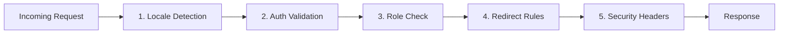

| Step | Responsibility |
|------|---------------|
| **Locale Detection** | Reads `Accept-Language` header and cookies. Sets `x-locale` header. Redirects to localized path if configured. |
| **Auth Validation** | For `(authenticated)` and `(admin)` groups, validates session token. Redirects to `/login` if expired. |
| **Role Check** | For `(admin)` group, verifies user role against route requirements. Returns 403 if insufficient permissions. |
| **Redirect Rules** | Handles legacy URL redirects, trailing slash normalization, and canonical URL enforcement. |
| **Security Headers** | Injects CSP, X-Frame-Options, X-Content-Type-Options, and Referrer-Policy headers. |

---

## 6. State Management

The Om frontend separates state into five distinct categories, each managed by a purpose-built mechanism. This prevents the "single global store" anti-pattern that plagues complex applications.

### 6.1 State Category Architecture

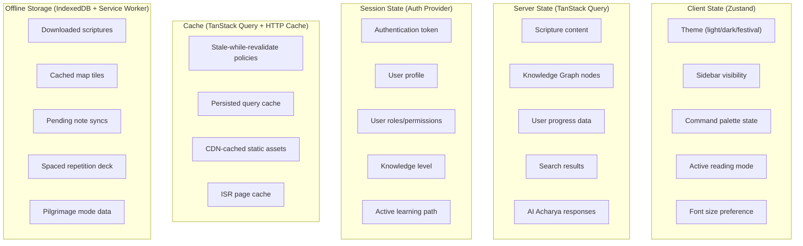

### 6.2 State Responsibility Matrix

| State Category | Manager | Persistence | Scope | Examples |
|---------------|---------|-------------|-------|---------|
| **Global Client State** | Zustand | `localStorage` (selective) | Application-wide, ephemeral preferences | Active theme, sidebar open/closed, command palette visibility, reading mode (Research/Pilgrimage), font size |
| **Server State** | TanStack Query | In-memory cache with optional `localStorage` persistence | Per-query, automatic lifecycle | Scripture verses, graph nodes, search results, user progress, AI conversations |
| **Session State** | Auth Provider (React Context) | `httpOnly` cookie (token) + React Context (profile) | Per-session, server-validated | JWT token, user profile, roles, knowledge level, active persona |
| **Cache** | TanStack Query + HTTP Cache-Control + CDN | In-memory + HTTP cache + Edge cache | Per-resource, TTL-governed | API responses (5 min stale time), static pages (ISR revalidation), font files (1 year) |
| **Offline Storage** | IndexedDB (via `idb` wrapper) + Cache API (Service Worker) | Device-local, persistent | Per-device, user-initiated | Downloaded lesson packs, offline map tiles, queued workspace notes, spaced repetition card state |

### 6.3 State Isolation Rules

| Rule | Description |
|------|-------------|
| **No Server State in Zustand** | All data originating from the backend flows exclusively through TanStack Query. Zustand stores must never cache API responses. |
| **No Client State in URL** | Ephemeral UI state (modals, tooltips, sidebar) must not appear in the URL. Only navigational state is URL-encoded. |
| **URL as Source of Truth for Navigation** | The current route, search parameters, and filter state are always derivable from the URL. Deep links must reproduce exact application state. |
| **Session State is Server-Authoritative** | The frontend never trusts client-side session state for authorization decisions. Role checks happen in middleware and are re-validated on the server. |
| **Offline State Syncs Unidirectionally** | Offline mutations queue in IndexedDB and sync to the server on reconnection. Conflicts are resolved server-side with last-write-wins or manual merge prompts. |

---

## 7. Data Flow

### 7.1 Data Flow Architecture

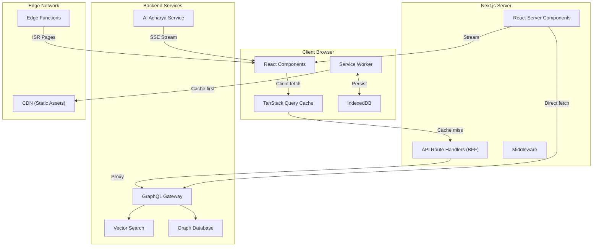

### 7.2 Data Fetching Patterns

| Pattern | When Used | Mechanism | Example |
|---------|----------|-----------|---------|
| **Server Component Fetch** | Static or semi-static content that benefits from zero client JS | `fetch()` in Server Components with `revalidate` interval | Scripture verse pages, temple pages, concept pages |
| **Client Query (TanStack)** | Dynamic, user-specific, or interactive data | `useQuery()` / `useSuspenseQuery()` with cache configuration | User dashboard, search results, AI conversation history |
| **Streaming SSR** | Long-loading pages with independent data sections | React Suspense boundaries with streaming response | Dashboard (streak loads fast, recommendations stream later) |
| **Prefetching** | Predictable next-page navigation | `queryClient.prefetchQuery()` on hover/focus of navigation links | Prefetch next verse when reading current verse |
| **Optimistic Updates** | Immediate UI feedback for mutations | `useMutation()` with `onMutate` callback | Bookmarking a verse, adding a note, toggling a flashcard |
| **Infinite Scroll** | Paginated content lists | `useInfiniteQuery()` with intersection observer trigger | Search results, temple directory, dynasty listings |
| **Real-time Streaming** | AI Acharya responses | Server-Sent Events (SSE) consumed via `EventSource` or `fetch` with `ReadableStream` | AI conversation, live collaboration (future) |

### 7.3 Caching Strategy

| Resource | Cache Location | Stale Time | Revalidation | Eviction |
|----------|---------------|------------|--------------|----------|
| **Scripture Verses** | TanStack Query + ISR | 24 hours | On-demand ISR trigger from CMS | LRU (least recently used) |
| **Knowledge Graph Nodes** | TanStack Query | 15 minutes | Background refetch on window focus | Size-limited (500 entries) |
| **Search Results** | TanStack Query (no persist) | 0 (always fresh) | Every request | Immediate on new query |
| **User Progress** | TanStack Query + localStorage | 5 minutes | Background refetch | Session-scoped |
| **AI Conversations** | TanStack Query + IndexedDB | Indefinite (user data) | Manual refresh | User-initiated deletion |
| **Map Tiles** | Service Worker Cache API | 30 days | Cache-first, network-update | Storage quota management |
| **Static Assets (fonts, icons)** | HTTP Cache + CDN | 1 year | Filename hash busting | CDN eviction policy |
| **Design Tokens** | CSS Custom Properties (runtime) | Session | Page reload | Not cached independently |

### 7.4 Error Recovery

| Error Type | Detection | Recovery Strategy | User Experience |
|-----------|-----------|-------------------|-----------------|
| **Network Failure** | TanStack Query `onError`, `navigator.onLine` | Serve from cache if available; queue mutations for retry | "You're offline" banner; cached content continues to display |
| **API 4xx** | Response status code | Display contextual error message; suggest alternative actions | Inline error card with "Try a different search" or "Check your permissions" |
| **API 5xx** | Response status code | Automatic retry with exponential backoff (3 attempts) | Skeleton UI during retry; error fallback after exhaustion |
| **Streaming Interruption** | SSE connection close, ReadableStream error | Reconnect with last event ID; resume from interruption point | AI response shows "Reconnecting..." indicator; resumes seamlessly |
| **Stale Cache** | TanStack Query stale time expiry | Background refetch; serve stale data while revalidating | No visible change — stale content silently replaced |
| **Optimistic Update Failure** | Mutation error callback | Roll back optimistic change; display error toast | Bookmark icon reverts; toast explains "Could not save — try again" |

---

## 8. Design Token Integration

The frontend consumes the design token registry defined in P06B §2 (`packages/config/tokens.json`). Tokens flow through a three-stage pipeline: JSON definition → TailwindCSS configuration → CSS Custom Properties → runtime consumption.

### 8.1 Token Pipeline

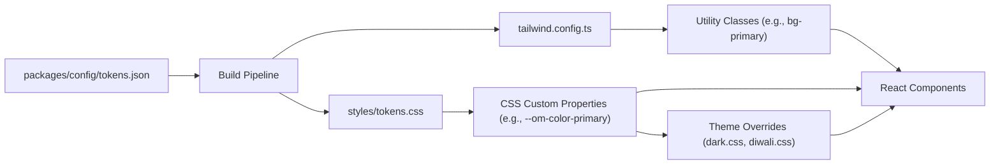

### 8.2 Token Categories

#### Typography Tokens

| Token Path | CSS Custom Property | Usage |
|-----------|-------------------|-------|
| `typography.fontFamily` | `--om-font-family` | Primary font stack: `'Inter', system-ui, sans-serif` |
| `typography.fontFamilyMonospace` | `--om-font-mono` | Code and IAST transliteration: `'Fira Code', monospace` |
| `typography.fontSize.display` | `--om-text-display` | Hero headings: `clamp(2.5rem, 5vw, 4rem)` |
| `typography.fontSize.h1` | `--om-text-h1` | Page titles: `clamp(2rem, 4vw, 3rem)` |
| `typography.fontSize.body` | `--om-text-body` | Paragraph text: `clamp(1rem, 2.5vw, 1.125rem)` |
| `typography.fontSize.caption` | `--om-text-caption` | Helper text, footnotes: `clamp(0.75rem, 2vw, 0.875rem)` |
| `typography.lineHeight` | `--om-leading` | Universal line height: `1.5` |

> **Indic Script Note**: Devanagari and other Indic scripts require additional font-face declarations in `styles/typography.css`. The `font-family` stack includes script-specific fallbacks: `'Noto Sans Devanagari'` for Hindi/Sanskrit, `'Noto Sans Tamil'` for Tamil, etc. Fallbacks are loaded via `font-display: swap` to prevent FOIT (Flash of Invisible Text).

#### Color Tokens

| Token Path | CSS Custom Property | Light Mode | Dark Mode |
|-----------|-------------------|------------|-----------|
| `color.primary.base` | `--om-color-primary` | `hsl(210, 65%, 45%)` (Deep Indigo) | `hsl(210, 65%, 65%)` |
| `color.primary.light` | `--om-color-primary-light` | `hsl(210, 65%, 60%)` | `hsl(210, 65%, 75%)` |
| `color.primary.dark` | `--om-color-primary-dark` | `hsl(210, 65%, 30%)` | `hsl(210, 65%, 50%)` |
| `color.secondary.base` | `--om-color-secondary` | `hsl(30, 80%, 45%)` (Saffron) | `hsl(30, 80%, 55%)` |
| `color.accent.base` | `--om-color-accent` | `hsl(120, 50%, 40%)` (Evergreen) | `hsl(120, 50%, 55%)` |
| `color.neutral.white` | `--om-color-bg` | `hsl(0, 0%, 100%)` | `hsl(0, 0%, 10%)` |
| `color.neutral.black` | `--om-color-text` | `hsl(0, 0%, 0%)` | `hsl(0, 0%, 95%)` |

#### Spacing Tokens

| Token | CSS Custom Property | Value | Usage |
|-------|-------------------|-------|-------|
| `spacing.xs` | `--om-space-xs` | `0.25rem` (4px) | Inline padding, icon margins |
| `spacing.sm` | `--om-space-sm` | `0.5rem` (8px) | Component internal padding |
| `spacing.md` | `--om-space-md` | `1rem` (16px) | Standard spacing between elements |
| `spacing.lg` | `--om-space-lg` | `1.5rem` (24px) | Section spacing |
| `spacing.xl` | `--om-space-xl` | `2rem` (32px) | Major section gaps |
| `spacing.xxl` | `--om-space-xxl` | `3rem` (48px) | Page-level margins |

#### Radius Tokens

| Token | CSS Custom Property | Value | Usage |
|-------|-------------------|-------|-------|
| `borderRadius.sm` | `--om-radius-sm` | `0.125rem` | Subtle rounding on inputs |
| `borderRadius.md` | `--om-radius-md` | `0.25rem` | Standard card and button rounding |
| `borderRadius.lg` | `--om-radius-lg` | `0.5rem` | Modal and dialog rounding |
| `borderRadius.pill` | `--om-radius-pill` | `9999px` | Tags, badges, avatars |

#### Elevation Tokens

| Token | CSS Custom Property | Value | Usage |
|-------|-------------------|-------|-------|
| `elevation.shadow0` | `--om-shadow-0` | `none` | Flat elements |
| `elevation.shadow1` | `--om-shadow-1` | `0 1px 3px rgba(0,0,0,0.12)` | Cards, dropdowns at rest |
| `elevation.shadow2` | `--om-shadow-2` | `0 4px 6px rgba(0,0,0,0.15)` | Elevated cards, popovers, tooltips |

#### Animation Tokens

| Token | CSS Custom Property | Value | Usage |
|-------|-------------------|-------|-------|
| Duration (micro) | `--om-duration-micro` | `150ms` | Button press, hover feedback |
| Duration (standard) | `--om-duration-standard` | `300ms` | Card transitions, accordion |
| Duration (page) | `--om-duration-page` | `500ms` | Page transitions, modal enter |
| Easing (standard) | `--om-ease-standard` | `cubic-bezier(0.4, 0.0, 0.2, 1)` | Most transitions |
| Easing (celebratory) | `--om-ease-celebratory` | `cubic-bezier(0.68, -0.55, 0.27, 1.55)` | Achievement animations |

### 8.3 Dark Mode Architecture

Dark mode is implemented via a CSS class toggle (`[data-theme="dark"]` on `<html>`) that swaps CSS Custom Property values. The toggle respects:

1. **System Preference**: `prefers-color-scheme` media query as default.
2. **User Override**: Explicit toggle stored in `localStorage` and Zustand.
3. **Server Hint**: `Sec-CH-Prefers-Color-Scheme` client hint prevents flash of wrong theme on SSR.

### 8.4 Festival Theme Architecture

Festival themes (P06B §5) are implemented as CSS override layers that adjust accent colors and background imagery while preserving accessibility contrast ratios.

| Festival | Accent Override | Background Motif | Active Period |
|----------|----------------|-------------------|---------------|
| **Diwali** | `hsl(45, 90%, 50%)` (Gold) | Subtle diya pattern overlay | Kartik Amavasya ± 5 days |
| **Holi** | `hsl(320, 70%, 55%)` (Magenta) | Watercolor splash texture | Phalguna Purnima ± 3 days |
| **Navaratri** | `hsl(350, 75%, 45%)` (Crimson) | Geometric kolam border | Ashvin Shukla Pratipada to Dashami |
| **Maha Shivaratri** | `hsl(240, 50%, 35%)` (Deep Blue) | Minimal trishula watermark | Magha Krishna Chaturdashi ± 2 days |

Festival themes are activated by the Panchanga Alignment rule engine (P05 §3.1 Rule 1) and can be disabled by the user in profile settings (P05 §3.2).

---

## 9. Localization Architecture

The Om platform must support 100+ languages (ROADMAP v1.0.0) across diverse scripts, including right-to-left (RTL) languages and complex Indic scripts with conjunct characters.

### 9.1 Architecture Overview

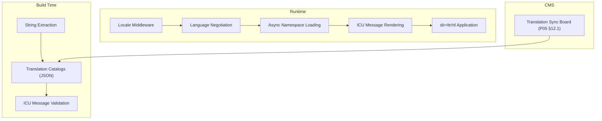

### 9.2 Multi-Language Strategy

| Concern | Strategy |
|---------|----------|
| **Translation Framework** | ICU MessageFormat via `next-intl` or equivalent. Supports plurals, gender, date/time, and number formatting across all locales. |
| **Namespace Isolation** | Translation files are split by feature namespace (`texts.json`, `places.json`, `dashboard.json`). Only the active page's namespace is loaded, keeping the translation bundle minimal. |
| **Server-Driven Translations** | Scripture content translations (Sanskrit → English, Hindi, Tamil, etc.) are stored in the backend and fetched as structured data — not as i18n strings. UI chrome translations and content translations are architecturally separate systems. |
| **Locale Detection** | Priority: URL path prefix (`/hi/texts/...`) → Cookie (`NEXT_LOCALE`) → `Accept-Language` header → Default (`en`). |
| **Fallback Chain** | If a string is missing in the requested locale, the system falls back: Regional variant → Language base → English → Key ID. Missing translations are logged to the monitoring system. |

### 9.3 RTL Support

| Mechanism | Description |
|-----------|-------------|
| **Logical Properties** | All CSS uses logical properties (`margin-inline-start`, `padding-block-end`) instead of physical properties (`margin-left`, `padding-bottom`). This automatically mirrors layouts for RTL scripts (Urdu, Arabic, Hebrew). |
| **`dir` Attribute** | The `<html dir="...">` attribute is set by the locale provider based on the active language's script direction. |
| **Bidirectional Text** | Scripture content frequently mixes LTR (English commentary) with RTL or neutral (Sanskrit/Devanagari) text. The `unicode-bidi` and `direction` CSS properties are applied at the content block level, not globally. |
| **Icon Mirroring** | Directional icons (arrows, chevrons) are mirrored in RTL mode via CSS `transform: scaleX(-1)`. Non-directional icons (checkmarks, stars) are not mirrored. |

### 9.4 Regional Script Rendering

| Script | Font Stack | Special Considerations |
|--------|-----------|----------------------|
| **Devanagari** | `'Noto Sans Devanagari', 'Mangal', system-ui` | Conjunct consonants (ligatures), vowel matras above/below, Vedic accent marks (udatta/anudatta/svarita) |
| **Tamil** | `'Noto Sans Tamil', 'Latha', system-ui` | Vowel-consonant combinations, unique glyph positioning |
| **Telugu** | `'Noto Sans Telugu', system-ui` | Complex vowel signs, subscript consonants |
| **Kannada** | `'Noto Sans Kannada', system-ui` | Ottaksharas (consonant conjuncts) |
| **Malayalam** | `'Noto Sans Malayalam', system-ui` | Traditional vs reformed script rendering |
| **Bengali** | `'Noto Sans Bengali', 'Vrinda', system-ui` | Juktakshar (conjunct consonants) |
| **Grantha** | `'Noto Sans Grantha', system-ui` | Historical script for Sanskrit in South India — rare but required for manuscript viewing |
| **IAST** | `'Inter', 'Fira Code', system-ui` | Latin script with diacritical marks (ā, ī, ū, ṛ, ṃ, ḥ, ś, ṣ, ṇ, ṭ, ḍ) |

### 9.5 Transliteration Engine

The frontend includes a client-side transliteration engine that converts between script representations in real-time:

| Conversion | Direction | Use Case |
|-----------|-----------|----------|
| IAST ↔ Devanagari | Bidirectional | Scripture reader toggle |
| IAST ↔ Regional Scripts | IAST → Target | Regional script rendering of Sanskrit texts |
| Harvard-Kyoto → IAST | Input → Display | Keyboard input normalization |
| Velthuis → IAST | Input → Display | Legacy input format support |

The transliteration engine runs entirely client-side as a pure function with no external dependencies. It is implemented as a shared utility in `utils/transliteration.ts` and consumed by the Scripture Reader organism and the CMS editor.

### 9.6 Language Switching

| Behavior | Description |
|----------|-------------|
| **Instant Switching** | Changing the UI language does not trigger a page reload. The locale provider updates the React context, and components re-render with the new namespace. |
| **Content Language Independence** | The user can read Sanskrit scripture with Tamil translation while the UI chrome is in English. UI language and content language are independent selections. |
| **Persistent Preference** | Language selection is stored in a cookie (`NEXT_LOCALE`) and in the user profile (for authenticated users). |
| **Per-Route Localization** | URL paths include the locale prefix (`/hi/texts/...`) for SEO and shareability. |

---

## 10. Accessibility

Accessibility in the Om platform is governed by the principle that **no user should be excluded from accessing civilizational knowledge** due to physical, cognitive, or situational disabilities.

### 10.1 WCAG Compliance Matrix

| WCAG Principle | Level AAA Requirements | Om Implementation |
|---------------|----------------------|-------------------|
| **Perceivable** | Text alternatives for all non-text content; captions and audio descriptions for multimedia; content adaptable to different presentations; sufficient contrast. | All images have descriptive `alt` text. Audio content (chanting, lectures) includes synchronized transcripts. Color contrast exceeds 7:1 for body text. |
| **Operable** | Keyboard accessible; sufficient time; no seizure-inducing content; navigable; input modalities beyond keyboard. | Full keyboard navigation with visible focus indicators. No time limits on reading. No flashing content. Skip links and landmark regions on every page. |
| **Understandable** | Readable text; predictable behavior; input assistance. | Language attribute set on `<html>`. Consistent navigation across all pages. Form validation errors are descriptive and linked to the offending field. |
| **Robust** | Compatible with assistive technologies. | Semantic HTML5 elements. Valid ARIA attributes. Tested with screen readers (VoiceOver, NVDA, TalkBack). |

### 10.2 Keyboard Navigation Architecture

| Context | Key Bindings | Behavior |
|---------|-------------|----------|
| **Global** | `Cmd/Ctrl+K` | Open Command Palette |
| **Global** | `?` | Open keyboard shortcut help dialog |
| **Global** | `/` | Focus search input |
| **Global** | `Esc` | Close active modal/overlay/panel |
| **Scripture Reader** | `←` / `→` | Previous / next verse |
| **Scripture Reader** | `Shift+T` | Toggle translation panel |
| **Scripture Reader** | `Shift+C` | Toggle commentary panel |
| **Scripture Reader** | `Shift+A` | Play/pause audio |
| **Knowledge Graph** | `+` / `-` | Zoom in / out |
| **Knowledge Graph** | Arrow keys | Pan canvas |
| **Knowledge Graph** | `Enter` | Expand selected node |
| **Command Palette** | `↑` / `↓` | Navigate results |
| **Command Palette** | `Enter` | Select action |
| **Flashcards** | `Space` | Flip card |
| **Flashcards** | `1`–`4` | Rate recall difficulty |

### 10.3 Screen Reader Semantics

| Element | ARIA Pattern | Live Region |
|---------|-------------|-------------|
| **Command Palette** | `role="combobox"` with `aria-expanded`, `aria-activedescendant` | `aria-live="polite"` for result count updates |
| **Scripture Reader** | `role="article"` with `aria-label` containing verse reference | `aria-live="polite"` for translation/commentary toggle |
| **Knowledge Graph** | `role="application"` with descriptive `aria-label`; nodes as `role="treeitem"` | `aria-live="assertive"` for node expansion announcements |
| **AI Chat** | `role="log"` with `aria-label="AI Acharya Conversation"` | `aria-live="polite"` for streaming message updates |
| **Progress Dashboard** | Charts described via `aria-label` and hidden data tables | None (static content) |
| **Map Explorer** | `role="application"` with keyboard trap management | `aria-live="polite"` for location announcements |
| **Toast Notifications** | `role="status"` | `aria-live="polite"` |
| **Error Messages** | `role="alert"` | `aria-live="assertive"` |

### 10.4 Reduced Motion

When `prefers-reduced-motion: reduce` is active:

| Animation Type | Default Behavior | Reduced Motion Behavior |
|---------------|-----------------|------------------------|
| Page transitions | Slide animation (500ms) | Instant cut (0ms) |
| Card hover | Elevation lift (300ms) | Subtle opacity change (150ms) |
| Skeleton loading | Animated gradient sweep | Static gray placeholder |
| Confetti (achievements) | Particle burst | Static badge display |
| Knowledge graph | Physics-directed spring animation | Instant layout positioning |
| AI chat typing indicator | Animated dots | Static "Thinking..." text |

### 10.5 High Contrast Mode

High contrast mode is activated via the user's OS setting (`prefers-contrast: more`) or an explicit toggle in profile settings. It overrides the standard color tokens:

| Token | Standard Value | High Contrast Value |
|-------|---------------|-------------------|
| `--om-color-text` | `hsl(0, 0%, 15%)` | `hsl(0, 0%, 0%)` |
| `--om-color-bg` | `hsl(0, 0%, 100%)` | `hsl(0, 0%, 100%)` |
| `--om-color-primary` | `hsl(210, 65%, 45%)` | `hsl(210, 100%, 30%)` |
| `--om-shadow-1` | `0 1px 3px rgba(0,0,0,0.12)` | `0 0 0 2px hsl(0, 0%, 0%)` (border instead of shadow) |
| Focus indicator | `4dp accent outline` | `4dp solid black outline` |

### 10.6 Large Text and Zoom

All layouts are tested and must remain fully functional at 200% browser zoom. The architecture enforces this through:

- **Fluid Typography**: `clamp()` functions (P06B §2) ensure text scales proportionally.
- **Relative Units**: All spacing uses `rem` units, scaling with the root font size.
- **No Fixed Heights**: Content containers use `min-height` instead of `height` to accommodate text expansion.
- **Horizontal Scroll Prevention**: No content overflows horizontally at any zoom level.

### 10.7 Offline Accessibility

Offline mode maintains full accessibility:

- Cached pages retain all ARIA attributes and semantic structure.
- Screen readers continue to function with locally cached content.
- Keyboard navigation works identically in offline mode.
- The offline status banner is announced to screen readers via `aria-live="polite"`.

---

## 11. Performance Strategy

### 11.1 Performance Architecture

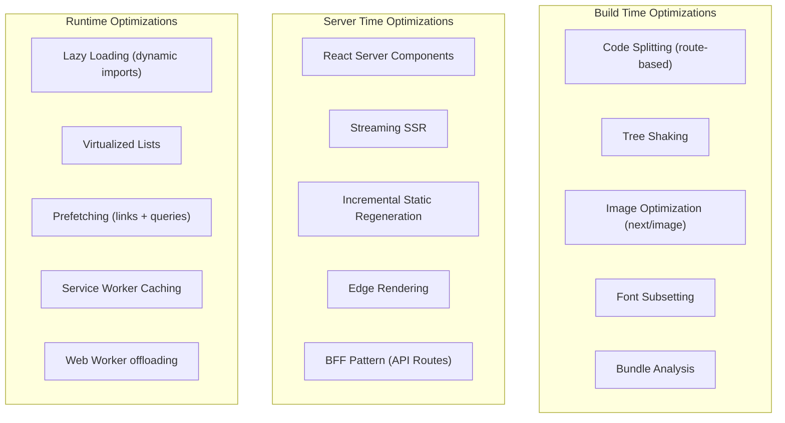

### 11.2 Image Optimization

| Strategy | Mechanism | Target |
|----------|----------|--------|
| **Automatic Format** | `next/image` serves WebP/AVIF based on browser support | All content images |
| **Responsive Sizes** | `sizes` attribute generates multiple resolutions; `srcSet` delivers optimal size | Hero banners, temple photos, manuscript scans |
| **Lazy Loading** | `loading="lazy"` for below-fold images; `loading="eager"` for LCP candidates | All images except hero/LCP |
| **Blur Placeholder** | Base64-encoded 10px blur-up placeholder during load | Content cards, gallery views |
| **CDN Delivery** | All images served through CDN with cache headers (`max-age=31536000, immutable`) | All static image assets |
| **SVG for Icons** | Icon set delivered as inline SVG with `currentColor`, not as image files | All UI icons |

### 11.3 Lazy Loading Strategy

| Resource | Trigger | Mechanism |
|----------|---------|-----------|
| **Route Components** | Navigation to route | Next.js automatic route-level code splitting |
| **Knowledge Graph Renderer** | User navigates to `/explorer/graph` | `next/dynamic` with `ssr: false` (WebGL requires browser APIs) |
| **Map Explorer** | User navigates to `/places/map` | `next/dynamic` with `ssr: false` |
| **AI Chat Panel** | User opens AI Acharya | `next/dynamic` with loading skeleton |
| **Mermaid Diagrams** | Diagram enters viewport | Intersection Observer triggers dynamic import |
| **Recharts** | Dashboard enters viewport | `next/dynamic` with skeleton chart placeholder |
| **Audio Player** | User interacts with pronunciation content | Dynamic import on first interaction |
| **Festival Theme CSS** | Panchanga date match | Dynamic `<link>` injection |

### 11.4 Code Splitting Boundaries

| Bundle | Contents | Max Size (gzipped) |
|--------|----------|--------------------|
| **Framework** | React, Next.js runtime, router | ≤ 45 KB |
| **Shared UI** | Atoms, molecules, layout components | ≤ 30 KB |
| **Design System** | TailwindCSS utilities, CSS Custom Properties | ≤ 10 KB |
| **Per-Route** | Route-specific organisms, feature logic | ≤ 50 KB per route |
| **Vendor (graph)** | Force-graph library, D3 utilities | ≤ 80 KB (loaded only on graph routes) |
| **Vendor (map)** | MapLibre GL JS | ≤ 120 KB (loaded only on map routes) |
| **Vendor (AI)** | SSE client, markdown renderer | ≤ 20 KB (loaded only on AI routes) |

### 11.5 Server Components Strategy

| Component Type | Rendering | Rationale |
|---------------|-----------|-----------|
| **Scripture Text Display** | Server Component | Static text with no interactivity. Zero client JS. |
| **Temple Information Page** | Server Component | Static content rendered from CMS. |
| **Navigation Header** | Client Component | Requires state (theme toggle, sidebar, search). |
| **Knowledge Graph Canvas** | Client Component | WebGL rendering, mouse/touch interaction. |
| **AI Chat Interface** | Client Component | Real-time streaming, input management. |
| **Breadcrumbs** | Server Component | Derived from URL path. No client interactivity. |
| **Flashcard Deck** | Client Component | Drag/swipe interaction, state management. |
| **Footer** | Server Component | Static links and branding. |

### 11.6 Edge Rendering

| Page Type | Edge Strategy | TTL |
|-----------|--------------|-----|
| **Landing Page** | SSG at build time, served from edge | Until next deployment |
| **Scripture Pages** | ISR with 24-hour revalidation, served from edge | 24 hours |
| **Temple Pages** | ISR with 24-hour revalidation, served from edge | 24 hours |
| **Search Results** | SSR at edge (short-lived) | No cache (dynamic) |
| **Dashboard** | SSR at origin (user-specific data) | No edge cache |
| **API Routes** | Origin only (data mutations) | No edge cache |

---

## 12. Offline-First Strategy

The offline-first architecture ensures the Om platform remains functional in environments with unreliable connectivity — rural temples, underground transit, and remote pilgrimage routes.

### 12.1 Architecture Overview

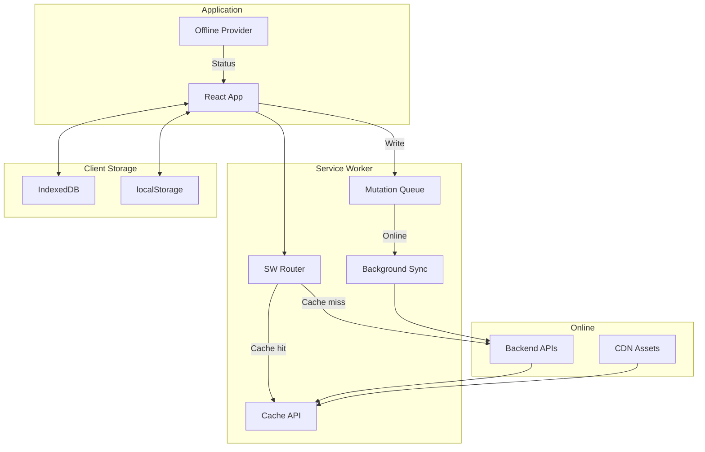

### 12.2 Service Worker Strategy

| Cache | Strategy | Contents | Max Size |
|-------|----------|----------|----------|
| **App Shell** | Cache-first, network-update | HTML shell, CSS, JS bundles, fonts | 5 MB |
| **Static Assets** | Cache-first | Icons, images, manifest | 20 MB |
| **API Responses** | Stale-while-revalidate | Scripture pages, temple data, concept pages | 50 MB |
| **Map Tiles** | Cache-first, manual refresh | Offline map tiles for downloaded regions | 100 MB |
| **User Data** | Network-first, cache-fallback | Dashboard, progress, notes | 10 MB |

### 12.3 IndexedDB Schema

| Store | Key | Contents | Sync Direction |
|-------|-----|----------|---------------|
| `downloaded_lessons` | `lesson_id` | Complete lesson content (text, audio, images) | Server → Client (download) |
| `offline_notes` | `note_id` | User workspace notes created offline | Client → Server (background sync) |
| `flashcard_state` | `card_id` | Spaced repetition state (interval, ease factor, next review) | Bidirectional (last-write-wins) |
| `offline_mutations` | `mutation_id` | Queued API mutations (bookmarks, highlights, quiz answers) | Client → Server (ordered queue) |
| `map_regions` | `region_id` | Downloaded map tile sets and temple metadata | Server → Client (download) |
| `pilgrimage_data` | `route_id` | GPS waypoints, temple info, ritual guides | Server → Client (download) |

### 12.4 Background Sync

When the device regains connectivity:

1. **Mutation Queue Drain**: Queued mutations are replayed in order against the backend. Conflicts are resolved via server-side timestamps.
2. **Stale Cache Refresh**: Cached API responses that exceeded their stale time during offline are silently revalidated.
3. **Progress Sync**: Locally computed learning progress (flashcard reviews, streak counts) is reconciled with server state.
4. **Download Completion**: Partially downloaded lesson packs resume from the last byte received.

### 12.5 Downloaded Lessons

Users can download complete lesson packs for offline study:

| Pack Type | Contents | Estimated Size |
|-----------|----------|---------------|
| **Scripture Pack** | Full text + 3 translations + pronunciation audio + commentary | 5–15 MB per scripture |
| **Temple Pack** | Temple page + images + ritual guides + offline map tiles (1 km radius) | 10–30 MB per temple |
| **Journey Pack** | Complete Civilization Journey (all nodes, maps, audio) | 20–50 MB per journey |
| **Practice Pack** | Flashcard deck + quiz questions + review schedule | 1–3 MB per deck |

### 12.6 Pilgrimage Mode

Pilgrimage Mode (P05 §3.1 Rule 2) is a special offline-optimized experience activated when the user is near a registered temple site:

| Feature | Offline Capability |
|---------|-------------------|
| **GPS Navigation** | Device GPS (no network required). Pre-cached route data. |
| **Temple Information** | Fully cached temple page with high-contrast, sunlight-readable theme. |
| **Ritual Guides** | Downloaded ritual instructions with step-by-step audio. |
| **Offline Map** | Vector tiles cached for the temple complex and surrounding area. |
| **Photo Capture** | Store photos locally with GPS coordinates. Upload on reconnection. |
| **Audio Chanting** | Pre-downloaded chanting tracks playable without network. |

---

## 13. Security

### 13.1 Security Architecture

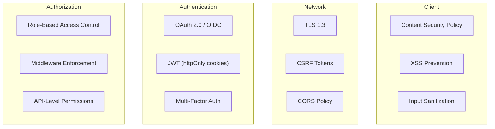

### 13.2 Authentication

| Concern | Strategy |
|---------|----------|
| **Protocol** | OAuth 2.0 with OpenID Connect (OIDC). Supports social login (Google, Apple) and email/password with PKCE flow. |
| **Token Storage** | Access tokens stored in `httpOnly`, `Secure`, `SameSite=Strict` cookies. Never stored in `localStorage` or JavaScript-accessible memory. |
| **Session Management** | Short-lived access tokens (15 minutes). Long-lived refresh tokens (7 days) with rotation on each use. |
| **Token Refresh** | Silent refresh via `httpOnly` cookie sent to `/api/auth/refresh`. Transparent to the UI — TanStack Query retries failed 401 requests after refresh. |
| **Logout** | Server-side session invalidation. Client-side cookie clearing. TanStack Query cache reset. IndexedDB user data purge. |

### 13.3 Authorization

| Layer | Mechanism | Scope |
|-------|----------|-------|
| **Middleware** | Next.js middleware validates session and role before route rendering. | Route-level access control (`(authenticated)`, `(admin)` groups) |
| **API Routes** | BFF API routes verify permissions before proxying to backend services. | Endpoint-level access control |
| **Component-Level** | Conditional rendering based on user role from session context. | UI element visibility (edit buttons, admin links) |
| **Server Component** | Data fetching in Server Components includes auth headers; unauthorized data is never sent to the client. | Data-level access control |

### 13.4 Content Security Policy (CSP)

| Directive | Value | Rationale |
|-----------|-------|-----------|
| `default-src` | `'self'` | Restrict all resources to same origin by default |
| `script-src` | `'self' 'nonce-{random}'` | Only allow scripts with a per-request nonce. No `unsafe-inline`, no `unsafe-eval`. |
| `style-src` | `'self' 'unsafe-inline'` | Required for CSS-in-JS and inline style tokens. Mitigated by strict script-src. |
| `img-src` | `'self' data: https://cdn.om.org` | Allow images from self, data URIs (blur placeholders), and CDN |
| `font-src` | `'self' https://fonts.gstatic.com` | Self-hosted fonts and Google Fonts CDN |
| `connect-src` | `'self' https://api.om.org wss://api.om.org` | API connections and WebSocket for real-time features |
| `frame-ancestors` | `'none'` | Prevent clickjacking — Om pages cannot be embedded in iframes |
| `base-uri` | `'self'` | Prevent base URL injection attacks |

### 13.5 XSS Prevention

| Vector | Mitigation |
|--------|-----------|
| **User-Generated Content** | All CMS content is sanitized server-side before storage. Client renders using React's JSX auto-escaping. |
| **URL Parameters** | All URL parameters are validated against Zod schemas before use. No direct insertion into DOM. |
| **Markdown Rendering** | MDX content is compiled at build time. Runtime markdown rendering uses a strict allowlist of HTML tags (no `<script>`, `<iframe>`, `<object>`). |
| **AI Responses** | AI Acharya responses are treated as untrusted text. Rendered via React text nodes, never `dangerouslySetInnerHTML`. |
| **Search Queries** | Search input is sanitized before display in search results. Query terms are highlighted via text node manipulation, not HTML injection. |

### 13.6 CSRF Protection

| Mechanism | Description |
|-----------|-------------|
| **SameSite Cookies** | All auth cookies use `SameSite=Strict`, preventing cross-origin request attachment. |
| **CSRF Tokens** | State-mutating API routes require a CSRF token generated server-side and validated on each request. |
| **Origin Validation** | API routes validate the `Origin` header against a whitelist of allowed domains. |

### 13.7 Input Validation

| Boundary | Validator | Scope |
|----------|----------|-------|
| **Form Submission** | Zod schema (client-side) + server-side re-validation | All user input forms (profile, notes, CMS) |
| **URL Parameters** | Zod schema in route loaders | Dynamic route segments, search params |
| **API Responses** | Zod schema in service layer | All data crossing the network boundary |
| **File Uploads** | MIME type validation, size limits, virus scanning (server-side) | CMS media uploads, profile avatars |

### 13.8 Secrets Management

| Secret | Location | Access |
|--------|----------|--------|
| **API Keys** | Environment variables (server-side only) | Never exposed to client bundles. Accessed only in Server Components and API routes. |
| **OAuth Credentials** | Environment variables | Server-side only. PKCE flow eliminates client secret requirement for public clients. |
| **Encryption Keys** | Key management service (KMS) | Server-side only. Used for encrypting Svadhyaya reflection journal entries (P05 §6.1). |
| **Analytics IDs** | Public environment variables (prefixed `NEXT_PUBLIC_`) | Allowed in client bundles (non-sensitive). |

---

## 14. Error Handling

### 14.1 Error Hierarchy

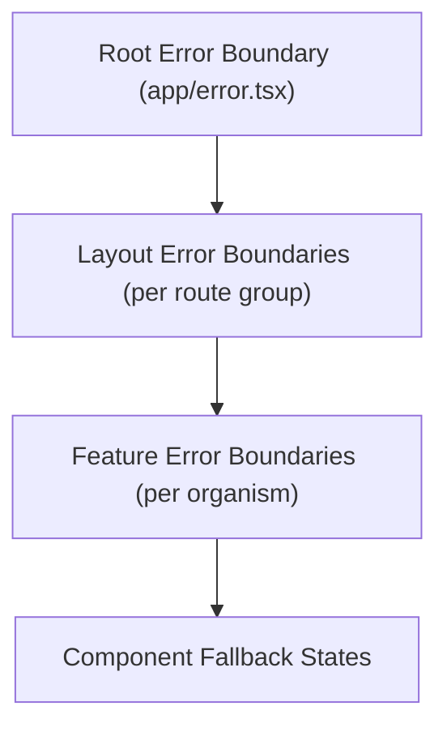

### 14.2 Error Categories

| Category | Scope | Handling | User Experience |
|----------|-------|---------|-----------------|
| **Global Errors** | Application crash, chunk load failure, unhandled exceptions | Root error boundary renders recovery page. Error logged to monitoring. | Full-page error screen with "Refresh" button and support link. Brand-consistent styling maintained. |
| **Layout Errors** | Route group-level failures (auth provider crash, layout data fetch failure) | Layout error boundary renders within the application shell. | Error card within the main content area. Navigation remains functional. |
| **Feature Errors** | Individual organism failure (graph renderer crash, map tile load error) | Feature-level error boundary isolates the failure. | Failed component replaced with error card: "This section couldn't load. Try again." Rest of page unaffected. |
| **Data Fetch Errors** | API timeout, 4xx/5xx responses | TanStack Query retry logic (3 attempts with exponential backoff). | Skeleton UI during retry. Error card after exhaustion with "Retry" button. |
| **Validation Errors** | Form input validation failures | Zod schema validation with field-level error messages | Inline error text below the offending field. Form does not submit. |
| **Offline Errors** | Network unavailable, sync failures | Offline provider detects status. Mutations queued for retry. | "You're offline" banner. Cached content continues to display. Queued actions shown as pending. |

### 14.3 Fallback UI Specifications

| Error Context | Fallback Content | Recovery Action |
|--------------|-----------------|----------------|
| **Scripture Page Load Failure** | Cached version if available; otherwise error illustration with verse reference | "Try again" button; link to search for the verse |
| **Knowledge Graph Crash** | Static list view of the same data | "Switch to list view" (graceful degradation) |
| **Map Load Failure** | Text-based temple directory with addresses | "View as list" link |
| **AI Chat Failure** | "The AI Acharya is temporarily unavailable" card | "Try again" button; link to related scripture pages |
| **Image Load Failure** | Colored placeholder with content type icon | Automatic retry on scroll-back into viewport |
| **Audio Load Failure** | Disabled play button with "Audio unavailable" text | Link to download audio for offline use |

### 14.4 Retry Logic

| Resource | Max Retries | Backoff Strategy | Timeout |
|----------|------------|-----------------|---------|
| **API Data Fetches** | 3 | Exponential: 1s → 2s → 4s | 10s per attempt |
| **AI Streaming** | 2 | Linear: 2s → 4s | 30s per attempt |
| **Image Loading** | 2 | Immediate retry, then 5s delay | 15s per attempt |
| **Map Tiles** | 3 | Exponential: 500ms → 1s → 2s | 5s per attempt |
| **Background Sync** | 5 | Exponential: 30s → 1m → 5m → 15m → 1h | No timeout (background) |

### 14.5 Logging and Monitoring

| Signal | Collection Method | Destination |
|--------|------------------|-------------|
| **Client Errors** | `window.onerror`, `unhandledrejection`, error boundaries | Error monitoring service (Sentry or equivalent) |
| **Performance Metrics** | Web Vitals API (`web-vitals` library) | Analytics service |
| **API Error Rates** | TanStack Query `onError` callbacks | Structured logging to backend |
| **User-Reported Issues** | In-app feedback form triggered from error fallback UI | Support ticketing system |
| **Offline Sync Failures** | Background sync error events | Queued for next online reporting |

---

## 15. Analytics

The Om platform implements **privacy-first analytics** that measure learning effectiveness and platform health without employing surveillance capitalism techniques. The platform explicitly rejects addictive engagement tracking.

### 15.1 Analytics Principles

| Principle | Description |
|-----------|-------------|
| **Privacy First** | No third-party trackers. No cross-site tracking. No advertising data. No fingerprinting. |
| **Consent Based** | Analytics are opt-in. Users can withdraw consent at any time. Withdrawal immediately stops collection. |
| **Aggregated by Default** | Individual-level data is never exposed in dashboards. All metrics are aggregated to cohort level. |
| **Learning Focused** | Metrics measure learning outcomes (knowledge retention, path completion) not engagement maximization (time-on-site, click-through). |
| **No Addictive Patterns** | Analytics never inform features designed to increase compulsive usage (infinite scroll, notification spam, streak anxiety). Grace-streaks celebrate consistency without punishing absence. |

### 15.2 Analytics Categories

| Category | Metrics | Purpose | Reference |
|----------|---------|---------|-----------|
| **Learning Analytics** | Path completion rate, spaced repetition retention, quiz accuracy, knowledge level progression | Measure educational effectiveness; improve curriculum design | P04 §3 |
| **Search Analytics** | Query frequency, zero-result rate, intent distribution, search-to-content conversion | Improve search quality and content discoverability (P05 §13.2 CDS) | P05 §8 |
| **Navigation Analytics** | Page-to-page flow, Command Palette usage, cross-domain bridge activation | Optimize information architecture; validate navigation intelligence rules | P05 §3, P07 §17 |
| **Performance Analytics** | Core Web Vitals (LCP, FID, CLS), TTI, resource load times | Maintain performance budgets; identify regression | §11.1 |
| **Accessibility Analytics** | Screen reader activation rate, keyboard-only session rate, high-contrast mode usage, font size distribution | Ensure accessibility features are functioning and discoverable | §10 |
| **Error Analytics** | Error boundary trigger rate, API error rates, offline sync failure rate | Identify reliability issues; prioritize fixes | §14 |

### 15.3 Implementation Architecture

| Concern | Strategy |
|---------|----------|
| **Collection** | First-party analytics service (self-hosted or privacy-respecting SaaS like Plausible/Umami). No Google Analytics. |
| **Client SDK** | Lightweight (<5 KB) analytics abstraction in `lib/analytics.ts`. Events dispatched via `navigator.sendBeacon` to avoid blocking navigation. |
| **Server-Side Events** | Server Components and API routes emit analytics events server-side for data that never reaches the client (e.g., ISR cache hit rates). |
| **Data Retention** | Raw event data retained for 90 days. Aggregated summaries retained indefinitely. Individual user data deleted on account deletion. |
| **GDPR / DPDPA Compliance** | Consent management integrated into the auth flow. Data export and deletion endpoints available via user profile. |

---

## 16. Testing Strategy

### 16.1 Testing Pyramid

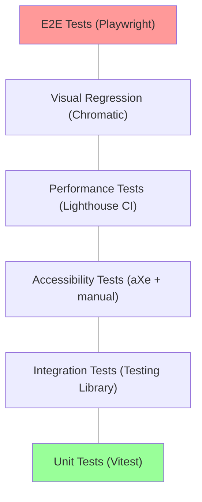

### 16.2 Test Category Matrix

| Category | Tool | Scope | Trigger | Coverage Target |
|----------|------|-------|---------|----------------|
| **Unit Tests** | Vitest | Pure functions, utilities, hooks, Zod schemas | Every PR | ≥ 90% of `utils/`, `hooks/`, `lib/` |
| **Integration Tests** | Vitest + React Testing Library | Component rendering, user interactions, state management | Every PR | ≥ 80% of `components/`, `features/` |
| **Accessibility Tests** | aXe-core (automated) + manual screen reader testing | WCAG compliance, ARIA semantics, keyboard navigation | Automated: every PR. Manual: quarterly | 100% of interactive components |
| **Performance Tests** | Lighthouse CI | Core Web Vitals, bundle size, load times | Every PR to `main` | All metrics within budget (§11.1) |
| **Visual Regression** | Chromatic (Storybook-based) | Pixel-level comparison of component states and themes | Every PR | All atoms, molecules, and organisms |
| **E2E Tests** | Playwright | Critical user flows (onboarding, search, scripture reading, AI chat) | Pre-deployment (staging) | Top 20 user journeys |

### 16.3 Critical Test Flows

| Flow | Steps | Assertions |
|------|-------|------------|
| **First Visit** | Landing → Explore → Search → Scripture Page | LCP < 2.5s, all images loaded, search results relevant |
| **Authentication** | Sign up → Onboarding → Dashboard | Token stored, profile loaded, streak initialized |
| **Scripture Reading** | Navigate to verse → Toggle translation → Play audio → Bookmark | Text renders correctly, audio plays, bookmark persists |
| **AI Conversation** | Open AI Acharya → Ask question → Receive streamed response → View citation | Streaming works, citations link to correct pages |
| **Offline Mode** | Download lesson → Go offline → Read lesson → Go online → Sync | Content accessible offline, progress syncs correctly |
| **Accessibility** | Navigate entire scripture reader using keyboard only | All controls reachable, focus visible, screen reader announces content |
| **Localization** | Switch language to Hindi → Browse scriptures → Switch to Tamil | UI chrome translates, content translations load, script renders correctly |

### 16.4 Test Environment Strategy

| Environment | Purpose | Data | Deployment |
|-------------|---------|------|------------|
| **Local** | Developer testing during development | Mock data via MSW (Mock Service Worker) | `npm run dev` |
| **CI** | Automated test execution on every PR | Seeded test database | GitHub Actions |
| **Staging** | Pre-production validation, E2E tests, manual QA | Production-like data (anonymized) | Preview deployment per PR |
| **Production** | Monitoring and synthetic tests | Live data | Continuous deployment from `main` |

---

## 17. Build Pipeline

### 17.1 Pipeline Architecture

```mermaid
flowchart LR
    Commit["Git Commit"] --> Lint["1. Lint"]
    Lint --> Format["2. Format Check"]
    Format --> Types["3. Type Check"]
    Types --> Unit2["4. Unit + Integration Tests"]
    Unit2 --> A11yCI["5. Accessibility Audit"]
    A11yCI --> Build["6. Build"]
    Build --> Bundle["7. Bundle Analysis"]
    Bundle --> Perf2["8. Performance Budget"]
    Perf2 --> VR2["9. Visual Regression"]
    VR2 --> Preview["10. Preview Deploy"]
    Preview --> E2ECI["11. E2E Tests"]
    E2ECI --> Approve["12. Review Approval"]
    Approve --> Prod["13. Production Deploy"]
```

### 17.2 Pipeline Stage Details

| Stage | Tool | Failure Behavior | Runtime |
|-------|------|-----------------|---------|
| **Linting** | ESLint with custom Om ruleset (import boundaries, no-restricted-imports, accessibility rules) | PR blocked | < 30s |
| **Format Check** | Prettier (check-only mode, no auto-fix in CI) | PR blocked | < 15s |
| **Type Checking** | `tsc --noEmit` (strict mode) | PR blocked | < 60s |
| **Unit + Integration Tests** | Vitest (parallel execution) | PR blocked | < 120s |
| **Accessibility Audit** | aXe-core on rendered Storybook components | PR blocked for new violations, warned for existing | < 60s |
| **Build** | `next build` (production mode) | PR blocked | < 180s |
| **Bundle Analysis** | `@next/bundle-analyzer` output compared against size budgets | PR blocked if any bundle exceeds budget by > 10% | < 30s |
| **Performance Budget** | Lighthouse CI against staging URL | PR warned (not blocked) if any metric regresses > 10% | < 120s |
| **Visual Regression** | Chromatic snapshot comparison | PR blocked for unreviewed visual changes | < 180s |
| **Preview Deployment** | Vercel preview deployment (or equivalent) | PR cannot proceed without preview URL | < 120s |
| **E2E Tests** | Playwright against preview deployment | PR blocked for critical flow failures | < 300s |
| **Review Approval** | Manual — minimum 2 reviewers (1 domain expert, 1 accessibility reviewer for UI changes) | PR blocked | Human time |
| **Production Deployment** | Automated from `main` branch via CI/CD | Automatic rollback if health checks fail within 5 minutes | < 180s |

### 17.3 Branch Strategy

| Branch | Purpose | Deployment Target | Protection |
|--------|---------|------------------|------------|
| `main` | Production-ready code | Production | Required reviews, all CI gates pass |
| `develop` | Integration branch for feature work | Staging | Required reviews, core CI gates pass |
| `feature/*` | Individual feature development | Preview deployments | No protection (developer branch) |
| `hotfix/*` | Critical production fixes | Production (expedited) | 1 reviewer, core CI gates pass |

---

## 18. Future Scalability

### 18.1 Plugin System Architecture

The Om frontend is designed to evolve from a monolithic application to a plugin-extensible platform. The plugin system allows external contributors (universities, cultural institutions, regional language communities) to extend the platform without modifying core code.

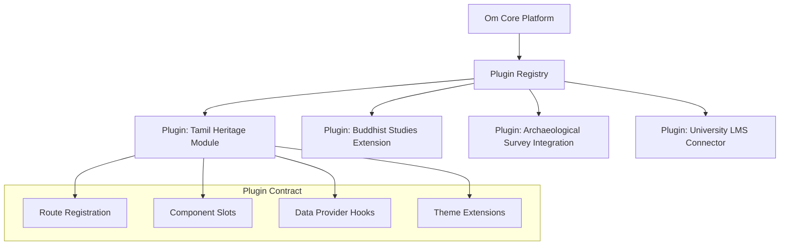

| Plugin Capability | Mechanism |
|------------------|-----------|
| **Route Registration** | Plugins register new routes under a reserved path prefix (`/extensions/[plugin-slug]/`). Routes are lazy-loaded and sandboxed. |
| **Component Slots** | Core pages expose named slots (e.g., `scripture-sidebar-bottom`, `temple-page-related`) where plugins can inject components. |
| **Data Provider Hooks** | Plugins can register custom TanStack Query hooks that extend the data layer with external APIs. |
| **Theme Extensions** | Plugins can register additional theme variants that extend the festival theme system. |
| **Translation Namespaces** | Plugins provide their own translation namespaces, loaded alongside core namespaces. |

### 18.2 Feature Module Independence

Each feature module in `features/` is designed to be extractable into an independent micro-frontend:

| Characteristic | Current State | Micro-Frontend Ready |
|---------------|--------------|---------------------|
| **Own Routes** | Route files in `app/` reference feature components | Feature owns its route definitions |
| **Own State** | Feature-specific Zustand stores and TanStack queries | Fully independent state management |
| **Own Types** | Feature-specific TypeScript types | No cross-feature type dependencies |
| **Own Services** | Feature-specific API service files | Independent backend communication |
| **Shared Dependencies** | Imports from `components/`, `hooks/`, `utils/` | Shared via Module Federation or npm package |

### 18.3 Micro-Frontend Migration Path

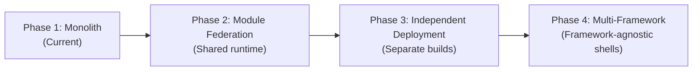

| Phase | Description | Trigger |
|-------|-------------|---------|
| **Phase 1** | Single Next.js application with feature modules. All code in one repository, one build, one deployment. | Current state |
| **Phase 2** | Webpack Module Federation enables independent feature builds sharing a common runtime (React, design system). Features can be developed and deployed by separate teams. | When team count exceeds 5 independent feature teams |
| **Phase 3** | Features are fully independent applications with their own build pipelines, deployed to separate CDN origins. Composed at the edge via a shell application. | When deployment frequency diverges significantly across features |
| **Phase 4** | The shell application becomes framework-agnostic, allowing features to be built in different frameworks if necessary (e.g., a WebGL-heavy graph explorer in Svelte). | Only if specific performance requirements demand it |

### 18.4 Extension APIs

| API | Purpose | Consumers |
|-----|---------|-----------|
| **Widget Embed API** | Allow external websites to embed Om components (verse cards, temple maps, knowledge graph snippets) via `<iframe>` with postMessage communication | Partner universities, digital museums |
| **Content API** | JSON-LD annotated REST/GraphQL API for consuming platform content | External applications, research tools |
| **Webhook API** | Event-driven notifications for content updates, new publications, and moderation decisions | CMS integrations, notification services |

---

## 19. Anti-Patterns

This section documents architectural decisions that the Om frontend **must never adopt**. These anti-patterns are explicitly prohibited because they contradict the platform's core principles (§1.2).

### 19.1 Prohibited Patterns

| Anti-Pattern | Why It Is Prohibited | What to Do Instead |
|-------------|---------------------|-------------------|
| **Infinite Scroll** | Creates compulsive consumption loops. Contradicts Svadhyaya (reflection) principle (P04 §1.1). Users lose orientation in knowledge space. | Paginated navigation with explicit "Load more" actions. Clear positional indicators (page X of Y). |
| **Dark Patterns** | Manipulative UI (hidden unsubscribe, confirmshaming, forced continuity) violates Satya (Truth) brand value (P06A §2). | Transparent, honest UI. Clear labeling. Easy opt-out for all features. |
| **Notification Spam** | Push notification abuse creates anxiety and compulsion. Contradicts ethical engagement principle. | Mindful notifications: daily digest (opt-in), festival reminders (opt-in), streak encouragement (never punitive). |
| **Global CSS** | Unscoped CSS creates specificity wars and unpredictable cascading. | TailwindCSS utility classes + CSS Modules for component-specific overrides. Global CSS limited to `tokens.css`, `typography.css`, and `animations.css`. |
| **Prop Drilling (> 3 levels)** | Passing props through multiple component layers creates tight coupling and maintenance burden. | React Context for cross-cutting concerns. Zustand for global state. TanStack Query for server state. |
| **God Components** | Components exceeding 300 lines or managing more than one domain responsibility. | Decompose into Atomic Design tiers. Extract logic into custom hooks. |
| **Client-Side Auth Decisions** | Trusting client-side role checks for security-sensitive operations. | Server-side middleware for route protection. Server Component data fetching with auth headers. Client-side rendering only for UI cosmetics (show/hide buttons). |
| **Barrel Files at Scale** | Re-exporting everything through `index.ts` files defeats tree-shaking and increases bundle size. | Direct imports from specific modules. Barrel files allowed only for `components/atoms/` and `components/molecules/` (small, frequently co-imported). |
| **any Type** | TypeScript `any` bypasses the type system entirely, negating its value. | `unknown` for truly unknown types with runtime validation. Explicit type narrowing. Zod schemas at boundaries. |
| **Non-Semantic HTML** | `<div>` and `<span>` soup destroys accessibility and SEO. | `<article>`, `<section>`, `<nav>`, `<aside>`, `<main>`, `<header>`, `<footer>` for structural semantics. ARIA roles only when no semantic HTML equivalent exists. |
| **localStorage for Sensitive Data** | `localStorage` is accessible to any JavaScript on the page (XSS vector). | `httpOnly` cookies for tokens. IndexedDB with structured access patterns for user data. |
| **Synchronous Data Fetching in Components** | Blocking renders on data fetches creates poor UX. | React Suspense boundaries with streaming fallbacks. TanStack Query with skeleton UI. |
| **Vendor Lock-In** | Deep coupling to a single vendor's proprietary APIs. | Abstraction layers (e.g., map abstraction over MapLibre/Leaflet, analytics abstraction over any provider). |
| **Engagement-Maximizing Metrics** | Optimizing for time-on-site, session duration, or click-through rate. | Optimize for learning outcomes: knowledge retention rate, path completion, reflection journal entries. |

### 19.2 Code Quality Gates

The following automated gates prevent anti-pattern introduction:

| Gate | Tool | Rule |
|------|------|------|
| **No `any`** | ESLint `@typescript-eslint/no-explicit-any` | Error (blocks PR) |
| **No `console.log`** | ESLint `no-console` | Error (use structured logger) |
| **Import Boundaries** | ESLint `no-restricted-imports` (custom config) | Error (blocks circular dependencies) |
| **Component Size** | Custom ESLint rule | Warning at 200 lines, Error at 300 lines |
| **Accessibility** | `eslint-plugin-jsx-a11y` | Error for missing `alt`, `aria-label`, `role` |
| **No `dangerouslySetInnerHTML`** | ESLint custom rule | Error (requires explicit exception with security review) |

---

## 20. Architecture Summary

### 20.1 How This Architecture Serves the Om Vision

The Om Frontend Architecture is not a collection of technology choices — it is a **philosophical commitment encoded in engineering discipline**. Every decision in this document traces back to the platform's founding principles: that civilizational knowledge must be preserved with integrity, made accessible to all, and presented in a way that encourages wisdom rather than consumption.

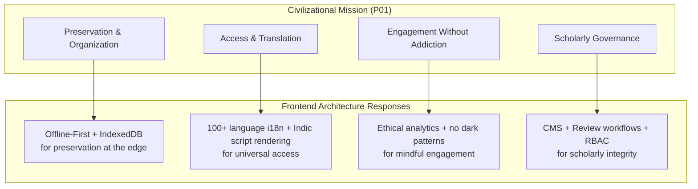

### 20.2 Architectural Invariants

These are the non-negotiable properties of the Om frontend that must survive every refactor, every feature addition, and every team change:

1. **The frontend renders knowledge, not advertisements.** There are no ad slots, no sponsored content zones, and no engagement-maximizing algorithms in the client architecture.

2. **Offline is a first-class state.** The Service Worker, IndexedDB, and background sync infrastructure are not optional add-ons — they are core architectural components that must function for every feature.

3. **Every component is accessible.** No component is merged without passing automated aXe audits and, for interactive components, manual screen reader testing.

4. **Performance budgets are deployment gates.** If a PR causes LCP to exceed 2.5s or the initial bundle to exceed 150 KB gzipped, it does not ship.

5. **Type safety spans the entire boundary.** Zod schemas validate every API response, every URL parameter, and every form input. TypeScript strict mode is never disabled.

6. **The architecture is composable, not monolithic.** Feature modules are isolated, independently testable, and extractable to micro-frontends when organizational scale demands it.

7. **Cultural fidelity is a technical requirement.** Devanagari rendering, IAST transliteration, festival themes, and Panchanga-aware navigation are not cosmetic features — they are architectural constraints that inform font loading, theming, and data modeling.

### 20.3 Document Traceability Matrix

| This Document Section | Traces To |
|----------------------|-----------|
| §1 Frontend Vision | P01 (Vision), P02 (PRD) |
| §2 Technology Stack | P06B (Design System), P05 (IA) |
| §3 Folder Structure | Monorepo structure (README §4) |
| §4 Component Architecture | P06B §4 (Component Library), P07 (UI/UX) |
| §5 Routing Architecture | P05 §1 (Product Map), P05 §13 (URL Architecture) |
| §6 State Management | P05 §6 (Workspace), P07 §11 (Learning Flows) |
| §7 Data Flow | P05 §8 (Search), P05 §10 (AI Integration) |
| §8 Design Token Integration | P06A §4 (Visual Language), P06B §2 (Tokens) |
| §9 Localization | P02 §2 (User Cohorts), P01 §3.2 (Access) |
| §10 Accessibility | P02 §3 (WCAG), P06A §6, P07 §14 |
| §11 Performance | P02 §3 (Scalability), P05 §11 (Multi-Device) |
| §12 Offline-First | P01 §3.2, P02 §2 (Pilgrim), P05 §3.1 Rule 2 |
| §13 Security | P05 §12 (CMS Workflows), P06A §7 (Data Sovereignty) |
| §14 Error Handling | P07 §16 (Empty/Loading/Error States) |
| §15 Analytics | P04 §1.1 (Ethical Design), P05 §3.3.2 (Analytics) |
| §16 Testing | P06B §7 (Accessibility Checklist) |
| §17 Build Pipeline | ROADMAP (Release Milestones) |
| §18 Future Scalability | P05 §14 (Scalability), ROADMAP v1.0.0 |
| §19 Anti-Patterns | P04 §1 (Learning Philosophy), P06A §2 (Brand Values) |
| §20 Architecture Summary | P01 (Vision), all documents |

---

*Prepared by the Om Frontend Architecture Team — July 2026*
*This document is the single source of truth for all frontend engineering decisions on the Om platform.*
